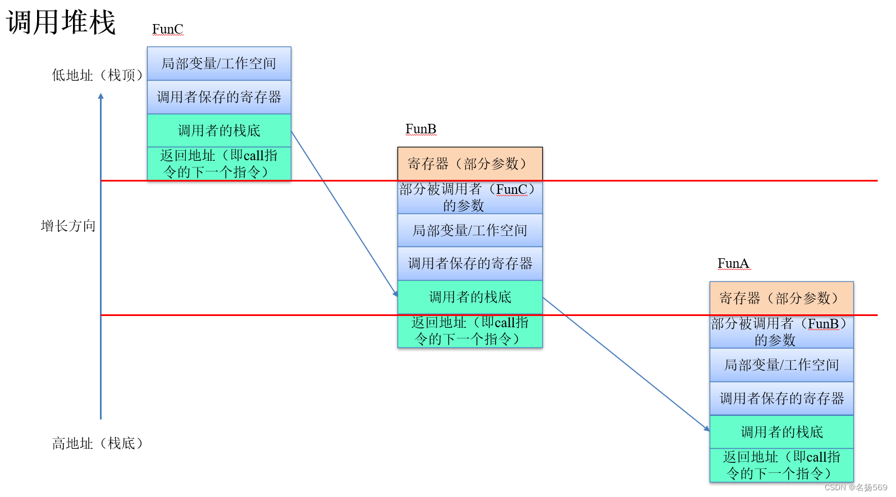
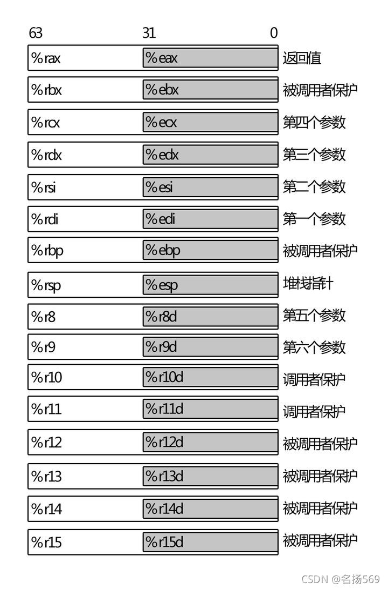

# 编译,安装,运行与调试linux内核（真机环境，基于crash调试）

## 一、内核编译与安装

1、下载内核代码（通过官网或者[github](https://so.csdn.net/so/search?q=github&spm=1001.2101.3001.7020)）  
2、安装相关依赖  
3、设置内核参数  
如果需要调试，就需要开启`CONFIG_DEBUG_INFO=y` (2.6以前的内核需要手动在顶层Makefile中添加`-g`参数)

    cd linux-x.x.x
    
    # 复制本机原本的.config文件
    cp -v /boot/config-$(uname -r) .config
    
    # 通过menuconfig修改配置
    [可选] make menuconfig
    # 或者直接修改.config文件
    [可选] vim .config


4、编译

    # 全部编译
    make -j $(nproc)
    
    # 如果想只编译内核，可以使用命令
    make -j $(nproc) vmlinux bzImage


5、安装内核模块

    # 注意检查是否有报错信息
    sudo make -j $(nproc) INSTALL_MOD_STRIP=1 modules_install


6、安装内核

    sudo make install -j $(nproc)


输出的内容参考：

    $ sudo make install
    arch/x86/Makefile:142: CONFIG_X86_X32 enabled but no binutils support
    sh ./arch/x86/boot/install.sh 5.15.114+ \
            arch/x86/boot/bzImage System.map "/boot"
    run-parts: executing /etc/kernel/postinst.d/initramfs-tools 5.15.114+ /boot/vmlinuz-5.15.114+
    update-initramfs: Generating /boot/initrd.img-5.15.114+
    run-parts: executing /etc/kernel/postinst.d/unattended-upgrades 5.15.114+ /boot/vmlinuz-5.15.114+
    run-parts: executing /etc/kernel/postinst.d/update-notifier 5.15.114+ /boot/vmlinuz-5.15.114+
    run-parts: executing /etc/kernel/postinst.d/xx-update-initrd-links 5.15.114+ /boot/vmlinuz-5.15.114+
    run-parts: executing /etc/kernel/postinst.d/zz-shim 5.15.114+ /boot/vmlinuz-5.15.114+
    run-parts: executing /etc/kernel/postinst.d/zz-update-grub 5.15.114+ /boot/vmlinuz-5.15.114+
    Sourcing file `/etc/default/grub'
    Sourcing file `/etc/default/grub.d/init-select.cfg'
    Generating grub configuration file ...
    Found linux image: /boot/vmlinuz-5.15.114+
    Found initrd image: /boot/initrd.img-5.15.114+
    Found linux image: /boot/vmlinuz-5.15.114+.old
    Found initrd image: /boot/initrd.img-5.15.114+
    Found linux image: /boot/vmlinuz-5.15.0-78-generic
    Found initrd image: /boot/initrd.img-5.15.0-78-generic
    Found linux image: /boot/vmlinuz-5.15.0-76-generic
    Found initrd image: /boot/initrd.img-5.15.0-76-generic
    Found Windows Boot Manager on /dev/nvme0n1p1@/EFI/Microsoft/Boot/bootmgfw.efi
    Adding boot menu entry for UEFI Firmware Settings
    done


7、（可选）更新bootloader  
一般来说，上一步的`make install`过程中，已经更新了initramfs和bootloader。但是如果没有更新，那就需要手动更新。

    # 更新initramfs
    sudo update-initramfs -c -k 6.0.7
    # 更新grub bootloader
    sudo update-grub


8、重启

    sudo reboot
    # 重启后，验证linux内核版本
    uname -a


## 二、代码调试

### 2.1 （略）基于虚拟机的内核代码调试

可以使用[qemu](https://so.csdn.net/so/search?q=qemu&spm=1001.2101.3001.7020)调试，方法比较简单，教程也很多。  
原理就是gdb remote调试qemu中的内核程序，默认端口为1234。

### 2.2 基于gdb打印一些信息

比较常用的就是，根据报错中的地址信息，例如`unmap_dup_page_entry+0x37d`这种，去找它大概在代码中的第几行。

    $ gdb ./vmlinux 
    ......
    (gdb) l *unmap_dup_page_entry+0x37d
    0xffffffff813bc16d is in unmap_dup_page_entry (mm/migrate.c:207).
    202             /*
    203              * Recheck VMA as permissions can change since migration started
    204              */
    205             entry = pte_to_swp_entry(*pvmw.pte);
    206             if (is_writable_migration_entry(entry)) {
    207                 if (cpu_to_node((int)pvmw.vma->vm_mm->owner->cpu) == *(int *)target_nid) {
    208                     pte = maybe_mkwrite(pte, vma);
    209                 }
    210             }
    211             else if (pte_swp_uffd_wp(*pvmw.pte))
    (gdb) 


## 三、（真机）基于kdump+crash调试内核代码

### 3.1、环境安装

[参考链接](https://www.ebpf.top/post/ubuntu_kdump_crash/)

#### 3.1.1 安装kdump(ubuntu环境下)

    sudo apt install linux-crashdump # 官方文档: https://ubuntu.com/server/docs/kernel-crash-dump
    
    # 安装中的信息提取
    实际安装的包：
      crash kdump-tools kexec-tools libsnappy1v5 linux-crashdump makedumpfile
    相关配置文件：
     Sourcing file `/etc/default/grub'
     Sourcing file `/etc/default/grub.d/init-select.cfg'
     Sourcing file `/etc/default/grub.d/kdump-tools.cfg'
    Generating grub configuration file ...
    Found linux image: /boot/vmlinuz-5.15.114+
    Found initrd image: /boot/initrd.img-5.15.114+
    Adding boot menu entry for UEFI Firmware Settings
    done
    服务
    kdump-tools-dump.service is a disabled or a static unit, not starting it.


#### 3.1.2 安装crash(建议使用源码安装)

方法1. 使用apt安装（不建议，因为版本比较老）

    sudo apt install crash


方法2. 从源码安装（推荐）

    $ 依赖
    $ sudo apt install bison libz-dev ncurses-dev
    
    $ git clone https://github.com/crash-utility/crash.git
    $ cd crash
    
    # [可选] 删除apt安装的crash 
    $ sudo apt remove crash
    
    $ make
    $ sudo make install
    $ crash --version
    
    #  使用./crash明确确定运行的源码安装的crash
    $ sudo ./crash /home/xxx/linux-5.15.114/vmlinux


#### 3.1.3 检查配置文件

[参考链接](https://www.ebpf.top/post/ubuntu_kdump_crash/)

    $ sudo cat /etc/default/grub.d/kdump-tools.cfg
    GRUB_CMDLINE_LINUX_DEFAULT="$GRUB_CMDLINE_LINUX_DEFAULT crashkernel=512M-:192M"
    
    $ sudo cat /boot/grub.cfg
    或者
    $ sudo cat /boot/grub/grub.cfg
    
    # 启动命令中出现了`crashkernel=512M-:192M`类似的参数
    ```shell
    ......
    menuentry 'Ubuntu, with Linux 5.15.0-76-generic' --class ubuntu --class gnu-linux --class gnu --class os $menuentry_id_option 'gnulinux-5.15.0-76-generic-advanced-078bc78b-9ff0-479c-a59d-72b8d55732a5' {
                   ....................
                    echo    'Loading Linux 5.15.0-76-generic ...'
                    linux   /boot/vmlinuz-5.15.0-76-generic root=UUID=078bc78b-9ff0-479c-a59d-72b8d55732a5 ro rootdelay=10 nomodeset crashkernel=512M-:192M
                    echo    'Loading initial ramdisk ...'
                    initrd  /boot/initrd.img-5.15.0-76-generic
            }
    ..........


#### 3.1.4 重启

重启电脑，可以在`dmesg`中查看到`kdump`的信息

    $ dmesg | grep -i crash
    [    0.000000] Command line: BOOT_IMAGE=/boot/vmlinuz-5.15.114+ root=UUID=078bc78b-9ff0-479c-a59d-72b8d55732a5 ro rootdelay=10 nomodeset crashkernel=512M-:192M
    [    0.000000] x86/split lock detection: #AC: crashing the kernel on kernel split_locks and warning on user-space split_locks
    [    0.007880] Reserving 192MB of memory at 1152MB for crashkernel (System RAM: 32509MB)
    [    0.058309] Kernel command line: BOOT_IMAGE=/boot/vmlinuz-5.15.114+ root=UUID=078bc78b-9ff0-479c-a59d-72b8d55732a5 ro rootdelay=10 nomodeset crashkernel=512M-:192M


其它检查命令

    $ sudo kdump-config show
    $ sudo cat /proc/cmdline
    $ sudo service kdump-tools status
    
    sudo  cat /sys/kernel/kexec_crash_size
    201326592
    # 需要加sudo，否则全都是0-0
    $ sudo cat /proc/iomem | grep -i crash
      48000000-53ffffff : Crash kernel


#### 3.1.5 测试验证

1、利用Linux的`sysrq`手动触发内核的panic，让内核生成崩溃的内核快照和日志

    # 开启sysrq
    $ sudo sysctl kernel.sysrq=1
    
    # 触发panic
    $ sudo -i
    (root用户下)$ echo 'c' > /proc/sysrq-trigger


> 网上一般给出的命令都是  
> echo ‘c’ > /proc/sysrq-trigger 或者 sudo echo ‘c’ > /proc/sysrq-trigger  
> 但是，我登录普通用户，使用`sudo`提升权限，会报错  
> $ `sudo echo 'c' > /proc/sysrq-trigger`  
> `bash: /proc/sysrq-trigger: Permission denied`

    $ sudo echo c > /proc/sysrq-trigger
    # sudo echo c > /proc/sys/kernel/sysrq 


2、电脑将崩溃，然后重启  
重启后，可以找到kdump转存的信息（路径为`/var/crash/xxxxxxxxx`）

    $ ls -lh /var/crash/202308011504/
    # 日志文件
    -rw------- 1 root whoopsie  80K 8月   1 15:04 dmesg.202308011504
    # 快照文件
    -rw------- 1 root whoopsie 230M 8月   1 15:04 dump.202308011504


3、运行crash

    cd crash
    # crash的第一个参数设置为编译linux内核后的未压缩的内核文件（vmlinux） ，第二个参数则为kdump转存的快照
    sudo ./crash /home/xxx/linux-5.15.114/vmlinux ./dump.202308011504


## 4、crash调试内核的步骤以及技巧

参考：[Debug.Hacks中文版\_深入调试的技术和工具](https://book.douban.com/subject/6799412//)、[Linux Kernel Crash Book  
Everything you need to know](https://www.dedoimedo.com/computers/www.dedoimedo.com-crash-book.pdf)、[Crash White Paper](https://crash-utility.github.io/crash_whitepaper.html)

### 4.1 基本步骤

根据查阅资料，以及自己的调试经验。调试步骤基本分为：

#### 1、kdump的安装与配置

相关资料：  
[https://docs.kernel.org/admin-guide/kdump/kdump.html](https://docs.kernel.org/admin-guide/kdump/kdump.html)

##### 安装kdump（前面安装的kdump-tools包中中已经包含了）

##### 配置kdump

-   grub中关于kdump的启动参数

    $ sudo vim /etc/default/grub.d/kdump-tools.cfg
    
    # 默认内容
    $ sudo cat /etc/default/grub.d/kdump-tools.cfg
    GRUB_CMDLINE_LINUX_DEFAULT="$GRUB_CMDLINE_LINUX_DEFAULT crashkernel=xxxM-:xxxM"
    

> 配置文件中的参数说明（参考[crashkernel syntax](https://www.kernel.org/doc/html/next/admin-guide/kdump/kdump.html)）  
> 基本格式如下：  
> `crashkernel=range1:size1[,range2:size2,...][@offset]`  
> 其中，`range=start-[end]`  
> `range`表示系统内存的大小（在不同大小的系统内存下，预留的大小也不同）  
> 示例：`crashkernel=512M-2G:64M,2G-:128M@16M`

> bug记录，我电脑上默认参数为  
> `GRUB_CMDLINE_LINUX_DEFAULT="$GRUB_CMDLINE_LINUX_DEFAULT crashkernel=512M-:192M"`  
> 但当我修改为  
> `GRUB_CMDLINE_LINUX_DEFAULT=vmlinuz-5.15.0-78-generic crashkernel=128M-:1024M`  
> 之后  
> 系统重启后，显示器无法正常连接  
> 幸好，ssh可以正常连接，我用ssh连接服务器，然后打印日志信息，报错信息如下：
>
>  [    3.438758] i915 0000:00:02.0: [drm] Finished loading DMC firmware i915/adls_dmc_ver2_01.bin (v2.1)
>  [    3.441019] ------------[ cut here ]------------
>  [    3.441020] i915 0000:00:02.0: drm_WARN_ON(!intel_gmbus_is_valid_pin(dev_priv, pin))
>  [    3.441039] WARNING: CPU: 14 PID: 537 at drivers/gpu/drm/i915/display/intel_gmbus.c:927 intel_gmbus_get_adapter+0x6d/0x90 [i915]
>  [    3.441136] Modules linked in: input_leds(+) snd_seq_midi_event kvm_intel(+) kvm joydev crct10dif_pclmul snd_rawmidi binfmt_misc i915(+) ghash_clmulni_intel aesni_intel crypto_simd snd_seq cryptd ttm snd_seq_device rapl drm_kms_helper snd_timer cec intel_cstate snd rc_core eeepc_wmi wmi_bmof i2c_algo_bit pmt_telemetry soundcore fb_sys_fops pmt_class mei_me syscopyarea sysfillrect mei sysimgblt ov01a1s power_ctrl_logic v4l2_fwnode v4l2_async videodev mc acpi_tad acpi_pad mac_hid sch_fq_codel msr parport_pc ppdev lp parport ramoops reed_solomon pstore_blk pstore_zone efi_pstore drm ip_tables x_tables autofs4 hid_generic usbhid hid mfd_aaeon asus_wmi sparse_keymap r8169 platform_profile nvme ahci xhci_pci crc32_pclmul nvme_core realtek libahci vmd intel_pmt xhci_pci_renesas wmi video
>  [    3.441168] CPU: 14 PID: 537 Comm: systemd-udevd Not tainted 5.15.0-78-generic #85~20.04.1-Ubuntu
>  [    3.441171] Hardware name: ASUS System Product Name/TUF GAMING B760M-PLUS D4, BIOS 0810 02/22/2023
>  [    3.441172] RIP: 0010:intel_gmbus_get_adapter+0x6d/0x90 [i915]
>  [    3.441239] Code: 4c 8b 67 50 4d 85 e4 75 03 4c 8b 27 e8 0c 30 59 e7 48 c7 c1 28 61 f9 c0 4c 89 e2 48 c7 c7 29 fa fa c0 48 89 c6 e8 a9 3e a0 e7 <0f> 0b 31 c0 5b 41 5c 41 5d 5d c3 cc cc cc cc 4c 89 ee 48 c7 c7 20
>  [    3.441241] RSP: 0018:ffffaed4c1323720 EFLAGS: 00010282
>  [    3.441243] RAX: 0000000000000000 RBX: 0000000000000009 RCX: 0000000000000027
>  [    3.441244] RDX: 0000000000000027 RSI: ffffaed4c1323560 RDI: ffff961a1f5a0588
>  [    3.441245] RBP: ffffaed4c1323738 R08: ffff961a1f5a0580 R09: 0000000000000001
>  [    3.441246] R10: ffffffffaae25169 R11: 00000000aae25132 R12: ffff9612c2fcb200
>  [    3.441247] R13: ffff9612c7280000 R14: 0000000000000003 R15: 0000000000000009
>  [    3.441247] FS:  00007fe52830e880(0000) GS:ffff961a1f580000(0000) knlGS:0000000000000000
>  [    3.441249] CS:  0010 DS: 0000 ES: 0000 CR0: 0000000080050033
>  [    3.441249] CR2: 00007fe527880000 CR3: 0000000112dba000 CR4: 0000000000750ee0
>  [    3.441250] PKRU: 55555554
>  [    3.441251] Call Trace:
>  [    3.441253]  <TASK>
>  [    3.441256]  intel_hdmi_init_connector+0x1ba/0x9d0 [i915]
>  [    3.441321]  ? kmem_cache_alloc_trace+0x15a/0x420
>  [    3.441325]  ? __cond_resched+0x19/0x40
>  [    3.441328]  intel_ddi_init+0x8a3/0xc40 [i915]
>  [    3.441392]  intel_setup_outputs+0x1d9/0xc30 [i915]
>  [    3.441458]  intel_modeset_init_nogem+0x28a/0x9f0 [i915]
>  [    3.441547]  ? gen12_fwtable_read32+0xbf/0x230 [i915]
>  [    3.441615]  ? intel_irq_postinstall+0x3a0/0x620 [i915]
>  [    3.441677]  i915_driver_probe+0x358/0x7a0 [i915]
>  [    3.441757]  ? mutex_lock+0x13/0x40
>  [    3.441764]  i915_pci_probe+0x5a/0x140 [i915]
>  [    3.441826]  local_pci_probe+0x48/0x90
>  [    3.441832]  pci_device_probe+0x186/0x1f0
>  [    3.441835]  really_probe.part.0+0xc8/0x380
>  [    3.441840]  really_probe+0x40/0x80
>  [    3.441841]  __driver_probe_device+0x119/0x190
>  [    3.441843]  driver_probe_device+0x23/0xb0
>  [    3.441844]  __driver_attach+0xc5/0x180
>  [    3.441845]  ? __device_attach_driver+0x140/0x140
>  [    3.441846]  bus_for_each_dev+0x7c/0xd0
>  [    3.441851]  driver_attach+0x1e/0x30
>  [    3.441852]  bus_add_driver+0x178/0x220
>  [    3.441853]  driver_register+0x74/0xe0
>  [    3.441855]  __pci_register_driver+0x68/0x70
>  [    3.441858]  i915_register_pci_driver+0x23/0x30 [i915]
>  [    3.441914]  i915_init+0x3b/0x102 [i915]
>  [    3.442002]  ? 0xffffffffc106b000
>  [    3.442005]  do_one_initcall+0x46/0x1e0
>  [    3.442011]  ? __cond_resched+0x19/0x40
>  [    3.442014]  ? kmem_cache_alloc_trace+0x15a/0x420
>  [    3.442018]  do_init_module+0x52/0x230
>  [    3.442024]  load_module+0x1294/0x1500
>  [    3.442026]  __do_sys_finit_module+0xbf/0x120
>  [    3.442028]  ? __do_sys_finit_module+0xbf/0x120
>  [    3.442031]  __x64_sys_finit_module+0x1a/0x20
>  [    3.442033]  do_syscall_64+0x59/0xc0
>  [    3.442037]  ? do_syscall_64+0x69/0xc0
>  [    3.442038]  ? __x64_sys_read+0x1a/0x20
>  [    3.442041]  ? do_syscall_64+0x69/0xc0
>  [    3.442043]  ? do_syscall_64+0x69/0xc0
>  [    3.442045]  ? sysvec_reschedule_ipi+0x78/0xe0
>  [    3.442046]  entry_SYSCALL_64_after_hwframe+0x61/0xcb
>  [    3.442049] RIP: 0033:0x7fe52893973d
>  [    3.442051] Code: 00 c3 66 2e 0f 1f 84 00 00 00 00 00 90 f3 0f 1e fa 48 89 f8 48 89 f7 48 89 d6 48 89 ca 4d 89 c2 4d 89 c8 4c 8b 4c 24 08 0f 05 <48> 3d 01 f0 ff ff 73 01 c3 48 8b 0d 23 37 0d 00 f7 d8 64 89 01 48
>  [    3.442053] RSP: 002b:00007ffd8037f808 EFLAGS: 00000246 ORIG_RAX: 0000000000000139
>  [    3.442056] RAX: ffffffffffffffda RBX: 0000557fc814a320 RCX: 00007fe52893973d
>  [    3.442058] RDX: 0000000000000000 RSI: 00007fe528819ded RDI: 0000000000000017
>  [    3.442058] RBP: 0000000000020000 R08: 0000000000000000 R09: 0000000000000000
>  [    3.442059] R10: 0000000000000017 R11: 0000000000000246 R12: 00007fe528819ded
>  [    3.442060] R13: 0000000000000000 R14: 0000557fc815c1c0 R15: 0000557fc814a320
>  [    3.442062]  </TASK>
>  [    3.442063] ---[ end trace cf0c4a4dc286cf3f ]---
>

-   kdump配置文件

    sudo vim /etc/default/grub.d/kdump-tools.cfg
    

#### 2、获取kdump文件

##### （1）sysRq（特殊按键中断）

sysRq是一种特殊的按键，只要内核没有被完全锁住，不管内核在做什么事情，使用这些组合键能即时打印出内核的信息。例如，**sysRq可以触发Kdump（命令为`c`）**。具体的触发条件有两种。

第一种，sysRq能够通过键盘的组合键来触发相应功能（如触发kdump）：按键为`Alt+SysRq+c`(部分笔记本上是`Alt+Fn+PrtSrc+<command key>`)。其中，

-   `SysRq`按键即`PrintScreen`键
-   `c`为触发kdump的命令，其它的命令可以查看[linux的sysrq文档](https://www.kernel.org/doc/html/latest/admin-guide/sysrq.html)

> 如果是串口模式下，无法使用组合键，那就需要先按Alt，再按SysRq，再按命令键（如`c`）。  
> 命令之间的间隔，依赖于信号延时？（break信号）

第二种，sysRq也直接通过`/proc/sysrq-trigger`接口来触发kdump，命令为

    echo "c" |sudo tee /proc/sysrq-trigger


1）需要内核开启配置（默认是配置好的）

    # 开启
    CONFIG_MAGIC_SYSRQ=y
    # 这个配置项指定了默认SysRq的值，这个值表示kernel会对哪些功能产生反应。
    CONFIG_MAGIC_SYSRQ_DEFAULT_ENABLE=0x01b6


2）需要开启SysRq功能

    # 临时开启SysRq功能
    echo 1 > /proc/sys/kernel/sysrq
    
    # 查看sysrq的配置
    cat /proc/sys/kernel/sysrq # 会输出一个掩码数字，每个bit对应一些功能
    # 参考：
    # http://blog.lujun9972.win/blog/2018/08/22/linux下的sysrq键/index.html
    # https://www.kernel.org/doc/html/latest/admin-guide/sysrq.html


3）\[可选\] 永久开启SysRq功能

    # 修改 /etc/sysctl.conf中的kernel.sysrq参数为1（具体含义/etc/sysctl.conf中有说明）
    echo "kernel.sysrq = 1"|sudo tee -a /etc/sysctl.conf


4）通过SysRq触发kdump

##### （2）死机情况下（看门狗）

相关资料：

-   （特定服务器）HPE iLO NMI Watchdog Driver: [https://docs.kernel.org/watchdog/hpwdt.html](https://docs.kernel.org/watchdog/hpwdt.html)
    
    > HPE：惠普；  
    > iLO: Integrated Lights-Out，集成远程管理技术，一种服务器远程管理技术，允许管理员在服务器关机或不受监管的情况下对服务器进行远程管理。
    
-   （较为通用）The Linux IPMI Driver: [https://docs.kernel.org/driver-api/ipmi.html](https://docs.kernel.org/driver-api/ipmi.html)
    
    > IPMI： Intelligent Platform Management Interface，智能型平台管理接口。横跨不同的操作系统、固件和[硬件](https://marketing.csdn.net/p/3127db09a98e0723b83b2914d9256174?pId=2782&utm_source=glcblog&spm=1001.2101.3001.7020)平台，可以智能的监控、控制和自动回报大量服务器的运作状况
    

###### 1、IPMI\_Watchdog

-   编译内核参数  
    但是死循环/自旋锁等情况会导致，系统一直卡死，这种情况下，需要提前启动watchdog功能。（IPMI watchdog timer）

    # 编译内核时，添加看门狗
    CONFIG_IPMI_WATCHDOG=y
    
-   添加service，让看门狗自动启动

    # 新建一个service文件
    sudo vim /etc/systemd/system/my-ipmi-watchdog.service
    

文件内容：

    [Unit]
    Description=Load IPMI Watchdog Kernel Module
    After=network.target
    
    [Service]
    Type=oneshot
    ExecStart=/sbin/modprobe ipmi_watchdog timeout=90 action=reset \
    	pretimeout=30 preaction=pre_int preop=preop_panic
    
    [Install]
    WantedBy=multi-user.target


开启服务

    sudo systemctl enable my-ipmi-watchdog


测试

    $ sudo reboot # 重启电脑
    
    # 检查服务是否已启动
    $ lsmod | grep ipmi_watchdog
    ipmi_watchdog          28672  0
    ipmi_msghandler       122880  2 ipmi_devintf,ipmi_watchdog


具体步骤可以参考[Debug.Hacks中文版\_深入调试的技术和工具](https://book.douban.com/subject/6799412/)的`第2.3节 用NMI watchdog在死机时获取崩溃转储`

#### 3、查看dmesg日志文件

查看旧的dmesg信息（位于`/var/log/`目录下）

    $ ls /var/log/dmesg*
    /var/log/dmesg  /var/log/dmesg.0  /var/log/dmesg.1.gz  /var/log/dmesg.2.gz  /var/log/dmesg.3.gz  /var/log/dmesg.4.gz


如果是断言错误，就容易定位的多。  
同时，不清楚是为什么，但是好像dmesg中打印的函数调用栈相关的信息更全一些。（不过有可能是因为我在使用crash分析的时候，linux kernel与快照版本不一致导致的）

#### 4、使用crash分析kdump文件（常规分析方法)

启动crash（指定内核和kdump文件）

##### （1）获取函数调用栈的信息

获取栈信息主要使用`bt`命令，常用的命令如下，更多命令参考[参考crash白皮书](https://crash-utility.github.io/help_pages/bt.html)。

> 这里默认当前的进程就是出错的进程，但如果当前进程不是出错的进程，还需要额外的步骤来定位出错进程。目前我还没什么经验，同时书中有这方面的内容。

    crach> bt #获取函数调用栈
    crash> bt -l #获取函数调用栈，同时打印行号


其中，最直接的信息是，`bt -l`命令展示的代码行号信息，根据这个可以大致定位出错代码的位置。

##### （2）获取寄存器信息。

在使用`bt`查看函数调用栈时，其实已经将寄存器的值打印出来了。需要注意的是，crash无法获取每一个函数当时的寄存器列表。因为kdump实质是一个内存快照文件，有的函数调用不需要将寄存器入栈，因此快照中也就无法获取这部分内容。  
具体什么函数会有寄存器的信息，好像是和内核栈有关，但是具体有哪些栈我暂时也没搞明白，貌似有用户态的、内核态的、还有中断相关的。

##### （3）获取栈帧信息

    crach> bt -f # 获取栈帧
    crash> bt -FF # 也是获取栈帧，但是格式稍有变化(会多一些注释信息)，参考文档：https://crash-utility.github.io/help_pages/bt.html


函数调用时，需要保存现场，而这些内容就是被保存到栈帧中。  
栈帧基本上必须保存的有：  
（1）函数返回后需要执行的指令地址；  
（2）调用者（caller）的栈底的地址。  
可能保存的有：  
（1）被调用者的参数（**多余的参数，大部分参数都是通过寄存器传递的，只有多余的参数才会存储于栈帧中**）  
（2）调用者保护的寄存器。  
（3）局部变量等。

基本布局如下图所示，需要说明的是（1）前后的栈帧在内存中其实是连续的，图中将它们分开只是逻辑上的表示； （2）图中红线表示栈帧之间的分割线。（3）图中显示的`寄存器（部分参数）`，其实是不在栈帧中的，因为这部分是直接传递给子函数的，**这大大增加了调试的困难程度**。（4）`栈帧中函数参数部分`以及`局部变量`不一定存在，有可能参数全部通过寄存器传递了，或者没有局部变量。  
  
x86\_64中函数调用时寄存器的约定规则：  


##### （4）分析出错处的代码

如果获取函数调用栈的信息后，无法理解错误发生的原因，那就需要进一步深入分析出错位置的代码。  
如果是内存越界，就可以查看具体是哪个指令访问了非法内存，然后再看这个错误的地址地址来源。  
锁相关的错误，我暂时没有经验。

#### 4、调试技巧与坑（自己总结的）

##### （1）函数调用关系获取时的坑

1）内联函数。内联函数会被直接展开，不会执行`call`指令，因此这类函数没有了栈帧。  
2）编译器优化的函数。具体优化的时机不确定，但是猜测是一些只被调用一次的子函数，直接被展开到了父函数里面，这类子函数也没有了栈帧。具体例子是内核中的`do_numa_fault`函数被展开到了`__handle_mm_fault`函数中，导致`__handle_mm_fault`函数特别长。  
3）中断栈。这类我不是特别确定，但是貌似通过中断调用的函数在调用栈中的信息不太全。

##### （2）函数参数实际值的获取

正常用gdb调试应用的时候，是可以直接读取参数的。即使是没有源码，只有汇编，也可以通过打印相关寄存器的值来获取参数的值。但是基于快照就不行了，很多寄存器的值获取不到，因此参数的值就无法直接拿到。网上很多文档，很多说函数参数的值存储于栈中，但是没有考虑寄存器传参，我也不是很懂为什么他们不提这个。

首先，可以明确的是，根据快照是可以获取函数参数实际值的。因为我们至少有一个底层函数的寄存器值，以及对应的堆栈信息，那么以这个为基础，手动在脑子里“执行”一条条汇编（即阅读汇编）+根据地址查询内存中的值，那么就可以获得每一步的寄存器的值。

但是，想要快速获取参数的值，就需要分析栈帧中的数据具体是哪些变量。

###### 1、分析栈帧的大小

1）一开始，函数push调用者保护的寄存器时，会扩展栈帧的容量。push了几次，栈帧就增加了几个8Byte。  
2）`sub $0x90,%rsp`会直接调整栈顶寄存器的地址，预先扩展栈帧的容量，例如这里就扩展了0x80 bit的栈帧大小。  
3）据说有一些栈会动态扩容，即触发page fault然后扩容，目前还没遇到。

###### 2、分析栈帧的内容

1）确定一些关键的指令是在干什么，需要能够读懂部分关键汇编代码。  
2）关注`mov -0x30(%rbp),%rax`（或者通过`rsp`访问，甚至恶心点的会出现`rax = rbp - 0x10`，然后在通过`rax`间接访问栈帧内容）这类从堆栈获取数据的这种指令，因为这里面存放的数据是我们可以从栈帧中读到的。  
其地址可以通过与栈顶或者栈底的偏移量分析出来，然后结合这条指令的含义，就可以分析处这个堆栈处存放的是什么数据。  
3）找到栈帧中的关键数据，并理解其含义，就可以利用这些数据来定位出错原因。

##### 3、一些小技巧

1）分析指令作用的时候，可以结合struct的各个成员的偏移量来分析；

##### 4、\_\_x86\_return\_thunk是什么？

猜测是ftrace的相关内容？

## 附：出错记录

#### 1、debian证书相关（编译时出错）

**报错信息**：

    make[1]: *** No rule to make target ‘debian/canonical-certs.pem‘, needed by ‘certs/x509_certificate_list‘
    make[1]: *** No rule to make target 'debian/canonical-revoked-certs.pem', needed by 'certs/x509_revocation_list'.


**解决方案**  
方法1：直接手动更改`.config`中的值  
原文件

    CONFIG_SYSTEM_TRUSTED_KEYS="debian/canonical-certs.pem"
    CONFIG_SYSTEM_REVOCATION_KEYS="debian/canonical-revoked-certs.pem"


修改后

    CONFIG_SYSTEM_TRUSTED_KEYS=""
    CONFIG_SYSTEM_REVOCATION_KEYS=""


或者方法2，利用脚本：

    scripts/config --disable SYSTEM_TRUSTED_KEYS
    scripts/config --disable SYSTEM_REVOCATION_KEYS


### 2、signing\_key相关（安装模块时出错）

运行`make modules_install`时，出现以下问题：

    At main.c:222:
    - SSL error:02001002:system library:fopen:No such file or directory: bss_file.c:175
    - SSL error:2006D080:BIO routines:BIO_new_file:no such file: bss_file.c:178


问题原因：之前`.config`中的`CONFIG_MODULE_SIG_KEY="certs/signing_key.pem`被我改成空值了（因为一开始编译的时候对证书报错，我不小心把这个也设置为空了），恢复之后即可

    # 这个不要设置为空，维持原样
    CONFIG_MODULE_SIG_KEY="certs/signing_key.pem"


### 3、crash调试时出错

**问题**  
准备使用crash调试崩溃后的linux时，发生段错误，报错信息如下：

    $ sudo crash /home/mingyang/hybrid_memory/linux-5.15.114-hotness/vmlinux
    crash 7.2.8
    ........
    GNU gdb (GDB) 7.6
    ........
    This GDB was configured as "x86_64-unknown-linux-gnu"...
    WARNING: kernel relocated [256MB]: patching 144603 gdb minimal_symbol values
    please wait... (patching 144603 gdb minimal_symbol values) Segmentation fault


**问题分析**  
目前我仍然不知道出错的原理，但是我更换了crash的版本后，问题就消失了，因此我猜测是crash版本或者gdb版本的问题。再结合报错信息中的关键词`gdb minimal_symbol values`，因此有可能是crash配套的gdb版本的问题？也有可能是我配置的crash预留空间太小。  
查阅资料，发现了一个[red hat的bug报告](https://bugzilla.redhat.com/show_bug.cgi?id=846553)，但是这个bug并没有发生段错误，而且这个bug并没有被解决。

> ps：使用`gdb crash --args crash *** ***`是可以调试crash的，但是apt安装的crash没有调试信息。于是我才会选择源码安装，结果源码安装的crash并没有出错。

**解决办法**：

原本的crash时通过apt安装的(`sudo apt install crash`，版本为`7.2.8`)，运行时出错。  
抱着试一试的态度，使用源码安装crash后（版本`crash 8.0.3++`），用同样的命令，并没有出错

附上运行的**软件版本**  
gcc/g++版本：

    gcc (Ubuntu 9.4.0-1ubuntu1~20.04.1) 9.4.0


旧版本crash（出错版本）：

    crash 7.2.8
    GNU gdb (GDB) 7.6


新版本crash（正常版本）

    crash 8.0.3++
    GNU gdb (GDB) 10.2


## 参考

https://blog.csdn.net/qq_29809823/article/details/132037139?ops_request_misc=%257B%2522request%255Fid%2522%253A%2522cdfeb408c48e9cc9058e417142a39d92%2522%252C%2522scm%2522%253A%252220140713.130102334..%2522%257D&request_id=cdfeb408c48e9cc9058e417142a39d92&biz_id=0&utm_medium=distribute.pc_search_result.none-task-blog-2~all~baidu_landing_v2~default-2-132037139-null-null.142^v100^pc_search_result_base5&utm_term=linux%20crash%E5%AE%89%E8%A3%85&spm=1018.2226.3001.4187