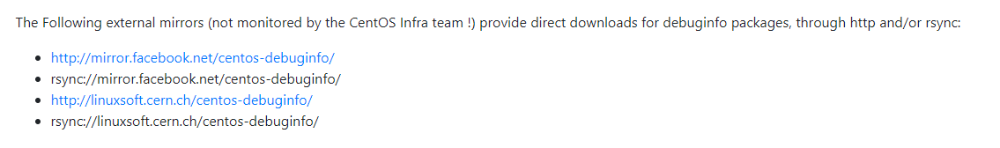

# Linux crash 调试环境搭建

在网上找了很多linux [crash](https://so.csdn.net/so/search?q=crash&spm=1001.2101.3001.7020) 调试工具安装的相关文章都没有成功，最后断断续续花时间去搭建这个环境，做个笔记，顺便分享下，本文记录的是ubuntu 18.04.4 LTS (Bionic Beaver) ,内核版本为5.4.0-42-generic

    curits@curits-virtual-machine:~/Desktop/crash-master$ uname -r
    5.4.0-42-generic
    curits@curits-virtual-machine:~/Desktop/crash-master$ cat /etc/os-release 
    NAME="Ubuntu"
    VERSION="18.04.4 LTS (Bionic Beaver)"
    ID=ubuntu
    ID_LIKE=debian
    PRETTY_NAME="Ubuntu 18.04.4 LTS"
    VERSION_ID="18.04"
    HOME_URL="https://www.ubuntu.com/"
    SUPPORT_URL="https://help.ubuntu.com/"
    BUG_REPORT_URL="https://bugs.launchpad.net/ubuntu/"
    PRIVACY_POLICY_URL="https://www.ubuntu.com/legal/terms-and-policies/privacy-policy"
    VERSION_CODENAME=bionic
    UBUNTU_CODENAME=bionic


0x01:首先安装需要调试系统。

0x02:要进行crash调试，需要安装带有调试信息的内核，这个在官网都可以下载到的，这里附上此版本dbgsym包的下载路径

    https://launchpad.net/ubuntu/bionic/amd64/linux-image-unsigned-5.4.0-42-generic-dbgsym/5.4.0-42.46~18.04.1


**Ubuntu dbgsym下载方法**

    # 具体codename是bionic还是focal可以通过以下命令查看
    $ lsb_release -a
    No LSB modules are available.
    Distributor ID:	Ubuntu
    Description:	Ubuntu 20.04.3 LTS
    Release:	20.04
    Codename:	focal
    
    # ubuntu 1804
    https://launchpad.net/ubuntu/bionic
    
    #ubuntu 2004
    https://launchpad.net/ubuntu/focal
    
    #ubuntu 2204
    https://launchpad.net/ubuntu/jammy


**附：针对不同的系统内核调试安装包的形式是不一样的，ubuntu为发布的ddeb包，centos为debuginfo包**

Ubuntu dbg包样例：

    linux-image-unsigned-5.4.0-42-generic-dbgsym_5.4.0-42.46_18.04.1_amd64.ddeb
    linux-image-unsigned-5.15.0-101-generic-dbgsym_5.15.0-101.111_amd64.ddeb


**Centos dbg下载方法**

    kernel-debuginfo-common-x86_64-3.10.0-693.el7.x86_64.rpm
    kernel-debuginfo-3.10.0-693.el7.x86_64.rpm


下载地址：

-   服务器下载  
    http://ddebs.ubuntu.com/pool/main/l/linux/
    
-   官网搜索  
    http://debuginfo.centos.org/7/x86\_64/
    
-   阿里云下载，下载速度还可以  
    https://mirrors.aliyun.com/centos-debuginfo/
    

可能有些内核版本在官网找不到，但是还有一些其他网点可以下载到(亲测其他网站下载更快)  


vmlinux路径为：

-   centos  
    /usr/lib/debug/lib/modules/3.10.0-693.el7.x86\_64/vmlinux
    
-   ubuntu  
    /usr/lib/debug/boot
    

0x03:虽然有些系统有自带的crash，但是这个系统默认是没有自带的crash工具，直接从github上下载最新的源码进行编译得到crash二进制文件（我是在物理编译出来的，因为虚拟机里编译太慢了，直接把编译的crash-master拷贝到此系统）

github地址：

    https://github.com/crash-utility/crash.git


编译方式：

    $ make -j 8
    $ sudo make install
    /usr/bin/install -d /usr/bin
    /usr/bin/install crash /usr/bin


0x04:dbgsym安装

-   使用ddeb包  
    下载好ddeb包之后，那就是安装，安装很简单直接：
    
        sudo dpkg -i linux-image-unsigned-5.4.0-42-generic-dbgsym_5.4.0-42.46_18.04.1_amd64.ddeb 
    
-   使用apt-get安装
    
        # cache中找dbgsym包
        apt-cache search linux-image-$(uname -r)
    
    

安装完之后可以在 /usr/lib/debug/boot/vmlinux-5.4.0-42-generic ,这个就是带有调试信息的vmlinux。

0x05:最后一步就是让crash 跑起来

    curits@curits-virtual-machine:~/Desktop/crash-master$ sudo ./crash /usr/lib/debug/boot/vmlinux-5.4.0-42-generic 
    
    crash 7.2.8++
    Copyright (C) 2002-2020  Red Hat, Inc.
    Copyright (C) 2004, 2005, 2006, 2010  IBM Corporation
    Copyright (C) 1999-2006  Hewlett-Packard Co
    Copyright (C) 2005, 2006, 2011, 2012  Fujitsu Limited
    Copyright (C) 2006, 2007  VA Linux Systems Japan K.K.
    Copyright (C) 2005, 2011  NEC Corporation
    Copyright (C) 1999, 2002, 2007  Silicon Graphics, Inc.
    Copyright (C) 1999, 2000, 2001, 2002  Mission Critical Linux, Inc.
    This program is free software, covered by the GNU General Public License,
    and you are welcome to change it and/or distribute copies of it under
    certain conditions.  Enter "help copying" to see the conditions.
    This program has absolutely no warranty.  Enter "help warranty" for details.
     
    GNU gdb (GDB) 7.6
    Copyright (C) 2013 Free Software Foundation, Inc.
    License GPLv3+: GNU GPL version 3 or later <http://gnu.org/licenses/gpl.html>
    This is free software: you are free to change and redistribute it.
    There is NO WARRANTY, to the extent permitted by law.  Type "show copying"
    and "show warranty" for details.
    This GDB was configured as "x86_64-unknown-linux-gnu"...
    
    WARNING: kernel relocated [330MB]: patching 111021 gdb minimal_symbol values
    
          KERNEL: /usr/lib/debug/boot/vmlinux-5.4.0-42-generic             
        DUMPFILE: /proc/kcore
            CPUS: 2
            DATE: Wed Aug 26 11:44:40 2020
          UPTIME: 05:12:39
    LOAD AVERAGE: 0.28, 0.06, 0.02
           TASKS: 499
        NODENAME: curits-virtual-machine
         RELEASE: 5.4.0-42-generic
         VERSION: #46~18.04.1-Ubuntu SMP Fri Jul 10 07:21:24 UTC 2020
         MACHINE: x86_64  (3407 Mhz)
          MEMORY: 4 GB
             PID: 9051
         COMMAND: "crash"
            TASK: ffff9489f43caf80  [THREAD_INFO: ffff9489f43caf80]
             CPU: 0
           STATE: TASK_RUNNING (ACTIVE)
    
    crash> 


​    

成功进入crash，接下来就是使用crash工具辣，这个下篇文章再唠唠

0x05: ubuntu安装内核源码  
crash 调试内核的时候，想要某个[函数](https://marketing.csdn.net/p/3127db09a98e0723b83b2914d9256174?pId=2782&utm_source=glcblog&spm=1001.2101.3001.7020)对应的源码时报以下错误，根本原因在对应目录下没有找到内核源码。

    crash> dis -s vfs_read
    FILE: /build/linux-hwe-5.15-p6caTn/linux-hwe-5.15-5.15.0/fs/read_write.c
    LINE: 466
    
    dis: vfs_read: source code is not available


参考下载方法

    # 在cache中查找内核源码对应的包
    root@curtis-Aspire-E5-471G:/usr/lib/debug/boot# apt-cache search linux-source
    linux-source - Linux kernel source with Ubuntu patches
    linux-source-5.4.0 - Linux kernel source for version 5.4.0 with Ubuntu patches
    linux-gkeop-source-5.4.0 - Linux kernel source for version 5.4.0 with Ubuntu patches
    linux-hwe-5.11-source-5.11.0 - Linux kernel source for version 5.11.0 with Ubuntu patches
    linux-hwe-5.13-source-5.13.0 - Linux kernel source for version 5.13.0 with Ubuntu patches
    linux-hwe-5.15-source-5.15.0 - Linux kernel source for version 5.15.0 with Ubuntu patches
    linux-hwe-5.8-source-5.8.0 - Linux kernel source for version 5.8.0 with Ubuntu patches
    linux-intel-5.13-source-5.13.0 - Linux kernel source for version 5.13.0 with Ubuntu patches
    
    root@curtis-Aspire-E5-471G:/usr/lib/debug/boot# uname -r
    5.15.0-52-generic
    root@curtis-Aspire-E5-471G:/usr/lib/debug/boot# sudo apt-get source linux-hwe-5.15-source-5.15.0
    
    # 安装包后源码所在路径
    curtis@curtis-Aspire-E5-471G:/usr/lib/debug/boot$ ls
    linux-5.15.0  linux_5.15.0-67.74.diff.gz  linux_5.15.0-67.74.dsc  linux_5.15.0.orig.tar.gz  vmlinux-5.15.0-52-generic


从实际操作来看，crash是从相对路径去找源码的`/build/linux-hwe-5.15-p6caTn/linux-hwe-5.15-5.15.0/fs/read_write.c`，也就是启动crash的工作目录去找源码。

-   将源码拷贝或者移动到对应目录

    curtis@curtis-Aspire-E5-471G:~/code$ sudo mkdir -p /build/linux-hwe-5.15-p6caTn/linux-hwe-5.15-5.15.0
    curtis@curtis-Aspire-E5-471G:~/code$ cd /build/linux-hwe-5.15-p6caTn/linux-hwe-5.15-5.15.0
    curtis@curtis-Aspire-E5-471G:/build/linux-hwe-5.15-p6caTn/linux-hwe-5.15-5.15.0$ cp -rf /usr/lib/debug/boot/linux-5.15.0/* ./
    
-   切换crash的工作路径

    ```
    crash> cd /
    crash> dis -s vfs_read
    FILE: /build/linux-hwe-5.15-p6caTn/linux-hwe-5.15-5.15.0/fs/read_write.c
    LINE: 466
    
      461           return __kernel_read(file, buf, count, pos);
      462   }
      463   EXPORT_SYMBOL(kernel_read);
      464
      465   ssize_t vfs_read(struct file *file, char __user *buf, size_t count, loff_t *pos)
    
    * 466   {
      467           ssize_t ret;
      468
      469           if (!(file->f_mode & FMODE_READ))
      470                   return -EBADF;
      471           if (!(file->f_mode & FMODE_CAN_READ))
      472                   return -EINVAL;
      473           if (unlikely(!access_ok(buf, count)))
      474                   return -EFAULT;
      475
      476           ret = rw_verify_area(READ, file, pos, count);
      477           if (ret)
      478                   return ret;
      479           if (count > MAX_RW_COUNT)
      480                   count =  MAX_RW_COUNT;
      481
      482           if (file->f_op->read)
      483                   ret = file->f_op->read(file, buf, count, pos);
      484           else if (file->f_op->read_iter)
      485                   ret = new_sync_read(file, buf, count, pos);
      486           else
      487                   ret = -EINVAL;
      488           if (ret > 0) {
      489                   fsnotify_access(file);
      490                   add_rchar(current, ret);
      491           }
      492           inc_syscr(current);
      493           return ret;
      494   }
    
    crash>
    ```
    
    
    

自编译crash启动报错

    For help, type "help".
    Type "apropos word" to search for commands related to "word"...
    
    crash: compressed kdump: uncompress failed: no lzo compression support
    crash: read error: kernel virtual address: ffffffff81788c38  type: "cpu_possible_mask"


根本原因是因为vmcore的压缩方式为lzo，当前crash不支持，解决办法是安装lzo相关[软件](https://marketing.csdn.net/p/3127db09a98e0723b83b2914d9256174?pId=2782&utm_source=glcblog&spm=1001.2101.3001.7020)包后编译。

    sudo apt-get install liblzo2-dev
    cd ~/crash
    make lzo