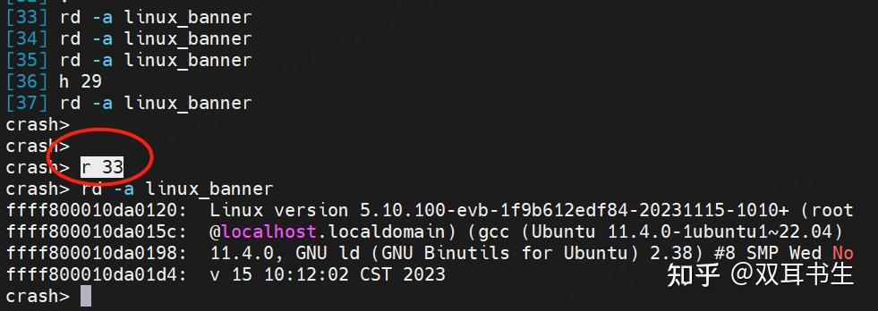
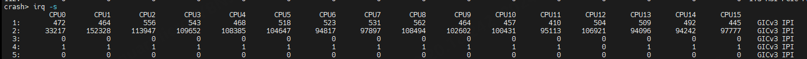
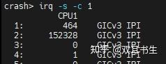
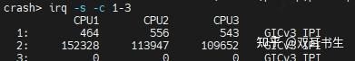

# crash 工具的使用

## crash 基本概念

### 启动crash

调试 crash dump文件

    crash /var/crash/vmlinux /var/crash/vmcore-zlib

vmlinux 文件需要是发生crash时运行的kernel。

  

调试 live system

    crash vmlinux

vmlinux 就是当前运行的内核，可通过 cat /proc/version 查看。

### command Input

打印历史命令

    h

重新执行历史命令的方式

1.  重新执行最后执行过的命令: r
2.  重新执行指定序号的命令： r
3.  通过键盘上、下键选中要执行的历史命令

### Crash context

这里的 context 即进程上下文。很多命令是 context 相关的，比如 files, vm, bt, sig, set, net, task 等，这些命令在指定 PID 或者 task 地址时，则输出指定 task 的内容，否则输出 current context 的内容。

  

current context 的选择根据启动 crash 命令时的场景不同而不同。

crash 调试dumpfiles 时:

-   The task that was running when `die()` was called.
-   The task that was running when `panic()` was called.
-   The task that was running when an ALT-SYSRQ-c keyboard interrupt was received.
-   The task that was running when the character "c" was echoed to `/proc/sysrq-trigger`.

  

crash 调试 live system时:

-   the `crash` task itself.

  

打印 current context

    crash> set
        PID: 0
    COMMAND: "swapper/17"
       TASK: ffff080080d45240  (1 of 18)  [THREAD_INFO: ffff080080d45240]
        CPU: 17
      STATE: TASK_RUNNING (PANIC)

  

Show the current state of crash internal variables

    crash> set -v
            scroll: on (/bin/more)
             radix: 10 (decimal)
           refresh: on
         print_max: 256
       print_array: off
           console: (not assigned)
             debug: 0
              core: off
              hash: on
            silent: off
              edit: vi
          namelist: vmlinux
          dumpfile: vmcore-zlib
            unwind: off
     zero_excluded: off
         null-stop: off
               gdb: off
             scope: 0 (not set)
           offline: show
           redzone: on
             error: default

更多关于 context 的内容参考 set 命令的说明。

## **crash 的常用命令详解**

crash 的所有命令可以分成4类：显示内核代码、数据的符号信息类命令，系统状态信息类，工具类，会话控制类命令。

最常用的 crash命令

    set     - set a new task context by pid, task address, or cpu.
    bt      - backtrace of the current context, or as specified with arguments.
    p       - print the contents of a kernel variable.
    rd      - read memory, which may be either kernel virtual, user virtual, or
              physical.
    ps      - simple process listing.
    log     - dump the kernel log_buf.
    struct  - print the contents of a structure at a specified address.
    foreach - execute a command on all tasks, or those specified, in the system.

## 符号信息类命令

这类命令借助 gdb 的强大功能，用于显示内核代码、数据的符号信息。

### struct

查看结构体的定义和大小

    crash> struct vm_area_struct
        struct vm_area_struct {
            struct mm_struct *vm_mm;
            long unsigned int vm_start;
            long unsigned int vm_end;
            struct vm_area_struct *vm_next;
            pgprot_t vm_page_prot;
            short unsigned int vm_flags;
            short int vm_avl_height;
            struct vm_area_struct *vm_avl_left;
            struct vm_area_struct *vm_avl_right;
            struct vm_area_struct *vm_next_share;
            struct vm_area_struct **vm_pprev_share;
            struct vm_operations_struct *vm_ops;
            long unsigned int vm_offset;
            struct file *vm_file;
            long unsigned int vm_pte;
        }
        SIZE: 56

如果输入一个命令不被 crash 识别，但它是内核的 变量，结构体，联合体，typedef 的名字，则 crash 会把该命令传递给 "p", "struct", "union", "whatis"。

因此可通过结构体名直接查看结构体的定义和大小

    crash> vm_area_struct
    struct vm_area_struct {
        unsigned long vm_start;
        unsigned long vm_end;
        struct vm_area_struct *vm_next;
        struct vm_area_struct *vm_prev;
        struct rb_node vm_rb;
        unsigned long rb_subtree_gap;
        struct mm_struct *vm_mm;
        pgprot_t vm_page_prot;
        unsigned long vm_flags;
        struct {
            struct rb_node rb;
            unsigned long rb_subtree_last;
        } shared;
        struct list_head anon_vma_chain;
        struct anon_vma *anon_vma;
        const struct vm_operations_struct *vm_ops;
        unsigned long vm_pgoff;
        struct file *vm_file;
        void *vm_private_data;
        atomic_long_t swap_readahead_info;
        struct vm_userfaultfd_ctx vm_userfaultfd_ctx;
    }
    SIZE: 0xb8

查看结构体成员的偏移

    crash> vm_area_struct -o
    struct vm_area_struct {
       [0x0] unsigned long vm_start;
       [0x8] unsigned long vm_end;
      [0x10] struct vm_area_struct *vm_next;
      [0x18] struct vm_area_struct *vm_prev;
      [0x20] struct rb_node vm_rb;
      [0x38] unsigned long rb_subtree_gap;
      [0x40] struct mm_struct *vm_mm;
      [0x48] pgprot_t vm_page_prot;
      [0x50] unsigned long vm_flags;
             struct {
                 struct rb_node rb;
                 unsigned long rb_subtree_last;
      [0x58] } shared;
      [0x78] struct list_head anon_vma_chain;
      [0x88] struct anon_vma *anon_vma;
      [0x90] const struct vm_operations_struct *vm_ops;
      [0x98] unsigned long vm_pgoff;
      [0xa0] struct file *vm_file;
      [0xa8] void *vm_private_data;
      [0xb0] atomic_long_t swap_readahead_info;
      [0xb8] struct vm_userfaultfd_ctx vm_userfaultfd_ctx;
    }
    SIZE: 0xb8

查看指定成员的偏移

    crash> mm_struct.pgd
    struct mm_struct {
       [0x40]     pgd_t *pgd;
    }

查看指定地址的结构体的值

    crash>struct vm_area_struct c1e44f10
        struct vm_area_struct {
          vm_mm = 0xc2857750,
          vm_start = 0x8048000, 
          vm_end = 0x80a5000, 
          vm_next = 0xc1e44a10,
          vm_page_prot = {
            pgprot = 0x25      
          },
          vm_flags = 0x1875,
          vm_avl_height = 0x2,   
          vm_avl_left = 0xc30fe200,
          vm_avl_right = 0xc30fed00,
          vm_next_share = 0x0,       
          vm_pprev_share = 0xc1e44a30,
          vm_ops = 0xc0215ca0,
          vm_offset = 0x0,       
          vm_file = 0xc0bfdc70,
          vm_pte = 0   
        }

查看指定地址的结构体的特定成员的值

    crash> struct mm_struct.pgd ffff810022e7d080
          pgd = 0xffff81000e3ac000

查看结构体指针成员指向的内存的内容，以十六进制显示

    crash> mm_struct.pgd ffff810022e7d080 -px
          pgd_t *pgd = 0xffff81000e3ac000
          -> {
               pgd = 0x2c0a6067
             }

查看结构体的多个成员的值

    crash> task_struct.state,stack ffff080080ccd240 -px
      state = 0x0,
      void *stack = 0xffff080080cd4000

查看结构体成员的VA

    crash> task_struct -o ffff080080ccd240
    struct task_struct {
      [ffff080080ccd240] struct thread_info thread_info;
      [ffff080080ccd258] volatile long state;
      [ffff080080ccd260] void *stack;
      [ffff080080ccd268] refcount_t usage;
      ...

通过结构体成员的地址查看结构体，ffff080080ccd600 为 task\_struct.rcu\_tasks\_holdout\_list 的地址

    crash> task_struct -l task_struct.rcu_tasks_holdout_list ffff080080ccd600
    struct task_struct {
      thread_info = {
        flags = 0x28,
        addr_limit = 0xffffffffffff,
        {
          preempt_count = 0x100010001,
          preempt = {
            count = 0x10001,
            need_resched = 0x1
          }
        }
      },
      ...

显示 per-cpu 全局变量

    crash> rcu_data
    PER-CPU DATA TYPE:
      struct rcu_data rcu_data;
    PER-CPU ADDRESSES:
      [0]: ffff080fb9791ec0
      [1]: ffff080fb97b5ec0
      [2]: ffff080fb97d9ec0
      [3]: ffff080fb97fdec0
      [4]: ffff080fb9821ec0
      ...

### union

union 的用法和 struct 的一样。

### p

打印内核变量的值，默认十进制输出。px以十六进制输出（p -x），pd 以十进制输出（p -d）。

    crash> p jiffies
    jiffies = $1 = 4299845467
    crash> px jiffies
    jiffies = $2 = 0x1004a6f5b
    crash> pd jiffies
    jiffies = $3 = 4299845467

打印结构体类型变量 vm\_area\_struct init\_mm

    crash> p init_mm
    init_mm = $4 = {
      {
        mmap = 0x0,
        mm_rb = {
          rb_node = 0x0
        },
        vmacache_seqnum = 0,
        ...

通过变量名直接 dump 内核变量

    crash> init_mm
    init_mm = $5 = {
      {
        mmap = 0x0,
        mm_rb = {
          rb_node = 0x0
        },
        vmacache_seqnum = 0,
        ...

打印 percpu 变量 irq\_stat 的类型以及地址

    crash> p irq_stat
    PER-CPU DATA TYPE:
      irq_cpustat_t irq_stat;
    PER-CPU ADDRESSES:
      [0]: ffff080fb9790900
      [1]: ffff080fb97b4900
      ...

打印指定cpu的 percpu变量

    crash> p irq_stat:1
    per_cpu(irq_stat, 1) = $6 = {
      __softirq_pending = 0
    }
    crash> p irq_stat:0
    per_cpu(irq_stat, 0) = $7 = {
      __softirq_pending = 0
    }

打印所有cpu的 percpu变量

    crash> p irq_stat:a
    per_cpu(irq_stat, 0) = $8 = {
      __softirq_pending = 0
    }
    per_cpu(irq_stat, 1) = $9 = {
      __softirq_pending = 0
    }
    per_cpu(irq_stat, 2) = $10 = {
      __softirq_pending = 0
    }
    ...

### whatis

查看结构体的定义

    crash> whatis linux_binfmt
    struct linux_binfmt {
        struct list_head lh;
        struct module *module;
        int (*load_binary)(struct linux_binprm *);
        int (*load_shlib)(struct file *);
        int (*core_dump)(struct coredump_params *);
        unsigned long min_coredump;
    }
    SIZE: 56

查看结构体的定义和对应偏移

    crash> whatis -o linux_binfmt
    struct linux_binfmt {
       [0] struct list_head lh;
      [16] struct module *module;
      [24] int (*load_binary)(struct linux_binprm *);
      [32] int (*load_shlib)(struct file *);
      [40] int (*core_dump)(struct coredump_params *);
      [48] unsigned long min_coredump;
    }
    SIZE: 56

查看变量的类型、定义

    crash> whatis cpu_bit_bitmap
    const unsigned long cpu_bit_bitmap[65][1];
    
    # 实际定义
    extern const unsigned long
        cpu_bit_bitmap[BITS_PER_LONG+1][BITS_TO_LONGS(NR_CPUS)];

​    
    crash> whatis jiffies
    volatile unsigned long jiffies;

查看函数的类型、定义

    crash> whatis ksys_read
    ssize_t ksys_read(unsigned int, char *, size_t);

查看 typedef 类型的定义

    crash> whatis dev_t
    typedef unsigned int dev_t;
    SIZE: 4
    crash> whatis bpf_user_pt_regs_t
    typedef struct user_pt_regs {
        __u64 regs[31];
        __u64 sp;
        __u64 pc;
        __u64 pstate;
    } bpf_user_pt_regs_t;

既然有 typedef struct user\_pt\_regs bpf\_user\_pt\_regs\_t; 那么 whatis user\_pt\_regs 和 whatis bpf\_user\_pt\_regs\_t 输出是一样的。

查看包含指向 struct mm\_struct 类型的所有结构体

    crash> whatis -m mm_struct
     SIZE  TYPE
       24  map_info
       24  ptdump_info
       24  trace_event_raw_mm_collapse_huge_page
       32  delayed_uprobe
       32  proc_maps_private
       32  stack_map_irq_work
        ...

这里的 mm\_struct 是结构体成员的类型，可以是指针类型，也可以是直接内嵌的非指针类型。注意不是结构体的成员名

    struct rq {
        struct rt_rq rt;
        struct dl_rq dl;
        struct mm_struct *prev_mm;
        ...
    };

查看大小为 192的所有结构体

    crash> whatis -r 192
    SIZE  TYPE
     192  anon_vma
     192  arm_smmu_priq
     192  arm_smmu_queue
     192  autofs_info
     ...

查看大小在\[256, 512\], 同时包含成员类型为 task\_struct 的所有结构体

    crash> whatis -r 256-512 -m task_struct
    SIZE  TYPE
     280  ata_host
     296  rcu_tasks
     312  ib_cq
     320  rdma_counter
     320  shmid_kernel
     408  elf_thread_core_info
    ...

### sym

打印符号表

    crash> sym -l
    ffff800010110000 (t) .head.text
    ffff800010110000 (t) __efistub__text
    ffff800010110000 (t) _head
    ffff800010110000 (T) _text
    ffff800010110040 (t) pe_header
    ffff800010110044 (t) coff_header
    ...

查看符号对应的地址VA

    crash> sym jiffies
    ffff800011a4b180 (D) jiffies

根据 VA 找符号

    crash> sym ffff800011a4b180
    ffff800011a4b180 (D) jiffies

根据代码段VA 找对应函数的源码文件和代码行

    crash> sym ffff8000101fdb44
    ffff8000101fdb44 (t) rcu_do_batch+484 /m/kernel-linux-5.10-back/kernel/rcu/tree.c: 2481

在符号表中找包含 pipe 字符串的符号

    crash> sym -q pipe
    ffff80001015ea54 (t) do_proc_dopipe_max_size_conv
    ffff800010160940 (t) proc_dopipe_max_size
    ffff800010277970 (t) relay_pipe_buf_release
    ffff800010407c10 (T) pipe_lock
    ffff800010407c40 (T) pipe_unlock
    ...

查看模块 virtio\_net 的符号表

    crash> sym -m virtio_net
    ffff800008df6000 MODULE START: virtio_net
    ffff800008df6000 (t) virtnet_stats
    ffff800008df60b0 (t) virtnet_get_sset_count
    ffff800008df60e0 (t) virtnet_get_ethtool_stats
    ...
    ffff800008e01de8 (?) __key.130
    ffff800008e04000 MODULE END: virtio_net

可通过 mod 命令查看 insmod 的模块。

当模块的符号找不到时，需要通过 mod 命令加载对于模块的 debug data.

    crash> sym -m uart401
        c8032000 MODULE START: uart401
        c8032138 (?) uart401intr  
        c803235c (?) attach_uart401  
        c8032638 (?) probe_uart401  
        c80326d4 (?) unload_uart401  
        c8033770 MODULE END: uart401
    
    crash> mod -s uart401
         MODULE   NAME         SIZE  OBJECT FILE
        c8032000  uart401      6000  /lib/modules/2.2.14/misc/uart401.o
    
    crash> sym -m uart401
        c8032000 MODULE START: uart401
        c8032050 (t) my_notifier_call  
        c8032084 (t) uart401_status  
        c8032098 (t) uart401_cmd

显示 jiffies 符号以及它的前一个、后一个符号。

    crash> sym -pn jiffies
    ffff800011a46180 (d) bit_wait_table
    ffff800011a4b180 (D) jiffies
    ffff800011a4b1c0 (D) jiffies_seq

### dis

反汇编 rcu\_do\_batch 函数

    crash> dis rcu_do_batch
    0xffff8000101fd960 <rcu_do_batch>:      mov     x9, x30
    0xffff8000101fd964 <rcu_do_batch+4>:    nop
    0xffff8000101fd968 <rcu_do_batch+8>:    stp     x29, x30, [sp, #-208]!
    0xffff8000101fd96c <rcu_do_batch+12>:   mrs     x1, sp_el0
    0xffff8000101fd970 <rcu_do_batch+16>:   mov     x29, sp
    0xffff8000101fd974 <rcu_do_batch+20>:   stp     x23, x24, [sp, #48]
    0xffff8000101fd978 <rcu_do_batch+24>:   mov     x23, x0
    0xffff8000101fd97c <rcu_do_batch+28>:   stp     x19, x20, [sp, #16]
    0xffff8000101fd980 <rcu_do_batch+32>:   stp     x21, x22, [sp, #32]
    0xffff8000101fd984 <rcu_do_batch+36>:   add     x22, sp, #0xb0

反汇编 rcu\_do\_batch 函数，带源码行信息

    crash> dis -l rcu_do_batch
    /m/kernel-linux-5.10-back/kernel/rcu/tree.c: 2426
    0xffff8000101fd960 <rcu_do_batch>:      mov     x9, x30
    0xffff8000101fd964 <rcu_do_batch+4>:    nop
    0xffff8000101fd968 <rcu_do_batch+8>:    stp     x29, x30, [sp, #-208]!
    0xffff8000101fd96c <rcu_do_batch+12>:   mrs     x1, sp_el0
    0xffff8000101fd970 <rcu_do_batch+16>:   mov     x29, sp
    0xffff8000101fd974 <rcu_do_batch+20>:   stp     x23, x24, [sp, #48]
    0xffff8000101fd978 <rcu_do_batch+24>:   mov     x23, x0
    0xffff8000101fd97c <rcu_do_batch+28>:   stp     x19, x20, [sp, #16]
    0xffff8000101fd980 <rcu_do_batch+32>:   stp     x21, x22, [sp, #32]
    /m/kernel-linux-5.10-back/kernel/rcu/tree.c: 2432
    0xffff8000101fd984 <rcu_do_batch+36>:   add     x22, sp, #0xb0

从指定地址（ rcu\_do\_batch 函数的地址+20）往前反汇编，直到函数的结束位置。

    crash> dis -f (rcu_do_batch+20)
    0xffff8000101fd974 <rcu_do_batch+20>:   stp     x23, x24, [sp, #48]
    0xffff8000101fd978 <rcu_do_batch+24>:   mov     x23, x0
    0xffff8000101fd97c <rcu_do_batch+28>:   stp     x19, x20, [sp, #16]
    0xffff8000101fd980 <rcu_do_batch+32>:   stp     x21, x22, [sp, #32]
    0xffff8000101fd984 <rcu_do_batch+36>:   add     x22, sp, #0xb0
    0xffff8000101fd988 <rcu_do_batch+40>:   ldr     x0, [x1, #1304]
    ...

从指定地址（ rcu\_do\_batch 函数的地址+20）往后反汇编，直到函数的开始位置。

    crash> dis -r (rcu_do_batch+20)
    0xffff8000101fd960 <rcu_do_batch>:      mov     x9, x30
    0xffff8000101fd964 <rcu_do_batch+4>:    nop
    0xffff8000101fd968 <rcu_do_batch+8>:    stp     x29, x30, [sp, #-208]!
    0xffff8000101fd96c <rcu_do_batch+12>:   mrs     x1, sp_el0
    0xffff8000101fd970 <rcu_do_batch+16>:   mov     x29, sp
    0xffff8000101fd974 <rcu_do_batch+20>:   stp     x23, x24, [sp, #48]

反汇编用户空间地址为 0x81ec624 开始的10条指令

    crash> dis -u 81ec624 10
        0x81ec624:      push   %ebp
        0x81ec625:      mov    %esp,%ebp
        0x81ec627:      sub    $0x18,%esp
        0x81ec62a:      movl   $0x1,0x8(%ebp)
        0x81ec631:      mov    0x82f9040,%eax
        0x81ec636:      mov    0x10(%eax),%edx
        0x81ec639:      and    $0x100,%edx
        0x81ec63f:      mov    0x14(%eax),%ecx
        0x81ec642:      and    $0x0,%ecx
        0x81ec645:      mov    %ecx,%eax

反汇编 rcu\_do\_batch 函数，以十六进制输出

    crash> dis -x rcu_do_batch
    0xffff8000101fd960 <rcu_do_batch>:      mov     x9, x30
    0xffff8000101fd964 <rcu_do_batch+0x4>:  nop
    0xffff8000101fd968 <rcu_do_batch+0x8>:  stp     x29, x30, [sp, #-208]!
    0xffff8000101fd96c <rcu_do_batch+0xc>:  mrs     x1, sp_el0
    ...

显示 mmput 函数的源码

    crash> dis -s mmput
        FILE: kernel/fork.c
        LINE: 617
    
          612   
          613   /*
          614    * Decrement the use count and release all resources for an mm.
          615    */
          616   void mmput(struct mm_struct *mm)
        * 617   {
          618           might_sleep();
          619   
          620           if (atomic_dec_and_test(&mm->mm_users)) {
          621                   uprobe_clear_state(mm);
          622                   exit_aio(mm);
          ...

反汇编指定的地址的代码

    crash> dis 0xffff8000101fd960
    0xffff8000101fd960 <rcu_do_batch>:      mov     x9, x30
    0xffff8000101fd964 <rcu_do_batch+4>:    nop
    0xffff8000101fd968 <rcu_do_batch+8>:    stp     x29, x30, [sp, #-208]!
    0xffff8000101fd96c <rcu_do_batch+12>:   mrs     x1, sp_el0
    ...

## 系统状态信息类

### bt

显示 current context的 stack trace, 包括当前进程的 bt 和 当前 cpu 的 bt

    crash> bt
    PID: 0      TASK: ffff080080d45240  CPU: 17  COMMAND: "swapper/17"
     #0 [ffff080fb99f4300] crash_kexec at ffff80001023f374
     #1 [ffff080fb99f4330] die at ffff80001012e524
     #2 [ffff080fb99f43e0] die_kernel_fault at ffff800010145518
     #3 [ffff080fb99f4410] __do_kernel_fault at ffff800010145848
     #4 [ffff080fb99f4450] do_page_fault at ffff800010d8d9e4
    ...
    --- <IRQ stack> ---
    #18 [ffff080080d4ff00] el1_irq at ffff800010122284
    #19 [ffff080080d4ff20] arch_cpu_idle at ffff800010d7d914
    #20 [ffff080080d4ff30] default_idle_call at ffff800010d8ad20
    #21 [ffff080080d4ff50] do_idle at ffff80001019b9fc

同上，差别是显示了发生调用时的函数的偏移量，且偏移量以十六进制输出

    crash> bt -sx
    PID: 0      TASK: ffff080080d45240  CPU: 17  COMMAND: "swapper/17"
     #0 [ffff080fb99f4300] crash_kexec+0x74 at ffff80001023f374
     #1 [ffff080fb99f4330] die+0x1f4 at ffff80001012e524
     #2 [ffff080fb99f43e0] die_kernel_fault+0x64 at ffff800010145518
     #3 [ffff080fb99f4410] __do_kernel_fault+0x134 at ffff800010145848

显示每个 cpu 上的 active task 的 stack trace, -a 选项只适用于 crash 分析，不适用于 live system

    bt -a

显示特定进程的 stack trace，通过指定 pid

    crash> bt 10 11
    PID: 10     TASK: ffff080080bd8040  CPU: 0   COMMAND: "rcu_tasks_rude_"
     #0 [ffff080080bd7ce0] __switch_to at ffff8000101276a8
     #1 [ffff080080bd7d00] __schedule at ffff800010d83f04
     #2 [ffff080080bd7d90] schedule at ffff800010d84630
     #3 [ffff080080bd7db0] rcu_tasks_kthread at ffff8000101f341c
     #4 [ffff080080bd7e50] kthread at ffff8000101818b8
    
    PID: 11     TASK: ffff080080bdd240  CPU: 0   COMMAND: "rcu_tasks_trace"
     #0 [ffff080080be3ce0] __switch_to at ffff8000101276a8
     #1 [ffff080080be3d00] __schedule at ffff800010d83f04
     #2 [ffff080080be3d90] schedule at ffff800010d84630
     #3 [ffff080080be3db0] rcu_tasks_kthread at ffff8000101f341c
     #4 [ffff080080be3e50] kthread at ffff8000101818b8

显示特定进程的 stack trace，通过指定 task\_struct 的地址

    crash> bt ffff0800b266a940
    PID: 567    TASK: ffff0800b266a940  CPU: 1   COMMAND: "vdev_pt_tlp"
     #0 [ffff080fb97b4680] crash_save_cpu at ffff80001023f6dc
     #1 [ffff080fb97b4830] ipi_handler at ffff800010135010
     ...

显示cpu 1上 active 进程的 stack trace

    crash> bt -c 1
    PID: 567    TASK: ffff0800b266a940  CPU: 1   COMMAND: "vdev_pt_tlp"
     #0 [ffff080fb97b4680] crash_save_cpu at ffff80001023f6dc
     #1 [ffff080fb97b4830] ipi_handler at ffff800010135010
     #2 [ffff080fb97b4880] handle_percpu_devid_fasteoi_ipi at ffff8000101e9ee4
    ...

显示cpu 0 和 1 上 active 进程的 stack trace

    crash> bt -c 0,1

显示 current context的 stack trace, 加 -f 会显示每个栈帧中具体内容，加-s 会显示发生调用时的函数的偏移量

    crash> bt -f -sx
    PID: 0      TASK: ffff080080d45240  CPU: 17  COMMAND: "swapper/17"
     #0 [ffff080fb99f4300] crash_kexec+0x74 at ffff80001023f374
        ffff080fb99f4300: ffff080fb99f4330 ffff80001012e528
        ffff080fb99f4310: ffff800011a5dbd8 ffff080fb99f43c7
        ffff080fb99f4320: 0000000000000000 000000000000000f
     #1 [ffff080fb99f4330] die+0x1f4 at ffff80001012e524
        ffff080fb99f4330: ffff080fb99f43e0 ffff80001014551c
        ffff080fb99f4340: 0000000096000004 00000000000819d8
        ffff080fb99f4350: ffff080fb99f4530 ffff80001141fc08
        ffff080fb99f4360: 0000000062000009 000000000000000a
        ffff080fb99f4370: 0000000000080800 ffff0800b0698040
        ffff080fb99f4380: ffff8000101fdb24 0000000000000002
        ffff080fb99f4390: 0000000000000001 f948ef2100000000
        ffff080fb99f43a0: 30303832359f43e0 3038323520343030
        ffff080fb99f43b0: 3832352033343030 3739203230303030
        ffff080fb99f43c0: 2820356338336666 3132666538343966
        ffff080fb99f43d0: 0000000062002029 b3b5105979d77e00
     #2 [ffff080fb99f43e0] die_kernel_fault+0x64 at ffff800010145518
        ffff080fb99f43e0: ffff080fb99f4410 ffff80001014584c
    ...

backtrace 解析如下：

1.  die\_kernel\_fault 函数在 0xffff800010145518 位置（die\_kernel\_fault+0x64）调用了 die 函数
2.  0xffff800010145518 : bl 0xffff80001012e330
3.  die 函数在 0xffff80001012e524 位置（die+0x1f4）调用了 crash\_kexec 函数
4.  0xffff80001012e524 : bl 0xffff80001023f300
5.  crash\_kexec 函数在 0xffff80001023f374 位置（crash\_kexec+0x74）调用了 \_\_crash\_kexec 函数
6.  0xffff80001023f374 : bl 0xffff80001023f1e0 <\_\_crash\_kexec>

根据栈帧中的数据，可看出函数参数的值。

显示 current context的 stack trace

    crash> bt -F
    PID: 0      TASK: ffff080080d45240  CPU: 17  COMMAND: "swapper/17"
     #0 [ffff080fb99f4300] crash_kexec at ffff80001023f374
        ffff080fb99f4300: ffff080fb99f4330 die+0x1f8
        ffff080fb99f4310: rs.1             ffff080fb99f43c7
        ffff080fb99f4320: 0000000000000000 000000000000000f
     #1 [ffff080fb99f4330] die at ffff80001012e524
        ffff080fb99f4330: ffff080fb99f43e0 die_kernel_fault+0x68
        ffff080fb99f4340: 0000000096000004 00000000000819d8
        ffff080fb99f4350: ffff080fb99f4530 kallsyms_token_index+0x68d0
        ffff080fb99f4360: 0000000062000009 000000000000000a
        ffff080fb99f4370: 0000000000080800 [filp]
        ...

\-F 类似 -f, 在显示栈中内容时，会显示符号信息。如果符号是 slab cache object，则会在方括号中显示 slab 名。

\-FF 类似 -F, 如果符号是 slab cache object，则会在方括号中同时显示地址和 slab 名。

查看 current context 的 cpu 上是否有 exception 栈

    crash> bt -e

这里的 exception 栈指的是广义的 exception, 包括 kernel-mode irq，user-mode system call 等。

检查所有进程的内核栈是否存在溢出

    crash> bt -v
    No stack overflows detected

### devs

显示所有字符设备和块设备

    crash> dev
    CHRDEV    NAME                 CDEV        OPERATIONS
    #主设备号  设备名           struct cdev 的地址  file_operations变量
       1      mem            ffff080080fc6c00  memory_fops
       2      pty            ffff0800a15e8800  tty_fops
       ...

显示pci总线和设备

    crash> dev -p
        ROOT BUS     BUSNAME
    #struct pci_bus的地址  domain:bus_num    
    ffff0800a1256800 0000:00
          PCI DEV      DO:BU:SL.FN  CLASS   PCI_ID      TYPE
      # struct pci_dev的地址
      ffff0800a10b0000 0000:00:00.0  0604   1f53:0   ROOT_PORT [BRIDGE]
          PCI BUS         PARENT BUS
      ffff0800a1257800 ffff0800a1256800
          PCI DEV      DO:BU:SL.FN  CLASS   PCI_ID      TYPE
      ffff0800a10b0000 0000:00:00.0  0604   1f53:0   ROOT_PORT [BRIDGE]
    ...

显示 I/O 资源和 mem 资源，类似 cat /proc/ioports 和 /proc/iomem

    crash> dev -i
        RESOURCE            RANGE        NAME
    #struct resource的地址
    ffff8000118cac88  00000000-00ffffff  PCI IO
    ffff0800a12d5520  00000000-0000ffff  PCI Bus 0000:40
    ffff0800a10b19b8  00001000-00001fff  PCI Bus 0000:41
    
        RESOURCE            RANGE        NAME
    ffff8000118cace8  00000000-ffffffffffffffff  PCI mem
    ffff0807fc2ef480  00000000-13347fff  System RAM
    ...

显示 disk I/O 的统计信息

    crash> dev -d
    MAJOR GENDISK            NAME       REQUEST_QUEUE      TOTAL ASYNC  SYNC
        8 ffff0800a1149000   sda        ffff0800a6a60000      64     0    64

显示 device dump，需要 vmcore文件中包含 device dump TODO

    crash> dev -V
        INDEX  OFFSET             SIZE             NAME
          0    0x240              33558464         cxgb4_0000:02:00.4
          1    0x2001240          33558464         cxgb4_0000:03:00.4

### files

显示current context 打开的文件列表

    crash> files
    PID: 4555   TASK: ffff0800a46e6000  CPU: 4   COMMAND: "fio"
    ROOT: /    CWD: /mnt/sda5/
     FD       FILE            DENTRY           INODE       TYPE PATH
    #fd struct file地址   struct dentry地址 struct inode地址
      0 ffff0800a6d51b00 ffff08008056c000 ffff0800a12a0060 CHR  /dev/ttyAMA0
      1 ffff0800a6d51b00 ffff08008056c000 ffff0800a12a0060 CHR  /dev/ttyAMA0
      2 ffff0800a6d51b00 ffff08008056c000 ffff0800a12a0060 CHR  /dev/ttyAMA0
      3 ffff0800a7273000 ffff0800a76405b0 ffff0800a65fde00 FIFO
      4 ffff0800a7273c00 ffff0800a76405b0 ffff0800a65fde00 FIFO
      5 ffff0800a9752200 ffff0800a5fef6c0 ffff0800a1d7de00 UNKN [timerfd]
      6 ffff0800a5864a00 ffff080080585520 ffff0800bc0228d0 REG  /mnt/sda5/data
      7 ffff0800a301da00 ffff080080585520 ffff0800bc0228d0 REG  /mnt/sda5/data

通过指定 PID 或者 taskp 可查看特定进程的打开文件列表

打印出有打开filename="/dev/ttyAMA0" 所有进程

    crash> foreach files -R /dev/ttyAMA0
    PID: 4334   TASK: ffff0800a3cbc000  CPU: 7   COMMAND: "bash"
    ROOT: /    CWD: /mnt/sda5/
     FD       FILE            DENTRY           INODE       TYPE PATH
      0 ffff0800a6d51b00 ffff08008056c000 ffff0800a12a0060 CHR  /dev/ttyAMA0
      1 ffff0800a6d51b00 ffff08008056c000 ffff0800a12a0060 CHR  /dev/ttyAMA0
    ...

这里 foreach 是遍历所有的进程。-R 指定打开文件的搜索条件，还可以是：fd, dentry, inode, address\_space, or file structure address

打印出地址 ffff080080585520 处的 struct dentry 信息。

    crash> files -d ffff080080585520
         DENTRY           INODE           SUPERBLK     TYPE PATH
    #struct dentry地址 struct inode地址  struct super_block地址
    ffff080080585520 ffff0800bc0228d0 ffff0800a7c2d800 REG  /mnt/sda5/data

显示current context 所有打开文件的相关结构体的地址

    crash> files -c
    PID: 4555   TASK: ffff0800a46e6000  CPU: 4   COMMAND: "fio"
    ROOT: /    CWD: /mnt/sda5/
     FD      INODE          I_MAPPING     NRPAGES TYPE PATH
      0 ffff0800a12a0060 ffff0800a12a01d8       0 CHR  /dev/ttyAMA0
      1 ffff0800a12a0060 ffff0800a12a01d8       0 CHR  /dev/ttyAMA0

I\_MAPPING 列来自 inode结构体的 i\_mapping 成员，它是 struct address\_space 类型的指针

NRPAGES 列表示该 inode 表示的文件它有多少个page 已经在缓存在 page cache中。

显示地址 f59b90fc 处的 struct inode 它指向的文件在 page cache 中页信息

    crash> files -p f59b90fc
         INODE    NRPAGES
        f59b90fc        6
    
          PAGE    PHYSICAL   MAPPING   INDEX CNT FLAGS
        ca3353e0  39a9f000  f59b91ac        0  2 82c referenced,uptodate,lru,private
        ca22cb20  31659000  f59b91ac        1  2 82c referenced,uptodate,lru,private
        ca220160  3100b000  f59b91ac        2  2 82c referenced,uptodate,lru,private
        ca1ddde0  2eeef000  f59b91ac        3  2 82c referenced,uptodate,lru,private
        ca36b300  3b598000  f59b91ac        4  2 82c referenced,uptodate,lru,private
        ca202680  30134000  f59b91ac        5  2 82c referenced,uptodate,lru,private

### fuser

fuser (file user) 命令主要用于列出有使用特定文件所有进程。

    fuser [pathname | inode]

进程使用文件的方式包括：

1.  作为当前工作目录
2.  作为根目录
3.  有打开过该文件
4.  有 mmap 过该文件

    crash> fuser /mnt/sda5/data
     PID         TASK        COMM             USAGE
     4538  ffff0800a4499000  "fio"            fd
     4539  ffff0800a3d24000  "fio"            fd

### irq

列出系统中已经注册的所有 irq 信息

    crash> irq
     IRQ   IRQ_DESC/_DATA      IRQACTION      NAME
    #virq  struct irq_desc 的地址
    #                       struct irqaction地址
      0       (unused)          (unused)
      1   ffff080080023e00  ffff08008003ff00  "IPI"
      2   ffff080080154000  ffff08008003ff80  "IPI"

查看 virq=13 的 irq 信息

    crash> irq 13
     IRQ   IRQ_DESC/_DATA      IRQACTION      NAME
     13   ffff0800a104d400  ffff0800a8026980  "uart-pl011"

打印中断 bottom half data

    crash> irq -b
    SOFTIRQ_VEC      ACTION
        [0]     ffff800010208188  <tasklet_hi_action>
        [1]     ffff8000102a2da8  <run_timer_softirq>
        [2]     ffff800010b1d220  <net_tx_action>
        [3]     ffff800010b22400  <net_rx_action>
        [4]     ffff800010628cb8  <blk_done_softirq>
        [5]     ffff80001068e030  <irq_poll_softirq>
        [6]     ffff8000102081c0  <tasklet_action>
        [7]     ffff800010249a98  <run_rebalance_domains>
        [8]     ffff8000102a5528  <hrtimer_run_softirq>
        [9]     ffff80001028e350  <rcu_core_si>

这里主要是打印 softirq\_vec 数组的值。

    struct softirq_action softirq_vec[10];
    struct softirq_action {
        void (*action)(struct softirq_action *);
    }

列出系统中已经注册的所有 irq 的 affinity 信息

    crash> irq -a
    IRQ NAME                 AFFINITY
      1 IPI                  0-15
      2 IPI                  0-15

查看中断在所有cpu 上的统计计数

  

查看中断在指定 cpu 上的统计计数

  

  

### kmem

kmem (kernel memory) 命令用于查看 kernel 内存子系统中关键信息。

    kmem [-f|-F|-c|-C|-i|-v|-V|-n|-z|-o|-h] [-p | -m member[,member]]
           [[-s|-S|-S=cpu[s]|-r] [slab] [-I slab[,slab]]] [-g [flags]] [[-P] address]]

查看内存的基本使用情况

    crash> kmem -i
                     PAGES        TOTAL      PERCENTAGE
        TOTAL MEM  7659051      29.2 GB         ----
             FREE  7368850      28.1 GB   96% of TOTAL MEM
             USED   290201       1.1 GB    3% of TOTAL MEM
           SHARED    44616     174.3 MB    0% of TOTAL MEM
          BUFFERS    21766        85 MB    0% of TOTAL MEM
           CACHED    76454     298.6 MB    0% of TOTAL MEM
             SLAB     8275      32.3 MB    0% of TOTAL MEM
    
       TOTAL HUGE        0            0         ----
       HUGE FREE        0            0    0% of TOTAL HUGE
    
       TOTAL SWAP        0            0         ----
        SWAP USED        0            0    0% of TOTAL SWAP
        SWAP FREE        0            0    0% of TOTAL SWAP
    
     COMMIT LIMIT  3829525      14.6 GB         ----
        COMMITTED    67226     262.6 MB    1% of TOTAL LIMIT

查看系统支持哪些 zones, 以 UMA 机器为例

    crash> p contig_page_data.node_zones |grep name
        name = 0xffff800010fe2fb0 "DMA",
        name = 0xffff800010f65e08 "DMA32",
        name = 0xffff800010f45b20 "Normal",
        name = 0xffff800010f65e10 "Movable",

如果有定义 CONFIG\_NUMA 的话，节点信息存储在 node\_data 数组中，否认在 contig\_page\_data 变量中。

struct pglist\_data \*node\_data\[\]

struct pglist\_data contig\_page\_data

当然用 zone\_type 更加方便。

    crash> enum zone_type
    enum zone_type {
      ZONE_DMA = 0
      ZONE_DMA32 = 1
      ZONE_NORMAL = 2
      ZONE_MOVABLE = 3
      __MAX_NR_ZONES = 4
    };

查看伙伴系统中空闲内存情况

    crash> kmem -f
    ZONE  NAME        SIZE    FREE      MEM_MAP       START_PADDR  START_MAPNR
    #          该zone总page数  该zone空闲page数 
      0   DMA       1048576   76212  fffffdffffe00000       0            0
    AREA    SIZE  FREE_AREA_STRUCT  BLOCKS  PAGES
      0       4k  ffff800011a46440       0      0
      0       4k  ffff800011a46450       6      6
      0       4k  ffff800011a46460       0      0
      0       4k  ffff800011a46470       0      0
      0       4k  ffff800011a46480       2      2
      0       4k  ffff800011a46490       0      0
      1       8k  ffff800011a464a8       0      0
      1       8k  ffff800011a464b8       8     16=8*2^1,order=1,migratetype=MOVABLE
      1       8k  ffff800011a464c8       0      0
      1       8k  ffff800011a464d8       0      0
      1       8k  ffff800011a464e8       0      0
      1       8k  ffff800011a464f8       0      0

该命令显示了伙伴系统中各个zone 的各个 order 的页的空闲情况。

AREA 列为对应 order的 free\_area。

SIZE 列为 block size = PAGE\_SIZE \* 2^order,

BLOCKS 列为该 order 该 migratetype 上的空闲 block 数。

    struct zone { //include\linux\mmzone.h
        struct free_area    free_area[MAX_ORDER];
    };
    
    struct free_area {
        struct list_head    free_list[MIGRATE_TYPES];
        unsigned long       nr_free;//该order总共有多少个空闲的 blocks。
                                   //转化为 nr_pages=blocks*2^order
    };

查看当前系统支持的 migrate types

    crash> enum migratetype
    enum migratetype {
      MIGRATE_UNMOVABLE = 0
      MIGRATE_MOVABLE = 1
      MIGRATE_RECLAIMABLE = 2
      MIGRATE_PCPTYPES = 3
      MIGRATE_HIGHATOMIC = 3
      MIGRATE_CMA = 4
      MIGRATE_ISOLATE = 5
      MIGRATE_TYPES = 6
    };

migratetype\_names 为对应名字

    crash> migratetype_names
    migratetype_names = $6 =
     {0xffff800010f6b600 "Unmovable", 0xffff800010f65e10 "Movable", 0xffff800010f6b610 "Reclaimable", 0xffff800010f6b620 "HighAtomic", 0xffff800010f6b630 "CMA", 0xffff800010f6b638 "Isolate"}

类似 kmem -f, 同时会显示每个空闲block 的起始 struct page 地址

    crash> kmem -F
    ZONE  NAME        SIZE    FREE      MEM_MAP       START_PADDR  START_MAPNR
      0   DMA       1048576   76212  fffffdffffe00000       0            0
    AREA    SIZE  FREE_AREA_STRUCT
      0       4k  ffff800011a46440
    AREA    SIZE  FREE_AREA_STRUCT
      0       4k  ffff800011a46450
    fffffe00001a4440
    fffffe0000204a40
    fffffe00002af440
    fffffe00002b7500
    fffffe00002f1880
    fffffe00003e4cc0

打印 mem\_map\[\]，其中放的是 struct page 的地址

    crash> kmem -p
          PAGE          PHYSICAL      MAPPING       INDEX CNT FLAGS
    #                               page.mapping    page.index page._count page.flags
    fffffdffffe00000           0                0        0  0 0
    fffffdffffe00040        1000                0        0  0 0

类似 kmem -p, 但是可指定输出 page 的成员

    crash> kmem -m lru
          PAGE        lru
    #                 page.lru.next    page.lru.prev
    fffffdffffe00000  fffffdffffe10008,fffffe00001b0008
    fffffdffffe00040  fffffdffffe00048,fffffdffffe00048
    crash> kmem -s
    CACHE             OBJSIZE  ALLOCATED     TOTAL  SLABS  SSIZE  NAME
    #struct kmem_cache object_size                                          # kmem_cache.name
    ffff0800a6a34100      144       1533      1540     55     4k  ext4_groupinfo_4k
    ffff0800a82f6000      672         13        46      1    32k  rpc_inode_cache

TODO 结合 mm 来看

### log

打印 crash 前内核的日志

    log

该命令打印 crash 时 kernel log\_buff 中记录的 log，不是当前启动内核的 log。log\_buf 的定义如下。

    // kernel\printk\printk.c
    #define __LOG_BUF_LEN (1 << CONFIG_LOG_BUF_SHIFT)
    static char __log_buf[__LOG_BUF_LEN];
    static char *log_buf = __log_buf;
    static u32 log_buf_len = __LOG_BUF_LEN;

类似log, 但会在每个 log message前显示log level前缀

    crash> log -m
    [    0.000000] <6>Booting Linux on physical CPU 0x0000000000 [0x410fd493]
    [    0.000000] <5>Linux version 5.10.134_jmnd1.2+ (root@localhost.localdomain) (gcc (GCC) 8.5.0 20210514 (Anolis 8.5.0-18.0.4), GNU ld version 2.30-119.0.2.an8.2) #2 SMP Wed Jan 24 09:14:24 CST 2024

在 log message 后增加 SUBSYSTEM、DEVICE两个键值对

    [    2.207433] acpi PNP0A08:00: _OSC: OS supports [ExtendedConfig ASPM ClockPM Segments MSI EDR HPX-Type3]
                   SUBSYSTEM=acpi
                   DEVICE=+acpi:PNP0A08:00
    [    2.216813] acpi PNP0A08:00: _OSC failed (AE_NOT_FOUND); disabling ASPM
                   SUBSYSTEM=acpi
                   DEVICE=+acpi:PNP0A08:00

以墙时间为时间戳显示log

    crash> log -T
    [Sun Feb  4 20:26:28 CST 2024] Booting Linux on physical CPU 0x0000000000 [0x410fd493]
    [Sun Feb  4 20:26:28 CST 2024] Linux version 5.10.134_jmnd1.2+ (root@localhost.localdomain) (gcc (GCC) 8.5.0 20210514 (Anolis 8.5.0-18.0.4), GNU ld version 2.30-119.0.2.an8.2) #2 SMP Wed Jan 24 09:14:24 CST 2024

### mach

显示机器相关的配置信息

    crash> mach
           MACHINE TYPE: aarch64
            MEMORY SIZE: 30.4 GB
                   CPUS: 16
                     HZ: 1000
              PAGE SIZE: 4096
    KERNEL VIRTUAL BASE: ffff000000000000
    KERNEL MODULES BASE: ffff800008000000
    KERNEL VMALLOC BASE: ffff800010000000
    KERNEL VMEMMAP BASE: fffffdffffe00000
      KERNEL STACK SIZE: 16384
         IRQ STACK SIZE: 16384
             IRQ STACKS:
                  CPU 0: ffff0807dd7d4440  # per cpu 中断栈基地址
                  CPU 1: ffff0807dd7f8440

Arm64 目前支持这个命令，x86, x86\_64 支持更多的选项。

### mod

显示当前安装的模块，按地址排序。

    crash> mod
         MODULE       NAME              BASE          SIZE  OBJECT FILE
    ffff800008da7500  phylink     ffff800008da0000   45056  (not loaded)  [CONFIG_KALLSYMS]
    ffff800008db2540  jmuio       ffff800008dac000   36864  (not loaded)  [CONFIG_KALLSYMS]
    ffff800008db8180  jmcore      ffff800008db6000   16384  (not loaded)  [CONFIG_KALLSYMS]
    ffff800008dd2800  macb        ffff800008dc4000   69632  (not loaded)  [CONFIG_KALLSYMS]
    ffff800008e01980  virtio_net  ffff800008df6000   57344  (not loaded)  [CONFIG_KALLSYMS]
    ...

查看所有模块的 debug data, 包括模块加载地址，模块路径等。

    crash> mod -S
         MODULE       NAME              BASE          SIZE  OBJECT FILE
    ffff800008da7500  phylink     ffff800008da0000   45056  /lib/modules/5.10.100-evb-1f9b612edf84-20231115-1010+/kernel/drivers/net/phy/phylink.ko
    mod: cannot find or load object file for jmuio module
    mod: cannot find or load object file for jmcore module
    ffff800008dd2800  macb        ffff800008dc4000   69632  /lib/modules/5.10.100-evb-1f9b612edf84-20231115-1010+/kernel/drivers/net/ethernet/cadence/macb.ko
    ...

对于每个已经加载的模块，该命令会在 /lib/modules/ 目录下找 _.ko,_ .o 文件。如果这个路径没有找到则会继续在 vmlinux所在的路径找。当指定路径，则会在 /lib/modules/ 目录 和 指定路径找。

    crash> mod -S /modules/
         MODULE       NAME              BASE          SIZE  OBJECT FILE
    ffff800008da7500  phylink     ffff800008da0000   45056  /lib/modules/5.10.100-evb-1f9b612edf84-20231115-1010+/kernel/drivers/net/phy/phylink.ko
    ffff800008db2540  jmuio       ffff800008dac000   36864  /modules/jmuio.ko
    ffff800008db8180  jmcore      ffff800008db6000   16384  /modules/rdma_ko_1121/jmcore.ko
    ...

查看指定模块的 debug data

    crash> mod -s phylink
         MODULE       NAME              BASE          SIZE  OBJECT FILE
    ffff800008da7500  phylink     ffff800008da0000   45056  /lib/modules/5.10.100-evb-1f9b612edf84-20231115-1010+/kernel/drivers/net/phy/phylink.ko

对于不在标准查看路径的模块，可直接指定模块的ko 路径

    crash> mod -s jmuio /modules/jmuio.ko
         MODULE       NAME              BASE          SIZE  OBJECT FILE
    ffff800008db2540  jmuio       ffff800008dac000   36864  /modules/jmuio.ko

### mount

显示已挂载的FS信息

    crash> mount
         MOUNT           SUPERBLK     TYPE   DEVNAME   DIRNAME
    #struct mount    struct super_block      mnt_devname
    ffff080080360180 ffff080080029000 rootfs none      /
    ffff080080008000 ffff0800a6a54000 sysfs  sysfs     /sys
    ffff080080008180 ffff0800a6a54800 proc   proc      /proc

### ps

显示系统中所有进程的状态信息

    crash> ps
       PID    PPID  CPU       TASK        ST  %MEM     VSZ    RSS  COMM
          0      0   0  ffff800011a59b40  RU   0.0       0      0  [swapper/0]
          0      0   1  ffff080080cc8040  RU   0.0       0      0  [swapper/1]
    >     0      0   2  ffff080080ccd240  RU   0.0       0      0  [swapper/2]
    >     0      0   3  ffff080080cca940  RU   0.0       0      0  [swapper/3]
    >     0      0   4  ffff080080ce8040  RU   0.0       0      0  [swapper/4]
          1      0  17  ffff080080b60040  IN   0.0    1920   1048  init
          ...

">" 表示 active task, 即在cpu 上运行的 task。\[\] 表示内核进程。

    每列表示的含义说明如下    
        1. the process PID.
        2. the parent process PID.
        3. the CPU number that the task ran on last.
        4. the task_struct address or the kernel stack pointer of the process.
           (see -s option below)
        5. the task state (RU, IN, UN, ZO, ST, TR, DE, SW, WA, PA, ID, NE).
        6. the percentage of physical memory being used by this task.
        7. the virtual address size of this task in kilobytes.
        8. the resident set size of this task in kilobytes.
        9. the command name.

显示特定进程的状态信息

    ps <pid> | <taskp> | <command>

显示 pid=1984 进程的 parent 层次关系

    crash> ps -p 1984
    PID: 0      TASK: ffff800011a59b40  CPU: 0   COMMAND: "swapper/0"
     PID: 1      TASK: ffff080080b60040  CPU: 17  COMMAND: "init"
      PID: 443    TASK: ffff0800b304a940  CPU: 0   COMMAND: "sshd"
       PID: 992    TASK: ffff0800b28ed240  CPU: 14  COMMAND: "sshd"
        PID: 1983   TASK: ffff0800af0a8040  CPU: 17  COMMAND: "bash"
         PID: 1984   TASK: ffff080080fe2940  CPU: 15  COMMAND: "top"

显示进程 swapper/0 的所有子进程

    crash> ps -c swapper/0
    PID: 0      TASK: ffff800011a59b40  CPU: 0   COMMAND: "swapper/0"
      PID: 0      TASK: ffff800011a59b40  CPU: 0   COMMAND: "swapper/0"
      PID: 0      TASK: ffff080080cc8040  CPU: 1   COMMAND: "swapper/1"
    ...
      PID: 0      TASK: ffff080080d45240  CPU: 17  COMMAND: "swapper/17"
      PID: 1      TASK: ffff080080b60040  CPU: 17  COMMAND: "init"
      PID: 2      TASK: ffff080080b65240  CPU: 14  COMMAND: "kthreadd"

Display all threads in a firefox session TODO

    crash> ps firefox
           PID    PPID  CPU       TASK        ST  %MEM     VSZ    RSS  COMM
          21273  21256   6  ffff81003ec15080  IN  46.3 1138276 484364  firefox
          21276  21256   6  ffff81003f49e7e0  IN  46.3 1138276 484364  firefox
          21280  21256   0  ffff81003ec1d7e0  IN  46.3 1138276 484364  firefox
          21286  21256   6  ffff81000b0d1820  IN  46.3 1138276 484364  firefox
          21287  21256   2  ffff81000b0d10c0  IN  46.3 1138276 484364  firefox
          26975  21256   5  ffff81003b5c1820  IN  46.3 1138276 484364  firefox
          26976  21256   5  ffff810023232820  IN  46.3 1138276 484364  firefox
          26977  21256   4  ffff810021a11820  IN  46.3 1138276 484364  firefox
          26978  21256   5  ffff810003159040  IN  46.3 1138276 484364  firefox
          26979  21256   5  ffff81003a058820  IN  46.3 1138276 484364  firefox

Display only the thread group leader in the firefox session TODO

    crash> ps -G firefox
           PID    PPID  CPU       TASK        ST  %MEM     VSZ    RSS  COMM
          21273  21256   0  ffff81003ec15080  IN  46.3 1138276 484364  firefox

显示进程的时间使用信息

    crash> ps -t ffff800011a59b40
    PID: 0      TASK: ffff800011a59b40  CPU: 0   COMMAND: "swapper/0"
        RUN TIME: 01:26:18
      START TIME: 0
           UTIME: 0
           STIME: 0

UTIME 表示累计的 user mode 时间。

STIME 表示累计的 kernel mode 时间。

显示所有内核进程的信息

    crash> ps -k

根据进程的状态分类，显示每种状态的进程数量

    crash> ps -S
      RU: 22
      IN: 132
      ID: 95

显示每个cpu 上的 active task

    crash> ps -A

以进程 last-run timestamp 排序显示进程状态信息，最近运行的进程排在第一

    crash> ps -l
    [task last-run timestamp value] [task's current state]
    [5178813327060] [IN]  PID: 568    TASK: ffff0800b2668040  CPU: 15  COMMAND: "jmnd_log_thread"
    [5178810101350] [IN]  PID: 548    TASK: ffff0800b1e92940  CPU: 15  COMMAND: "cmdq-rx-0"
    [5178800667900] [IN]  PID: 992    TASK: ffff0800b28ed240  CPU: 14  COMMAND: "sshd"
    ...

进程 last-run timestamp 的值可能是 task\_struct's last\_run, timestamp, or sched\_entity last\_arrival timestamp value。TODO 这些 timestamp 在新的调度系统中对应域是什么？

同上，差别是 timestamp value转化为从进程最后运行在cpu上到现在经过的时间

    crash> ps -m
    [天 小时:分钟:秒.毫秒]
    [0 00:00:00.000] [IN]  PID: 568    TASK: ffff0800b2668040  CPU: 15  COMMAND: "jmnd_log_thread"
    [0 00:00:00.003] [IN]  PID: 548    TASK: ffff0800b1e92940  CPU: 15  COMMAND: "cmdq-rx-0"
    [0 00:00:00.012] [IN]  PID: 992    TASK: ffff0800b28ed240  CPU: 14  COMMAND: "sshd"

同上，last-run 的进程限制在 cpu 17上的进程。

    crash> ps -m -C 17
    CPU: 17
    [0 00:00:00.049] [ID]  PID: 13     TASK: ffff080080bf8040  CPU: 17  COMMAND: "rcu_sched"
    [0 00:00:00.061] [IN]  PID: 112    TASK: ffff0800a1cd2940  CPU: 17  COMMAND: "kcompactd0"
    [0 00:00:00.073] [IN]  PID: 1983   TASK: ffff0800af0a8040  CPU: 17  COMMAND: "bash"

显示所有用户空间进程，用 KSTACKP 列替换原来的TASK列，表示进程内核栈的指针

    crash> ps -us
       PID    PPID  CPU      KSTACKP      ST  %MEM     VSZ    RSS  COMM
          1      0  17  ffff080080b5fc10  IN   0.0    1920   1048  init
        422      1  16  ffff0800a625b6d0  IN   0.0    1920   1068  inetd
        423      1   0  ffff0800aa8df6d0  IN   0.0    3868   3140  bash
    ...

显示 pid=1984 进程的启动参数和环境变量信息

    crash> ps -a 1984
    PID: 1984   TASK: ffff080080fe2940  CPU: 15  COMMAND: "top"
    ARG: top -b -n 2 -d 0.1
    ENV: SHELL=/bin/bash
         PWD=/root
         LOGNAME=root
         MOTD_SHOWN=pam
         HOME=/root
         SSH_CONNECTION=10.21.186.20 50620 10.21.186.120 22
         TERM=xterm
         USER=root
         SHLVL=1
         SSH_CLIENT=10.21.186.20 50620 22
         PATH=/usr/local/sbin:/usr/local/bin:/usr/sbin:/usr/bin:/sbin:/bin:/usr/games:/usr/local/games
         _=/usr/bin/top

Display the tasks in the thread group containing task c20ab0b0: TODO

    crash> ps -g c20ab0b0
        PID: 6425   TASK: f72f50b0  CPU: 0   COMMAND: "firefox-bin"
          PID: 6516   TASK: f71bf1b0  CPU: 0   COMMAND: "firefox-bin"
          PID: 6518   TASK: d394b930  CPU: 0   COMMAND: "firefox-bin"
          PID: 6520   TASK: c20aa030  CPU: 0   COMMAND: "firefox-bin"
          PID: 6523   TASK: c20ab0b0  CPU: 0   COMMAND: "firefox-bin"
          PID: 6614   TASK: f1f181b0  CPU: 0   COMMAND: "firefox-bin"

Display the tasks in the thread group for each instance of the program named "multi-thread": TODO

    crash> ps -g multi-thread
        PID: 2522   TASK: 1003f0dc7f0       CPU: 1   COMMAND: "multi-thread"
          PID: 2523   TASK: 10037b13030       CPU: 1   COMMAND: "multi-thread"
          PID: 2524   TASK: 1003e064030       CPU: 1   COMMAND: "multi-thread"
          PID: 2525   TASK: 1003e13a7f0       CPU: 1   COMMAND: "multi-thread"
    
        PID: 2526   TASK: 1002f82b7f0       CPU: 1   COMMAND: "multi-thread"
          PID: 2527   TASK: 1003e1737f0       CPU: 1   COMMAND: "multi-thread"
          PID: 2528   TASK: 10035b4b7f0       CPU: 1   COMMAND: "multi-thread"
          PID: 2529   TASK: 1003f0c37f0       CPU: 1   COMMAND: "multi-thread"
          PID: 2530   TASK: 10035597030       CPU: 1   COMMAND: "multi-thread"
          PID: 2531   TASK: 100184be7f0       CPU: 1   COMMAND: "multi-thread"

显示 pid=1984 进程的resource limits信息

    crash> ps -r 1984
    PID: 1984   TASK: ffff080080fe2940  CPU: 15  COMMAND: "top"
          RLIMIT     CURRENT       MAXIMUM
             CPU   (unlimited)   (unlimited)
           FSIZE   (unlimited)   (unlimited)
            DATA   (unlimited)   (unlimited)
           STACK     8388608     (unlimited)
            CORE        0        (unlimited)
             RSS   (unlimited)   (unlimited)
           NPROC     247542        247542
          NOFILE      1024          4096
         MEMLOCK      65536         65536
             AS   (unlimited)   (unlimited)
           LOCKS   (unlimited)   (unlimited)
      SIGPENDING     247542        247542
        MSGQUEUE     819200        819200
            NICE        0             0
          RTPRIO        0             0
          RTTIME   (unlimited)   (unlimited)

查看进程名匹配 POSIX正则表达式

    crash> ps 'kworker*'
       PID    PPID  CPU       TASK        ST  %MEM     VSZ    RSS  COMM
          6      2   0  ffff080080baa940  ID   0.0       0      0  [kworker/0:0H]
         15      2   0  ffff080080bfa940  ID   0.0       0      0  [kworker/0:1]
    ...

### pte

### runq

显示每个 cpu run queue 上的 tasks

    crash> runq
    CPU 0 RUNQUEUE: ffff0807dd7d8b80
      CURRENT: PID: 219    TASK: ffff0800a7c63000  COMMAND: "kworker/0:1H"
      RT PRIO_ARRAY: ffff0807dd7d8e80
         [no tasks queued]
      CFS RB_ROOT: ffff0807dd7d8c70
         [no tasks queued]
    
    CPU 1 RUNQUEUE: ffff0807dd7fcb80
      CURRENT: PID: 0      TASK: ffff08008035e000  COMMAND: "swapper/1"
      RT PRIO_ARRAY: ffff0807dd7fce80
         [no tasks queued]
      CFS RB_ROOT: ffff0807dd7fcc70
         [no tasks queued]

显示每个 cpu run queue 上的 active tasks 的 timestamp 信息

    crash> runq -t
     CPU 0: 11ab282374e2
     # task_struct.sched_info.last_arrival
            119e15853c38  PID: 219    TASK: ffff0800a7c63000  COMMAND: "kworker/0:1H"
     CPU 1: 11a30f14613a
            000000000000  PID: 0      TASK: ffff08008035e000  COMMAND: "swapper/1"

基于距离最近的 rq timestamp，显示每个cpu run queue 时间差

    crash> runq -T
       CPU 0: 0.00 secs
       CPU 4: 0.00 secs
       CPU 5: 0.00 secs
      CPU 15: 0.00 secs
      CPU 11: 34.75 secs

显示每个cpu 上 active task 运行的总时间

    crash> runq -m
    #        天 时:分:秒.毫秒
      CPU 0: [0 00:00:56.146]  PID: 219    TASK: ffff0800a7c63000  COMMAND: "kworker/0:1H"
      CPU 1: [0 05:23:12.030]  PID: 0      TASK: ffff08008035e000  COMMAND: "swapper/1"
      CPU 2: [0 05:23:12.030]  PID: 0      TASK: ffff08008035f000  COMMAND: "swapper/2"
      CPU 3: [0 05:23:12.030]  PID: 0      TASK: ffff0800808e0000  COMMAND: "swapper/3"

显示cpu 3上 task\_group 的层次结构

    crash> runq -g -c 3
      CPU 3
        CURRENT: PID: 2948   TASK: ffff88022af2a100  COMMAND: "bash"
        INIT_TASK_GROUP: ffffffff81e1a780  RT_RQ: ffff880028216148
           [no tasks queued]
        INIT_TASK_GROUP: ffffffff81e1a780  CFS_RQ: ffff880028216028
           [120] PID: 2948   TASK: ffff88022af2a100  COMMAND: "bash" [CURRENT]
    #                                                            task_group name
           TASK_GROUP: ffff88012b880800  CFS_RQ: ffff88012c5d1000  <libvirt>
              TASK_GROUP: ffff88012c078000  CFS_RQ: ffff88012c663e00  <qemu>
                 TASK_GROUP: ffff88022c7f4c00  CFS_RQ: ffff88012bb56000  <guest2>
                    TASK_GROUP: ffff88022b621400  CFS_RQ: ffff88012b012000  <vcpu0>
                       [120] PID: 3248   TASK: ffff88012a9d4100  COMMAND: "qemu-kvm"

sys

sys 命令用于显示 system-specific data

显示系统重要的信息

    crash> sys
          KERNEL: vmlinux-5.10.134_jmnd1.2+  [TAINTED]
        DUMPFILE: vmcore  [PARTIAL DUMP]
            CPUS: 16
            DATE: Mon Feb  5 01:50:14 CST 2024
          UPTIME: 05:23:46
    LOAD AVERAGE: 17.29, 16.64, 16.36
           TASKS: 291
        NODENAME: localhost.localdomain
         RELEASE: 5.10.134_jmnd1.2+
         VERSION: #2 SMP Wed Jan 24 09:14:24 CST 2024
         MACHINE: aarch64  (unknown Mhz)
          MEMORY: 30.4 GB
           PANIC: "Kernel panic - not syncing: RCU Stall"

-   **KERNEL**: specifies the kernel running at the time of the crash.
-   tainted 表示内核安装过模块。可通过 cat /proc/sys/kernel/tainted 查看状态。
-   **DUMPFILE**: is the name of the dumped memory core
-   **TASKS**: indicates the number of tasks in the memory at the time of the crash.
-   **MEMORY**: is the size of the physical memory on the crashed machine.
-   **PANIC:** specifies what kind of crash occurred on the machine. There are several types that you can see:
-   **SysRq** (System Request): echo c > /proc/sysrq-trigger
-   **Oops**
-   **PID:** is the process ID of the ... process that caused the crash.
-   **COMMAND:** is the name of the process, in this case swapper(idle process)
-   **TASK:** is the address in memory for the offending process.
-   **STATE:** indicates the process state at the time of the crash.

显示 kernel defconfig 内容。这里需要 CONFIG\_IKCONFIG=y

    crash> sys config
    #
    # Automatically generated file; DO NOT EDIT.
    # Linux/arm64 5.10.134_jmnd1.2 Kernel Configuration
    #
    CONFIG_CC_VERSION_TEXT="gcc (GCC) 8.5.0 20210514 (Anolis 8.5.0-18.0.4)"
    CONFIG_CC_IS_GCC=y
    CONFIG_GCC_VERSION=80500

显示内核 kernel taint 信息。

    crash> sys -t
    TAINTED_MASK: 200  W

TAINTED\_MASK 为 0x200, W 为对应 bit 的 taint type。TODO taint 是什么？

查看所有系统调用的信息。

    crash> sys -c
    NUM  SYSTEM CALL                FILE AND LINE NUMBER
    #syscall number 函数名            实现所在文件和行号
      0  __arm64_sys_io_setup       ../root/rpmbuild/BUILD/kernel-5.10.134_jmnd1.2+/fs/aio.c: 762
      1  __arm64_sys_io_destroy     ../root/rpmbuild/BUILD/kernel-5.10.134_jmnd1.2+/fs/aio.c: 1382

实现上主要是 dump sys\_call\_table\[\].

查看函数名包含 "poll" 的系统调用信息，不支持正则表达式

    crash> sys -c poll
    NUM  SYSTEM CALL                FILE AND LINE NUMBER
     14  __arm64_sys_epoll_create1  ../root/rpmbuild/BUILD/kernel-5.10.134_jmnd1.2+/fs/eventpoll.c: 2063
     15  __arm64_sys_epoll_ctl      ../root/rpmbuild/BUILD/kernel-5.10.134_jmnd1.2+/fs/eventpoll.c: 1511
     16  __arm64_sys_epoll_pwait    ../root/rpmbuild/BUILD/kernel-5.10.134_jmnd1.2+/fs/eventpoll.c: 2343
     49  __arm64_sys_ppoll          ../root/rpmbuild/BUILD/kernel-5.10.134_jmnd1.2+/fs/select.c: 1067

查看系统调用号为100的系统调用信息

    crash> sys -c 100
    NUM  SYSTEM CALL                FILE AND LINE NUMBER
     64  __arm64_sys_get_robust_list ../root/rpmbuild/BUILD/kernel-5.10.134_jmnd1.2+/kernel/futex.c: 3949

Dump the DMI string data

    crash> sys -i
              DMI_BIOS_VENDOR: JMIC
             DMI_BIOS_VERSION: 2.6.0
                DMI_BIOS_DATE: Jan 31 2024
             DMI_BIOS_RELEASE: 2.6
               DMI_SYS_VENDOR: JMIC
             DMI_PRODUCT_NAME: Corsica
          DMI_PRODUCT_VERSION: System Version

### task

task 命令主要用来显示 task\_struct 和 thread\_info 内容的

    task [-R member[,member]] [-dx] [pid | taskp] ...

以十六进制显示 current context 的 task\_struct 和 thread\_info 的值

    crash> task -x

显示 current context 的 task\_struct 中 stack, state, se.on\_rq 成员的值

    crash> task -R stack,state,se.on_rq
    PID: 0      TASK: ffff0800808e9000  CPU: 12  COMMAND: "swapper/12"
      stack = 0xffff0800808c8000,
      state = 0x0,
      se.on_rq = 0x0,

显示 current context 的 thread\_info 中 preempt\_count 成员的值

    crash> task -R preempt_count
    PID: 0      TASK: ffff0800808e9000  CPU: 12  COMMAND: "swapper/12"
        preempt_count = 0x100010000,

### timers

按时间顺序显示 timer queue entries

    crash> timer
    JIFFIES
    4314093572
    
    TIMER_BASES[0][BASE_STD]: ffff0807dd7c5200
      EXPIRES        TTE        TIMER_LIST     FUNCTION
      4314038152  -55420  ffff0800a6a603c0  ffff80001061b110  <blk_rq_timed_out_timer>
      4314054000  -39572  ffff8000119bea50  ffff80001064c560  <prandom_reseed>
    TIMER_BASES[0][BASE_DEF]: ffff0807dd7c6480
      EXPIRES        TTE        TIMER_LIST     FUNCTION
      4314038000  -55572  ffff800011970870  ffff8000102233c0  <delayed_work_timer_fn>
    
    TIMER_BASES[1][BASE_STD]: ffff0807dd7e9200
      EXPIRES        TTE          TIMER_LIST     FUNCTION
      4316433762   2340190  ffff0800a4cf0b48  ffff800010bd24d0  <tcp_keepalive_timer>
    TIMER_BASES[1][BASE_DEF]: ffff0807dd7ea480
      EXPIRES        TTE        TIMER_LIST     FUNCTION
      4314037288  -56284  ffff80001230cf38  ffff800010bbf098  <tcp_orphan_update>

timer 的实现如下

    #ifdef CONFIG_NO_HZ_COMMON  // corsica 有定义
    # define NR_BASES   2
    # define BASE_STD   0
    # define BASE_DEF   1
    #else
    # define NR_BASES   1
    # define BASE_STD   0
    # define BASE_DEF   0
    #endif
    
    struct timer_base {
        raw_spinlock_t      lock;
        struct timer_list   *running_timer;
    
        unsigned long       clk;
        unsigned long       next_expiry;
        unsigned int        cpu;
        bool            next_expiry_recalc;
        bool            is_idle;
        bool            timers_pending;
        DECLARE_BITMAP(pending_map, WHEEL_SIZE);
        struct hlist_head   vectors[WHEEL_SIZE];
    } ____cacheline_aligned;
    
    static DEFINE_PER_CPU(struct timer_base, timer_bases[NR_BASES]);

按时间顺序显示 hrtimer queue entries

    crash> timer -r
    CPU: 0  HRTIMER_CPU_BASE: ffff0807dd7c7700
      CLOCK: 0  HRTIMER_CLOCK_BASE: ffff0807dd7c7740  [ktime_get]
          CURRENT
      19426276000000
        SOFTEXPIRES       EXPIRES          TTE           HRTIMER           FUNCTION
      19426277000000  19426277000000        1000000  ffff0807dd7c7f98  ffff8000102b8708  <tick_sched_timer>
      21990232555515  21990232555515  2563956555515  ffff800011acd4d0  ffff8000102b7be0  <sched_clock_poll>
    
      CLOCK: 1  HRTIMER_CLOCK_BASE: ffff0807dd7c77c0  [ktime_get_real]
      (empty)
    
      CLOCK: 2  HRTIMER_CLOCK_BASE: ffff0807dd7c7840  [ktime_get_boottime]
      (empty)

### vm

vm 命令用于显示进程的 virtual memory 相关信息

显示进程 4548 的 vm 的信息

    crash> vm 4548
    PID: 4548   TASK: ffff0800a5b75000  CPU: 15  COMMAND: "fio"
           MM               PGD          RSS    TOTAL_VM
    #struct mm_struct  struct pgd_t     rss size       
    ffff0800a6adac00  ffff0800a4d3b000  532908k  2135132k
          VMA           START       END     FLAGS FILE
    #vm_area_struct 的链表       
    ffff0800a2e93dc0 aaaab4400000 aaaab44ad000    875 /usr/bin/fio
    ffff0800a2e93ea0 aaaab44be000 aaaab44c0000 100871 /usr/bin/fio

同上，同时会打印出 vm\_area\_struct 中 page 的 VA 与 PA map关系

    crash> vm -p 4548
    PID: 4548   TASK: ffff0800a5b75000  CPU: 15  COMMAND: "fio"
           MM               PGD          RSS    TOTAL_VM
    ffff0800a6adac00  ffff0800a4d3b000  532908k  2135132k
          VMA           START       END     FLAGS FILE
    #struct vm_area_struct vm_start vm_end vm_flags      
    ffff0800a2e93dc0 aaaab4400000 aaaab44ad000    875 /usr/bin/fio
    VIRTUAL     PHYSICAL
    #该vm_area_struct 的 VA/PA
    aaaab4400000  800bb922000
    aaaab4401000  800bca6a000

## 工具类

### rd

读取由符号 linux\_banner 指定的内存中内容，以 ascii 的格式打印出来，适合显示字符数组

    crash> rd -a linux_banner
    ffff800010da0120:  Linux version 5.10.100-evb-1f9b612edf84-20231115-1010+ (root
    ffff800010da015c:  @localhost.localdomain) (gcc (Ubuntu 11.4.0-1ubuntu1~22.04)
    ffff800010da0198:  11.4.0, GNU ld (GNU Binutils for Ubuntu) 2.38) #8 SMP Wed No
    ffff800010da01d4:  v 15 10:12:02 CST 2023

读取 linux\_banner 变量的内容

    crash> rd linux_banner
    ffff800010da0120:  65762078756e694c                    Linux ve
    
    crash> rd -8 linux_banner
    ffff800010da0120:  4c                                                L
    
    crash> rd -16 linux_banner
    ffff800010da0120:  694c                                      Li
    
    crash> rd -32 linux_banner
    ffff800010da0120:  756e694c                              Linu
    
    crash> rd -32 linux_banner 4
    ffff800010da0120:  756e694c 65762078 6f697372 2e35206e   Linux version 5.

rd 命令默认：

-   unit size: 在 32bit的机器为 32bit，64bit的机器为64bit。可通过 -8，-16等调整 unit size
-   count 默认为 1。可在 rd 命令最后指定输出 count。
-   以机器字节序的方式输出。可通过 -N 参数切换到网络字节序

上例中是在 Arm64 测试的结果，可以看到是rd 是以小端输出的，后面的 ascii 输出则为大端输出。

读取 linux\_banner 变量的内容，长度为 16 bit, 以网络字节序输出

    crash> rd -16 -N linux_banner
    ffff800010da0120:  4c69                                      iL

读取 linux\_banner 变量的内容，count 为 4，即读取 4 个 64bit=32B

    crash> rd linux_banner 4
    ffff800010da0120:  65762078756e694c 2e35206e6f697372   Linux version 5.
    ffff800010da0130:  652d3030312e3031 36623966312d6276   10.100-evb-1f9b6

rd 命令读取的内存长度为 unit\_size \* count。

rd 内存并显示符号

    crash> rd f6e31f70 28
        f6e31f70:  f6e31f6c f779c180 c04a4032 00a9dd40   l.....y.2@J.@...
        f6e31f80:  00000fff c0472da0 f6e31fa4 f779c180   .....-G.......y.
        f6e31f90:  fffffff7 00a9b70f f6e31000 c04731ee   .............1G.
        f6e31fa0:  f6e31fa4 00000000 00000000 00000000   ................
        f6e31fb0:  00000000 00a9dd40 c0404f17 00000000   ....@....O@.....
        f6e31fc0:  00a9dd40 00000fff 00a9dd40 00a9b70f   @.......@.......
        f6e31fd0:  bf9e2718 ffffffda c040007b 0000007b   .'......{.@.{...
    
    crash> rd -s f6e31f70 28
        f6e31f70:  f6e31f6c f779c180 kmsg_read 00a9dd40 
        f6e31f80:  00000fff vfs_read+159 f6e31fa4 f779c180 
        f6e31f90:  fffffff7 00a9b70f f6e31000 sys_read+60 
        f6e31fa0:  f6e31fa4 00000000 00000000 00000000 
        f6e31fb0:  00000000 00a9dd40 syscall_call+7 00000000 
        f6e31fc0:  00a9dd40 00000fff 00a9dd40 00a9b70f 
        f6e31fd0:  bf9e2718 ffffffda startup_32+123 0000007b 
    
    crash> rd -S f6e31f70 28
        f6e31f70:  [size-4096] [filp]   kmsg_read 00a9dd40 
        f6e31f80:  00000fff vfs_read+159 [size-4096] [filp]   
        f6e31f90:  fffffff7 00a9b70f [size-4096] sys_read+60 
        f6e31fa0:  [size-4096] 00000000 00000000 00000000 
        f6e31fb0:  00000000 00a9dd40 syscall_call+7 00000000 
        f6e31fc0:  00a9dd40 00000fff 00a9dd40 00a9b70f 
        f6e31fd0:  bf9e2718 ffffffda startup_32+123 0000007b 
    
    crash> rd -SS f6e31f70 28
        f6e31f70:  [f6e31f6c:size-4096] [f779c180:filp] kmsg_read 00a9dd40 
        f6e31f80:  00000fff vfs_read+159 [f6e31fa4:size-4096] [f779c180:filp] 
        f6e31f90:  fffffff7 00a9b70f [f6e31000:size-4096] sys_read+60 
        f6e31fa0:  [f6e31fa4:size-4096] 00000000 00000000 00000000 
        f6e31fb0:  00000000 00a9dd40 syscall_call+7 00000000 
        f6e31fc0:  00a9dd40 00000fff 00a9dd40 00a9b70f 
        f6e31fd0:  bf9e2718 ffffffda startup_32+123 0000007b

\-s 如果内存中内容刚好是符号表示的地址，则显示为符号名

\-S 如果内存中内容刚好是符号表示的地址，则显示为符号名。如果该符号是 slab cache object，则显示为 slab 名

\-SS 如果内存中内容刚好是符号表示的地址，则显示为符号名。如果该符号是 slab cache object，则同时显示为内存值和 slab 名。

  

以不同的格式输出内存中的值

    crash> rd jiffies
    ffff800011a4b180:  00000001004a6f5b                    [oJ.....
    
    crash> rd -d jiffies
    ffff800011a4b180:       4299845467
    
    crash> rd -D jiffies
    ffff800011a4b180:            4299845467

rd 默认以十六进制输出。-d 以有符号的十进制输出，-D 以有符号的十进制输出。

读指定范围（\[ffff800010da0120, ffff800010da01b0\]）的内存

    crash> rd ffff800010da0120 -e ffff800010da01b0
    ffff800010da0120:  65762078756e694c 2e35206e6f697372   Linux version 5.
    ffff800010da0130:  652d3030312e3031 36623966312d6276   10.100-evb-1f9b6
    ffff800010da0140:  2d34386664653231 3531313133323032   12edf84-20231115
    ffff800010da0150:  28202b303130312d 636f6c40746f6f72   -1010+ (root@loc
    ffff800010da0160:  6c2e74736f686c61 616d6f646c61636f   alhost.localdoma
    ffff800010da0170:  6363672820296e69 75746e7562552820   in) (gcc (Ubuntu
    ffff800010da0180:  2d302e342e313120 3175746e75627531    11.4.0-1ubuntu1
    ffff800010da0190:  202934302e32327e 202c302e342e3131   ~22.04) 11.4.0,
    ffff800010da01a0:  2820646c20554e47 756e694220554e47   GNU ld (GNU Binu

  

## 会话控制类

### set

Show the current context:

    crash> set
        PID: 0
    COMMAND: "swapper/17"
       TASK: ffff080080d45240  (1 of 18)  [THREAD_INFO: ffff080080d45240]
        CPU: 17
      STATE: TASK_RUNNING (PANIC)

Set the current context to task 0xffff0800b266a940

    crash> set ffff0800b266a940
        PID: 567
    COMMAND: "vdev_pt_tlp"
       TASK: ffff0800b266a940  [THREAD_INFO: ffff0800b266a940]
        CPU: 1
      STATE: TASK_RUNNING (ACTIVE)

设置 current context 为 panic task

    crash> set -p
        PID: 0
    COMMAND: "swapper/17"
       TASK: ffff080080d45240  (1 of 18)  [THREAD_INFO: ffff080080d45240]
        CPU: 17
      STATE: TASK_RUNNING (PANIC)

设置 current context 为 pid 为1的进程

    crash> set 1
        PID: 1
    COMMAND: "init"
       TASK: ffff080080b60040  [THREAD_INFO: ffff080080b60040]
        CPU: 17
      STATE: TASK_INTERRUPTIBLE

设置 current context 为执行在 cpu 2上的 active task

    crash> set -c 2
        PID: 0
    COMMAND: "swapper/2"
       TASK: ffff080080ccd240  (1 of 18)  [THREAD_INFO: ffff080080ccd240]
        CPU: 2
      STATE: TASK_RUNNING (ACTIVE)

Show the current state of crash internal variables

    crash> set -v
            scroll: on (/bin/more)
             radix: 10 (decimal)
           refresh: on
         print_max: 256
       print_array: off
           console: (not assigned)
             debug: 0
              core: off
              hash: on
            silent: off
              edit: vi
          namelist: vmlinux
          dumpfile: vmcore-zlib
            unwind: off
     zero_excluded: off
         null-stop: off
               gdb: off
             scope: 0 (not set)
           offline: show
           redzone: on
             error: default

Turn off output scrolling

    crash> set scroll off
    scroll: off (/bin/more)

默认 crash 输出是使用 more 分页显示的。设置 off 后，则会全部打印输出，不在分页显示。

设置非指针值的默认输出格式为十六进制

    set radix 16

更多的内部crash变量以及设置方式参考 [https://crash-utility.github.io](https://link.zhihu.com/?target=https%3A//crash-utility.github.io/help_pages/set.html)

## 参考资料

1. [White Paper: Crash Utility](https://link.zhihu.com/?target=https%3A//crash-utility.github.io/crash_whitepaper.html%23WHY_CRASH)
2. [crash online help website](https://link.zhihu.com/?target=https%3A//crash-utility.github.io/help.html)
3. [https://crash-utility.github.io/](https://link.zhihu.com/?target=https%3A//crash-utility.github.io/)
4. [redhat 7.6. Analyzing a core dump](https://link.zhihu.com/?target=https%3A//access.redhat.com/documentation/en-us/red_hat_enterprise_linux/7/html/kernel_administration_guide/kernel_crash_dump_guide%23chap-analyzing-a-core-dump)
5. [Kernel Crash kdump 使用指南](https://link.zhihu.com/?target=https%3A//blog.csdn.net/Rong_Toa/article/details/120925893)
6. [Ubuntu Kernel crash dump](https://link.zhihu.com/?target=https%3A//ubuntu.com/server/docs/kernel-crash-dump)
7. [Documentation for Kdump - The kexec-based Crash Dumping Solution](https://link.zhihu.com/?target=https%3A//www.kernel.org/doc/html/latest/admin-guide/kdump/kdump.html%23documentation-for-kdump-the-kexec-based-crash-dumping-solution)
8. [3.3.2 内核态调测工具：kdump&crash——kdump](https://zhuanlan.zhihu.com/p/104292358)
9. [Crash/coredump 原理与实例](https://zhuanlan.zhihu.com/p/240633280)
10. [深入学习kdump原理](https://link.zhihu.com/?target=https%3A//dumphex.github.io/2020/02/15/kdump/)
11. Linux Kernel Crash Book Everything you need to know pdf

## 参考

https://zhuanlan.zhihu.com/p/707500778