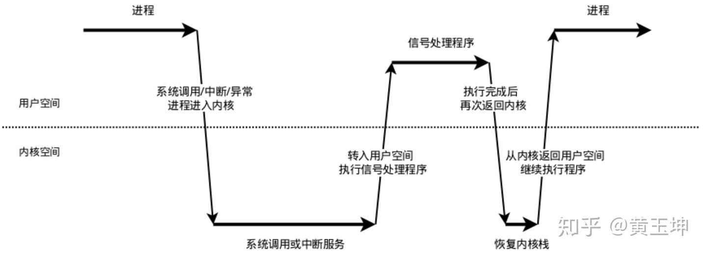
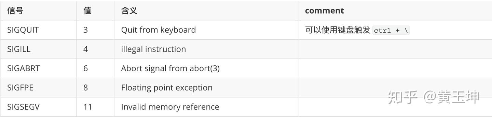
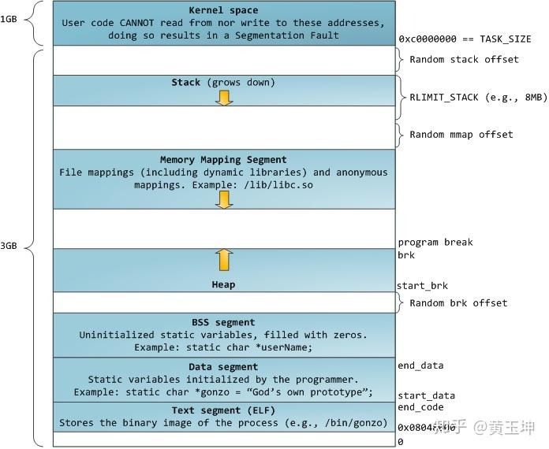

# Crash/coredump 原理与实例

crash/coredump是线上服务需要极力避免的地方。本文主要讲解crash的原理、分析排查思路、常见的crash种类与实战。

## 1.coredump 原理

当程序发生内存越界访问等行为时，会触发OS的保护机制，此时OS会产生一个信号(signal)发送给对应的进程。当进程从内核态到用户态切换时，该进程会处理这个信号。此类信号（比如SEGV）的默认处理行为生成一个coredump文件。

这里会涉及以下几个问题：

1.  哪些信号可以产生core文件？
2.  保存的core文件在什么地方？
3.  core文件，具体会把进程地址空间的哪些内容保存下来？
4.  如何控制core文件的大小？
5.  处理信号的代码，是运行在用户态还是内核态？  
    

这里我们主要探讨如下问题

### 1.1 哪些信号的默认行为是产生core？

    Signal     Value     Action   Comment
         ──────────────────────────────────────────────────────────
         SIGHUP        1       Term    Hangup detected on controlling terminal
                                       or death of controlling process
         SIGINT        2       Term    Interrupt from keyboard
         SIGQUIT       3       Core    Quit from keyboard
         SIGILL        4       Core    Illegal Instruction
         SIGABRT       6       Core    Abort signal from abort(3)
         SIGFPE        8       Core    Floating point exception
         SIGKILL       9       Term    Kill signal
         SIGSEGV      11       Core    Invalid memory reference
         SIGPIPE      13       Term    Broken pipe: write to pipe with no
                                       readers
         SIGALRM      14       Term    Timer signal from alarm(2)
         SIGTERM      15       Term    Termination signal
         SIGUSR1   30,10,16    Term    User-defined signal 1
         SIGUSR2   31,12,17    Term    User-defined signal 2
         SIGCHLD   20,17,18    Ign     Child stopped or terminated
         SIGCONT   19,18,25    Cont    Continue if stopped
         SIGSTOP   17,19,23    Stop    Stop process
         SIGTSTP   18,20,24    Stop    Stop typed at terminal
         SIGTTIN   21,21,26    Stop    Terminal input for background process
         SIGTTOU   22,22,27    Stop    Terminal output for background process

这里，我们可以看到3、4、6、8、11都能产生的信号， 默认都会产生core行为。

### 1.2 core文件名称

`/proc/sys/kernel/core_pattern` 指定core文件存储的位置，缺省值是core，表示将core文件存储到当前目录。这个pattern是可以定制的，模式如下：

    %p  出Core进程的PID
    %u  出Core进程的UID
    %s  造成Core的signal号
    %t  出Core的时间，从1970-01-0100:00:00开始的秒数
    %e  出Core进程对应的可执行文件名

`/proc/sys/kernel/core_uses_pid` 取值是0或者1，表示是否在core文件名字后面加上进程号

### 1.3 core文件会存储哪些信息

`/proc/$pid/coredump_filter` 设置那些内存会被dump出来，需要在程序启动之后进行设置。

    bit 0  Dump anonymous private mappings.
    bit 1  Dump anonymous shared mappings.
    bit 2  Dump file-backed private mappings.
    bit 3  Dump file-backed shared mappings.
    bit 4 (since Linux 2.6.24)
           Dump ELF headers.
    bit 5 (since Linux 2.6.28)
           Dump private huge pages.
    bit 6 (since Linux 2.6.28)
           Dump shared huge pages.

默认设置是33,也就是保留了bit位对应的0和5对应的内存。另外，core文件的save遵循如下原则：内存映射的IO 页不会被dump；[vdso](https://link.zhihu.com/?target=https%3A//man7.org/linux/man-pages/man7/vdso.7.html) 始终会被dump。我们可以比较不同filter下的内存大小.

### 1.4 文件的大小控制

ulimit -c 决定save的core文件大小限制. 如果不想限制大小，需要设置`ulimit -c unlimited`.

### 1.5 coredump-用户态 OR 内核态

这里我们先区分内核态和用户态：

-   内核线程只工作在内核态中；而用户线程则既可以运行在内核态（执行系统调用时），也可以运行在用户态
-   内核线程没有用户空间，所以对于一个内核线程来说，它的0~3G的内存空间是空白的，它的current->mm是空的，与内核使用同一张页表；而用户线程则可以看到完整的内存空间。（以上说法，针对32b系统）
-   用户态到内核态的切换有三种形式：异常（如缺页异常）、中断（读写相关中断）、系统调用（open等）  
    

这部分逻辑处于用户态还是内核态，是没有特定结论的。只能说这是一个用户进程，是否切换到内核态取决于具体执行的代码。

## 2.自定义core对应信号的处理函数

在实际的生产环境中，core文件是默认关闭的状态; 或者说，由于程序运行产生的core文件比较大，在生产环境下，为了避免产生core文件导致服务不可用，我们通常会关闭core文件的产生。这种情况下，我们需要自定义信号处理函数，来取代默认的core行为coredump. 一般情况下，我们是利用信号处理函数，保存crash时刻对应的函数调用堆栈。

    signal(SIGSEGV, DumpTraceback);//注册新号处理函数
    void DumpTraceback(int Signal)
    {
        const int len = 200;
        void* buffer[len];
        int nptrs = ::backtrace(buffer, len);
        char** strings = ::backtrace_symbols(buffer, nptrs);
        printf("sig:%d nptrs:%d\n", Signal, nptrs);
        if (strings) {
            for (int i = 0; i < nptrs; ++i) {
                printf("line=%d||trace_back=%s||\n", i, strings[i]);
            }
            free(strings);
        }
        exit(1);
    }

这里我们简单聊聊如下问题：

1.  如果在信号处理函数中，没有执行exit会发生什么？
2.  多线程程序中，具体执行信号处理函数的是哪个线程？
3.  编写crash对应的信号处理函数有什么需要注意的地方？
4.  backtrace的运行原理如何？为何backtraceyou时候会不完整，或者出现乱码？

### 2.1 信号的处理流程

信号处理的流程如下：

  

我们把这个过程拆分成信号的接收、检测、处理三个步骤。

-   信号的接收：接收信号的任务是由内核代理的，当内核接收到信号后，会将其放到对应进程的信号队列中，同时向进程发送一个中断，使其陷入内核态。注意，此时信号还只是在队列中，对进程来说暂时是不知道有信号到来的。
-   信号的检测：进程陷入内核态后，有两种场景会对信号进行检测：

-   进程从内核态返回到用户态前进行信号检测
-   进程在内核态中，从睡眠状态被唤醒的时候进行信号检测

-   信号的处理：信号处理函数是运行在用户态的，调用处理函数前，内核会将当前内核栈的内容备份拷贝到用户栈上，并且修改指令寄存器（eip）将其指向信号处理函数。接下来进程返回到用户态中，执行相应的信号处理函数。信号处理函数执行完成后，还需要返回内核态，检查是否还有其它信号未处理。如果所有信号都处理完成，就会将内核栈恢复（从用户栈的备份拷贝回来），同时恢复指令寄存器（eip）将其指向中断前的运行位置，最后回到用户态继续执行进程。

**信号处理线程：**信号可以发给整个进程，也可以发给特定线程；发给整个进程的信号，随机选取一个线程进行执行；发给特定线程的信号，只能有特定的线程负责处理。一些信号如果是某些线程代码的直接执行而引发，那么只能由特定的线程负责执行，例如`SIGILL, SIGSEG`.

> **A signal may be directed to either the process as a whole or to a specific thread**. A signal is thread-directed if it is generated as the direct result of the execution of a specific hardware instruction within the context of the thread (**`SIGBUS, SIGFPE, SIGILL, and SIGSEGV`**)

### 2.2 core相关的信号处理的问题

**问题一：信号处理函数是否会改变函数的执行流程？没有exit的结果是什么**

注意，我们看到上文的DumpTraceBack函数中，结尾有关键的一句exit(); 如果没有这一句，crash会一直进行下去：因为原线程的执行流程并没有被打断，在信号处理函数执行完毕之后，会继续运行到产生crash信号的那一行代码。

**问题二：为何存在crash堆栈没有打印完全的情况？**

从问题一出发，因为某个线程调用了`exit`，所以所有的线程都会退出。另外，`exit` 会清理该进程申请的所有资源，也会刷新对应的键盘缓冲区，所以会导致某些线程的堆栈并没有被完全打印。_这里需要注意一点：exit是一个c语言中的函数，不是一个c++中的函数，自然不满足cpp中的RAII原则，因此，exit不会清理对应的C++对象，包括ostream、特定对象的析构函数等等_。

**问题三：多线程中，如果有多个core信号同时到达，或者嵌套，该如何处理？**

宏观上，一个进程内部的多线程是可以同时运行信号处理程序的。我们可以通过在中断处理加入sleep函数来验证。

    void DumpTraceback(int signal)
    {
        std::thread::id tid = std::this_thread::get_id();
        printf(">>>> dumping :%ld\n", tid);
        const int len = 200;
        void* buffer[len];
        int nptrs = ::backtrace(buffer, len);
        char** strings = ::backtrace_symbols(buffer, nptrs);
        printf("id:%ld, sig:%d nptrs:%d\n", tid, signal, nptrs);
        if (strings) {
            for (int i = 0; i < nptrs; ++i) {
                printf("line=%d||trace_back=%s||\n", i, strings[i]);
                sleep(1);//这里加上sleep，观察信号处理函数
            }
            free(strings);
        }
        exit(1);
    }

我们测试一下，如果在信号处理函数中进一步产生core对应的信号，行为如何？

对应信号被处理时，该信号处于被屏蔽的状态，所以如果信号处理函数本身产生了对应的信号，结果是未定义的。以目前linux 系统的实现来看，如果信号处理函数本身的代码运行时产生了`SIGBUS, SIGFPE, SIGILL, or SIGSEGV`等信号，那么会出发系统默认的信号处理函数进行处理，继续crash。注意，这只是系统的默认行为。实际上，我们是可以通过`SA_RESETHAND`这个标志位，来决定信号处理期间，对应信号的处理行为. 如果`SA_RESETHAND` 设置为1，表示信号处理期间，重制信号处理函数到默认行为。

    #include<signal.h>
    #include<stdio.h>
    #include<stdlib.h>
    #include<unistd.h>
    
    volatile char *ptr;
    
    static void DisasterSignals(int signal)
    {
      /* We cannot save the situation, the purpose of catching the signal is
         only to do something clever to aid debugging before we go. */
      write(1, "11\n", 3);
      *ptr = 1;
      write(1, "13\n", 3);
      abort(); /* This should give us the expected core dump (if we survive to this point) */
    }
    
    struct sigaction sa = {}; /* initialised to all zero (I vote for GCC style breach of standard here) */
    
    int main()
    {
      sa.sa_handler = DisasterSignals;
      sa.sa_flags = /*SA_RESETHAND | */SA_NODEFER;  /* To have or have not */
      sigaction(SIGSEGV, &sa, NULL);
    
      write(1, "25\n", 3);
      *ptr = 1;
    }

**问题四：是否可以自定义core的处理函数，同时产生core文件？**

思路：在信号处理函数中继续产生对应信号，同时更改信号处理函数指针。

    // this is the trick: it will trigger the core dump
      signal(signum, SIG_DFL);
      kill(getpid(), signum);
    //SIG_DFL,SIG_IGN 分别表示无返回值的函数指针，指针值分别是0和1，这两个指针值逻辑上讲是实际程序中不可能出现的函数地址值。

### 2.3 core对应信号处理函数存在的隐患

**潜在的死锁问题**

我们注意上文中的函数`backtrace_symbols`. 可以看到这个函数的返回值是一个`char **`类型，也就是说函数内部是发生了内存分配的。另一方面，`malloc`等内存分配函数，是线程安全的，内部有一个lock。线程中malloc函数获取锁之后被signal中断，在signal处理函数中继续调用`malloc`，因为主线程中的`malloc`已经获取到了锁，signal处理函数只能等待锁释放，而主线程中的malloc函数正在等待signal处理函数返回后继续执行，这样就造成了锁死。如果我们把这个锁改成recursive lock，又会导致内存数据混乱。

**隐患：**信号处理函数，应该尽量简单，避免直接或者间接使用锁、信号量、条件变量等线程同步操作。可以使用`backtrace_symbols_fd`函数来避免`malloc`潜在的问题。

### 2.4 backtrace的原理

backtrace实际上是读取线程对应的函数调用栈。我们实现一个简单的程序，包含三层函数调用。

    int func3(int a, int b, int c){
            __asm__("int $0x03");
            return a + b + c;
    }
    int func2(int b, int c){
            int tmp = 1;
        return tmp + func3(3, b, c);
    }
    int func1(int a){
        int tmp = a;
            return tmp +func2(2, a);
    }
    int main()
    {
            func1(1);
            return 0;
    }

在程序执行到断点附近（源代码中的汇编指令处），查看进程堆栈，获得内容如下

    (gdb) x/20a $rbp
    0x7fffffffdf20: 0x7fffffffdf50  0x4005fe <func2(int, int)+39>
    0x7fffffffdf30: 0x20    0x200000001
    0x7fffffffdf40: 0x20    0x100000001
    0x7fffffffdf50: 0x7fffffffdf80  0x4005d0 <func1(int)+32>
    0x7fffffffdf60: 0x0 0x100000000
    0x7fffffffdf70: 0x400640 <__libc_csu_init>  0x1004004c0
    0x7fffffffdf80: 0x7fffffffdf90  0x400630 <main()+14>
    0x7fffffffdf90: 0x0 0x7ffff7014b15 <__libc_start_main+245>
    0x7fffffffdfa0: 0x602010    0x7fffffffe078
    0x7fffffffdfb0: 0x100000000 0x400622 <main()>

注意，以下地址形成的单项链表，恰好构成一个函数调用栈：`0x7fffffffdf20 >>0x7fffffffdf50 >> 0x7fffffffdf80` 这里，我们需要明确几点：

-   函数调用栈，就是对应的程序栈。也是函数调用关系保存的地方。OS并没有维护一个专门的实体结构，来保存函数调用关系。
-   随着程序的运行，函数调用栈是一个不断`入栈-出栈`的过程。由于函数调用栈就是进程对应的栈空间，一旦栈空间的数据被”写花“，会导致函数调用栈无法正常的构建和销毁。
-   第N层的函数调用结束后，回到N-1层函数。接下来执行的位置，也保存在栈中. `ret`汇编指令会将栈中对应的数据，赋值给`rip`指令寄存器。如果栈中对应的数据被写坏，会导致指令寄存器被复制错误，从而导致`非法指令`

关于函数调用、汇编、函数栈可以参考另外一篇文章：《C语言与函数调用》

## 3.coredump分析

### 3.1 coredump的信号种类

这里，我们总结一下默认行为含有coredump的信号种类。

### 3.2 不常见信号SIGQUIT、SIGILL、SIGABRT、SIGFPE

-   SIGQUIT一般在进程之外触发，引发coredump的地点完全是随机的, 可以 发生在任何一条指令执行之后。
-   SIGFPE 这个信号虽然叫作浮点异常，但是触发的场景实际上更广：除0异常等算数操作指令（INT\_MIN/(-1)在某些架构下会触发）
-   SIGABRT `abort()`函数触发，用于严重错误下的场景，程序异常退出，不做任何资源清理。常见的场景主要有(实际上，用户经常因为调用STL的相关操作，触发以下情况)：

-   libc或者其他的与内存管理相关的lib等，异常退出。
-   “assert” 判定失败.
-   `malloc()/free()` will call `abort()` if its internal structures are damaged by a heap overflow. 参考 [abort.cpp](https://zhuanlan.zhihu.com/p/240633280/edit#abort.cpp)

-   SIGILL是非法指令触发。一般情况下，我们的程序指令都是编译器生成的，正常情况下，可以认为编译器不会生成非法指令。如果在程序运行过程中出现了SIGILL对应的错误，有几种可能。

-   程序的编译与运行环境不一致：在32b的机器上，编译出64b的程序并且执行。
-   使用了一些“奇技淫巧”，并非所有的指令都是编译器正常编译产生的指令序列，包括但不局限于：手写汇编指令、程序运行时更改了代码段的内容.
-   变更了程序执行指令序列的控制逻辑，导致CPU的指令寄存器IP指向非合法指令地址。常见的原因包括：栈中的rip被写坏，导致rip指向一个非法地址(参考[ill\_1.cpp](https://zhuanlan.zhihu.com/p/240633280/ill_1.cpp))。（背景知识：处理器架构 `Risk` VS. `Cisk`）

### ill\_1.cpp {#ill\_1.cpp}

**Case1: rip被篡改，导致非法指令对应的crash**

    //ill_1.cpp
    long *ip_address = 0;
    void modify_ip(long a) {
        ip_address = (long *)((long)&a + 16);//这一句是在寻找存放rip值的栈地址
        *ip_address = 0x4006be;//这一句是给rip赋值，给对应的rip赋值成一个非法指令。Q：我是如何知道这个地址对应非法指令的？
    }
    
    int main(void)
    {
        modify_ip(0);
        return 0;
    }
    /*以下是这个程序的执行结果
    # ykhuang @ 0062a6cb7e5e in ~/test/core [2:21:15]
    $ ./ill
    [1]    28020 illegal hardware instruction (core dumped)  ./ill
    */

### abort.cpp {#abort.cpp}

**Case2: double free 导致abort**

    //abort.cpp
    int main ()
    {
       void *heap_start = malloc(10);
       printf("%p:%ld:cap %d\n", heap_start, sizeof(heap_start), *((long *)heap_start - 1));
       free(heap_start);
    
       heap_start = malloc(20);
       printf("%p:%ld:cap %d\n", heap_start, sizeof(heap_start), *((long *)heap_start - 1));
       free(heap_start);
    
       heap_start = malloc(30);
       printf("%p:%ld:cap %d\n", heap_start, sizeof(heap_start), *((long *)heap_start - 1));
       free(heap_start);
    
       heap_start = malloc(40);
       printf("%p:%ld:cap %d\n", heap_start, sizeof(heap_start), *((long *)heap_start - 1));
       free(heap_start);
    
       heap_start = malloc(50);
       printf("%p:%ld:cap %d\n", heap_start, sizeof(heap_start), *((long *)heap_start - 1));
       free(heap_start);
    
       heap_start = malloc(66);
       printf("%p:%ld:cap %d\n", heap_start, sizeof(heap_start), *((long *)heap_start - 1));
       free(heap_start);
       free(heap_start);
       return 0;
    }
    /*
    $ ./a.out
    0x1b4a040:8:cap 33
    0x1b4a040:8:cap 33
    0x1b4a060:8:cap 49
    0x1b4a060:8:cap 49
    0x1b4a090:8:cap 65
    0x1b4a0d0:8:cap 81
    *** Error in `./a.out': double free or corruption (fasttop): 0x0000000001b4a0d0 ***
    ======= Backtrace: =========
    /lib64/libc.so.6(+0x7cfe1)[0x7fefc58f8fe1]
    ./a.out[0x400966]
    /lib64/libc.so.6(__libc_start_main+0xf5)[0x7fefc589db15]
    ./a.out[0x4006f9]
    ======= Memory map: ========
    00400000-00401000 r-xp 00000000 fd:17 17574924                           /home/ykhuang/test/core/a.out
    00600000-00601000 r--p 00000000 fd:17 17574924                           /home/ykhuang/test/core/a.out
    00601000-00602000 rw-p 00001000 fd:17 17574924                           /home/ykhuang/test/core/a.out
    01b4a000-01b6b000 rw-p 00000000 00:00 0                                  [heap]
    */

需要指出的是，glibc等lib在调用abort之前，会打印相关的信息到tty，如`abort.cpp`中所示。但是，如果你的程序以service的方式运行，是看不到这些输出的。此时，我们把环境变量`LIBC_FATAL_STDERR_`设置成1，libc就会把应该输出到`/dev/tty`中的信息输出到`stderr`.

### abort2.cpp {#abort2.cpp}

**Case3: 调用纯虚函数导致abort()**

    //abort2.cpp
    #include<iostream>
    using namespace std;
    class A {
    public:
        A(A *pa){pa->f();}
        virtual void f()=0;
    };
    class D : public A {
    public:
        D():A(this){}
        virtual void f() {cout<<"D::f\n";}
    };
    int main(){
        D d;
        A *pa = &d;
        pa->f();
        return 0;
    }

这里需要注意一点：构造函数中不可以使用虚函数。构造函数中使用虚函数，在语法上是正确的，但是在语义上是错误的。因为一个C++对象在构造构成中，虚函数表的绑定是动态的，可能需要有多次绑定的过程。第一次绑定是从第一层Base类开始的。

### 3.3 常见信号：SIGSEGV Invalid memory reference

探索非法内存引用之前，我们先了解一下进程的[地址空间布局](https://zhuanlan.zhihu.com/p/240633280/edit#4.1-%E8%BF%9B%E7%A8%8B%E5%9C%B0%E5%9D%80%E7%A9%BA%E9%97%B4%E5%B8%83%E5%B1%80)。

**非法内存引用包括**：

-   内存地址不在进程的地址空间之内

-   以空指针为代表的程序起始空间
-   未申请的堆空间
-   段与段之间的空洞

-   内存地址空间合法，但是权限不满足

-   对代码段进行写操作：野指针，向代码段进行写操作
-   对数据段进行执行操作：rip错误，把数据段的数据当作指令来执行  
    

**合法的内存地址引用包括**：

-   尚未申请的栈空间(参考[stack\_space.cpp](https://zhuanlan.zhihu.com/p/240633280/edit#stack_space.cpp)).

这里需要说明的是，栈空间的管理和堆空间不同；栈空间在程序启动之后，就已经是一次性申请成功，这个申请和实际栈上变量的多少没有关系。这里我们说的申请，表示的栈空间的合法性。我们常说的栈空间的申请，默认是指ESP寄存器的移动；但是实际上，小于ESP（因为栈向低地址增长，所以小于ESP的空间，本质上是“未申请”的）的部分，也是合法的栈空间。

-   数组越界到合法的空间(参考[heap\_buffer.cpp](https://zhuanlan.zhihu.com/p/240633280/edit#heap_buffer.cpp))

堆空间是需要程序员手动申请和管理的。需要注意的是：1.出于内存对齐和减少内存碎片的角度考虑，内存分配函数并不是用户申请多少就新增多少，而是有一个额外buffer。2.如果一次性申请比较大的内存，对应的区域不在狭义的“堆”上，而是在mmap区域。

### stack\_space.cpp {#stack\_space.cpp}

    //stack_space.cpp
    int main()
    {
        int a[10];
        a[-100] = 10;
        return 0;
    }
    /*OK: a[-100] 对应的栈空间虽然没有申请，但是合法的*/

### heap\_buffer.cpp {#heap\_buffer.cpp}

    //heap_buffer.cpp
    #include<stdlib.h>
    #include<stdio.h>
    int main() {
        int size = 10;
        char *chs = (char *)malloc(size);
        printf("%p, %d, size: %d, meta: %d\n", chs, chs[size+1], size, *(long *)(chs - 8));
    
        return 0;
    }
    /*OK：chs[size+1] 对应的空间虽然“越界”，但是“合法”*/

### 3.4 `Invalid memory reference`导致crash的case分析

### 3.4.1 非法的指针解引用: 包括未初始化的指针、空指针、已经free后的指针

    #include <iostream>       // std::cout
    #include <unistd.h>
    #include <unordered_map>
    #include <cstdio>
    #include <stdlib.h>
    #define factor 1024
    class DC {
        public:
        char array[10];
        char onek[factor];
        char fill[0x1000*factor];
        std::unordered_map<int, int> hash_map;
        int level_1(int a) {
            auto it = hash_map.find(a);
            if (it != hash_map.end()) {
                std::cout << "not find" << std::endl;
            } else {
                std::cout << "found" << std::endl;
            }
            return 0;
        }
    };
    
    int main ()
    {
        int a;
        char *chs = (char *)malloc(1024);
        DC *dcp = nullptr;
        printf("adress:  a@ %p, chs@ %p, dcp@ %p, &array[0]@ %p, hash_map@ %p\n", &a, chs, dcp, &(dcp->array[0]), &(dcp->hash_map));// ok
        printf("array[0]:%p\n", dcp->array[0]); //crash will happen.
        dcp->level_1(0);//crash will happen
        return 0;
    }

通过这个程序的输出，我们可以得到下面的结论（也可以通过程序生成的汇编代码自行验证）

空指针或者野指针的访问，类似`p->member` 这种形式，仅仅是在把p作为基地址，在此基础上加上member的偏移量。并不会check指针本身的合法性。如果叠加偏移量之后的地址是合法的，那么这个内存地址访问就是合法的。

我们总结这个例子中的crash场景：

-   指针对应对象的成员变量访问
-   指针对应对应的成员函数访问: 注意，如果成员函数中没有访问到成员变量，是不会crash的。

这里，第二种crash的场景比较隐蔽，因为从crash堆栈中，无法直接看出问题的所在`hash_map.find()`.

如何排查和预防这样的问题？ **指针必须要初始化：一个被nullptr初始化的指针问题，相对于一个野指针更容易排查。**

### 3.4.2 多线程读写同一个变量

    //mystring.cpp
    class mystring {
    public:
        char *pointer;
        long capacity;
        long size;
        mystring operator = ( const mystring &input) {
            free(pointer);
            pointer = malloc(capacity);
            memcopy(pointer, input.pointer, input.size);
            size = input.size;
            capacity =  input.capacity;
            return *this;
        }
    }
    mystring test, a("hello"), b("world");
    // thread1:
    test = a;
    // thread2:
    test = b;

上文中，`thead1`和 `thread2`同时发生，可能导致的问题有：

-   double free
-   使用free之后的内存区域等

STL中的容器，基本都是非线程安全的。由于线程执行顺序的不确定性，多线程下多写同样变量如果出现crash，那么这个crash的位置和时机多半是不确定的。

### 3.4.3 可变参数函数参数个数不符合预期

    #include<cstdio>
    int main()
    {
        printf("a:%d, b:%d\n");
        char *chs= "hello";
        int a = 0x1234;
        printf("a:%d, s:%s\n", a, chs);
        int b = 0x0188;
        __asm__("mov $0x1111, %rdx");//这里，我们手动写入rdx 寄存器的值，是为了给第三个参数一个“非法”的垃圾值
        printf("a:%d, s:%s\n", b);//crash: 因为这里会试图打印出，以0x1111为起始地址的字符串
        return 0;
    }

对于可变参数函数，作为被调用方，是不会校验参数的合理性的。被调用方只会去对应的位置（寄存器 或者栈）寻找位置。因此一旦对应位置的垃圾数值不可访问，就会导致crash的发生。

### 3.4.4 内存越界

内存越界是一个相对比较宽泛的概念。最典型的就是数组下标越界，看一个例子。

    #include<cstring>
    #include<cstdio>
    #include<string>
    class Base {
        public:
        virtual void print() {
            printf("print\n");
        }
        void member_function () {
            printf("member\n");
        }
    };
    
    int i = 0;
    Base *foop = NULL;
    void CopyData(char const *szData)
    {
        Base foo1;
        foop = &foo1;
        char cDest[1];
        foop->print();
        cDest[8] = 'a'; 
        foo1.member_function();
        foo1.print();
        foop->member_function();
        foop->print();//crash here
    }
    int main()
    {
        CopyData("1234567890123456789012345678901234567890");
        return 0;
    }
    /*
    print
    member
    print
    member
    [1]    2335 segmentation fault (core dumped)
    */

这里`cDest[8] = 'a';`是对应数组下标越界，而这里的越界会导致foo1对象的虚函数表指针被写入垃圾数值，因而会导致CopyData函数的最后一句调用失败。

由于栈上保存了很多信息，尤其是一些关键寄存器的信息：EIP和EBP等。这些缓存的寄存器被写入垃圾数值之后，可能导致函数栈回溯失败、非法指令等问题，甚至由此衍生出缓冲区溢出等攻击手段（现代操作系统已经几乎不存在）。一个常见的栈数据破坏性写入的场景是**使用strcpy, strcat, sprintf, strcmp,strcasecmp等字符串操作函数，将目标字符串读/写爆.**

### 3.5 栈破坏下crash的分析与调试方法

对于crash的分析思路，我们都知道首先使用`bt`命令查看crash对应的函数调用栈。但是在一些场景下，线程本身的栈结构被破坏，无法通过bt查看函数调用栈的情况。那么如何在函数调用的开始和结束执行对应的操作呢？g++/gcc正好提供了这种功能，能够让我们在函数的开始和结束嵌入对应的代码。 具体的操作方法可以参见另外一篇文章《如何处理栈被破坏的crash》

## 4.背景知识

## 4.1 进程地址空间布局

进程的地址空间布局（下图为32b系统）。

  

  

这个不够直观，我们来看一个具体的程序：

    //memory.cpp
    #include<stdlib.h>
    #include<iostream>
    #include<stdio.h>
    int a[100] = {0};
    int b[200];
    static char* global_static_inited = "static_data";
    static char* global_static_uninited;
    int main()
    {
        int tmp[1024*1024];
        void *heap_small = malloc(10);
        void *heap_start = malloc(4*1024*1024 + 30);
        void *heap_second = malloc(4*1024*1024);
        printf("a:%p, \nb:%p, \nstatic_data:%p, \nglobal_static_uninited:%p, \ntmp:%p, \nhead_small:%p, \nheap_start:%p, \nheap_second:%p\n",\
                a,    b,    global_static_inited,    &global_static_uninited,   tmp,     heap_small,      heap_start,    heap_second);
        while(1);
        return 0;
    }
    /*
    a:0x601080,
    b:0x601220,
    static_data:0x4008e0,
    global_static_uninited:0x601548,
    tmp:0x7fffb3267ef0,
    head_small:0x1e64040,
    heap_start:0x7f65e8ab2010,
    heap_second:0x7f65e86b1010
    */

启动程序，运行`pmap -d $thread_id`

    Address           Kbytes Mode  Offset           Device    Mapping
    0000000000400000       4 r-x-- 0000000000000000 0fd:00017 a.out
    0000000000600000       4 r---- 0000000000000000 0fd:00017 a.out
    0000000000601000       4 rw--- 0000000000001000 0fd:00017 a.out
    0000000001e64000     132 rw--- 0000000000000000 000:00000   [ anon ]
    00007f65e86b1000    8200 rw--- 0000000000000000 000:00000   [ anon ]
    00007f65e8eb3000      88 r-x-- 0000000000000000 0fd:00017 libpthread-2.17.so
    00007f65e8ec9000    2048 ----- 0000000000016000 0fd:00017 libpthread-2.17.so
    00007f65e90c9000       4 r---- 0000000000016000 0fd:00017 libpthread-2.17.so
    00007f65e90ca000       4 rw--- 0000000000017000 0fd:00017 libpthread-2.17.so
    00007f65e90cb000      16 rw--- 0000000000000000 000:00000   [ anon ]
    00007f65e90cf000      12 r-x-- 0000000000000000 0fd:00017 libdl-2.17.so
    00007f65e90d2000    2044 ----- 0000000000003000 0fd:00017 libdl-2.17.so
    00007f65e92d1000       4 r---- 0000000000002000 0fd:00017 libdl-2.17.so
    00007f65e92d2000       4 rw--- 0000000000003000 0fd:00017 libdl-2.17.so
    00007f65e92d3000    1752 r-x-- 0000000000000000 0fd:00017 libc-2.17.so
    00007f65e9489000    2048 ----- 00000000001b6000 0fd:00017 libc-2.17.so
    00007f65e9689000      16 r---- 00000000001b6000 0fd:00017 libc-2.17.so
    00007f65e968d000       8 rw--- 00000000001ba000 0fd:00017 libc-2.17.so
    00007f65e968f000      20 rw--- 0000000000000000 000:00000   [ anon ]
    00007f65e9694000      84 r-x-- 0000000000000000 0fd:00017 libgcc_s-4.8.5-20150702.so.1
    00007f65e96a9000    2044 ----- 0000000000015000 0fd:00017 libgcc_s-4.8.5-20150702.so.1
    00007f65e98a8000       4 r---- 0000000000014000 0fd:00017 libgcc_s-4.8.5-20150702.so.1
    00007f65e98a9000       4 rw--- 0000000000015000 0fd:00017 libgcc_s-4.8.5-20150702.so.1
    00007f65e98aa000    1028 r-x-- 0000000000000000 0fd:00017 libm-2.17.so
    00007f65e99ab000    2044 ----- 0000000000101000 0fd:00017 libm-2.17.so
    00007f65e9baa000       4 r---- 0000000000100000 0fd:00017 libm-2.17.so
    00007f65e9bab000       4 rw--- 0000000000101000 0fd:00017 libm-2.17.so
    00007f65e9bac000     932 r-x-- 0000000000000000 0fd:00017 libstdc++.so.6.0.19
    00007f65e9c95000    2048 ----- 00000000000e9000 0fd:00017 libstdc++.so.6.0.19
    00007f65e9e95000      32 r---- 00000000000e9000 0fd:00017 libstdc++.so.6.0.19
    00007f65e9e9d000       8 rw--- 00000000000f1000 0fd:00017 libstdc++.so.6.0.19
    00007f65e9e9f000      84 rw--- 0000000000000000 000:00000   [ anon ]
    00007f65e9eb4000      24 r-x-- 0000000000000000 0fd:00017 gundam_preload.so
    00007f65e9eba000    2044 ----- 0000000000006000 0fd:00017 gundam_preload.so
    00007f65ea0b9000       4 r---- 0000000000005000 0fd:00017 gundam_preload.so
    00007f65ea0ba000       4 rw--- 0000000000006000 0fd:00017 gundam_preload.so
    00007f65ea0bb000     132 r-x-- 0000000000000000 0fd:00017 ld-2.17.so
    00007f65ea2b3000      28 rw--- 0000000000000000 000:00000   [ anon ]
    00007f65ea2da000       8 rw--- 0000000000000000 000:00000   [ anon ]
    00007f65ea2dc000       4 r---- 0000000000021000 0fd:00017 ld-2.17.so
    00007f65ea2dd000       4 rw--- 0000000000022000 0fd:00017 ld-2.17.so
    00007f65ea2de000       4 rw--- 0000000000000000 000:00000   [ anon ]
    00007fffb3267000    4104 rw--- 0000000000000000 000:00000   [ stack ]
    00007fffb372f000       8 r-x-- 0000000000000000 000:00000   [ anon ]
    ffffffffff600000       4 r-x-- 0000000000000000 000:00000   [ anon ]
    mapped: 31104K    writeable/private: 12640K    shared: 0K

我们逐一解释：

-   **代码段**

上文中`0000000000400000`是段的开始地址，并不是代码的开始地址。这个位置本身是不可访问的。代码段本身的权限是`r + x`. 需要注意的是`static_data` 这个字符串本身，是在代码段中。

    (gdb) x/100i 0x000000000400000
       0x400000:    Cannot access memory at address 0x400000
    (gdb) disassemble main
    Dump of assembler code for function main():
       0x0000000000400730 <+0>:     push   %rbp
       0x0000000000400731 <+1>:     mov    %rsp,%rbp
       0x0000000000400734 <+4>:     sub    $0x400010,%rsp
       0x000000000040073b <+11>:    mov    $0x40001e,%edi
       0x0000000000400740 <+16>:    callq  0x400600 <malloc@plt>
       0x0000000000400745 <+21>:    mov    %rax,-0x8(%rbp)
       0x0000000000400749 <+25>:    mov    $0x400000,%edi
       0x000000000040074e <+30>:    callq  0x400600 <malloc@plt>
       0x0000000000400753 <+35>:    mov    %rax,-0x8(%rbp)
       0x0000000000400757 <+39>:    jmp    0x400757 <main()+39>
    End of assembler dump.
    (gdb) x/20i 0x0000000000400730
       0x400730 <main()>:   push   %rbp
       0x400731 <main()+1>: mov    %rsp,%rbp
       0x400734 <main()+4>: sub    $0x400010,%rsp
       0x40073b <main()+11>:        mov    $0x40001e,%edi
       0x400740 <main()+16>:        callq  0x400600 <malloc@plt>
       0x400745 <main()+21>:        mov    %rax,-0x8(%rbp)
       0x400749 <main()+25>:        mov    $0x400000,%edi
       0x40074e <main()+30>:        callq  0x400600 <malloc@plt>
       0x400753 <main()+35>:        mov    %rax,-0x8(%rbp)
       0x400757 <main()+39>:        jmp    0x400757 <main()+39>

-   数据段

存放全局变量，包括静态和非静态，可以看到初始化和为初始化的数据，在同一个段上。这个段中的变量包括：a、b、global\_static\_uninited。

-   函数局部变量

对应tmp，对应stack区域, 权限是`rw`

-   堆空间

广义上，我们把mmap对应的区间也算作堆空间。这部分对应`heap_start`和`heap_second`. 狭义的堆空间，是`heap_small`对应的空间，起始段地址远小于`heap_start`对应的空间。

## 参考

https://zhuanlan.zhihu.com/p/146458802