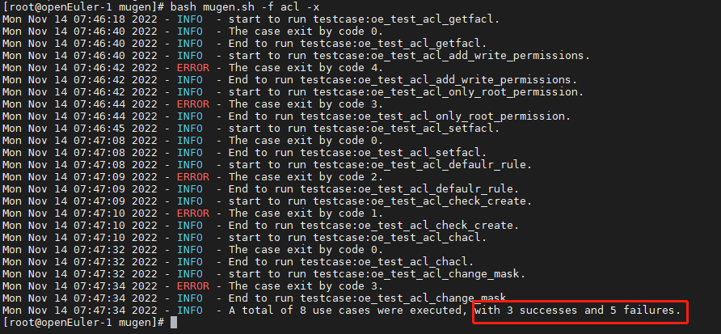
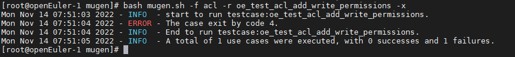

# 基于openEuler虚拟机本地执行mugen测试脚本

（1）首先需要准备一台[openEuler](https://so.csdn.net/so/search?q=openEuler&spm=1001.2101.3001.7020)虚拟机，若未安装，可参考 [VMware安装openEuler-22.03-LTS版本的虚拟机](http://blog.redrose2100.com/article/420) 安装一台openEuler虚拟机

（2）安装git工具，若已安装，则直接跳过

    dnf install -y git

（3）下载mugen代码

    cd /opt/
    git clone https://gitee.com/openeuler/mugen.git

（4）安装依赖

    cd mugen/
    chmod 777 dep_install.sh
    bash dep_install.sh

（5）查看命令帮助信息

    [root@openEuler-1 mugen]# bash mugen.sh --help
    mugen.sh：非法选项 -- -
    Usage:
    
        -c: configuration environment of test framework
    
        -a: execute all use cases
    
        -f: designated test suite
    
        -r: designated test case
    
        -x: the shell script is executed in debug mode
    
        -b: do make for test suite if test suite path have makefile or Makefile file
    
        -s: runing test case at remote NODE1

​    
​        Example:
​            run all cases:
​              normal mode:
​                bash mugen.sh -a
​              debug mode:
​                bash mugen.sh -a -x
​    
            run test suite:
              normal mode:
                bash mugen.sh -f test_suite
              debug mode:
                bash mugen.sh -f test_suite -x
    
            run test case:
              normal mode:
                bash mugen.sh -f test_suite -r test_case
              debug mode:
                bash mugen.sh -f test_suite -r test_case -x
    
            run at remote:
              normal mode:
                bash mugen.sh -a -s
                bash mugen.sh -f test_suite -s
                bash mugen.sh -f test_suite -r test_case -s
              debug mode:
                bash mugen.sh -a -s
                bash mugen.sh -f test_suite -s
                bash mugen.sh -f test_suite -r test_case -s

​    
​            configure env of test framework:
​                bash mugen.sh -c --ip $ip --password $passwd --user $user --port $port
​    
              if want run at remote should add --run_remote
              if want run at remote copy all testcase once add --put_all

​    
​        do make for test suite:
​            for all test suite:
​                bash mugen.sh -b -a
​            for one test suite:
​                bash mugen.sh -b test_suite

（6）配置环境变量

因为这里使用的本机作为被测虚拟机，因此ip设置为127.0.0.1

    bash mugen.sh -c --ip 127.0.0.1 --password xxxxxx --user root --port 22

（7）配置环境后，会自动生成confg/env.json环境变量文件

    [root@openEuler-1 mugen]# cat conf/env.json
    {
        "NODE": [
            {
                "ID": 1,
                "LOCALTION": "local",
                "MACHINE": "physical",
                "FRAME": "x86_64",
                "NIC": "",
                "MAC": "",
                "IPV4": "127.0.0.1",
                "USER": "root",
                "PASSWORD": "xxxxxx",
                "SSH_PORT": 22,
                "BMC_IP": "",
                "BMC_USER": "",
                "BMC_PASSWORD": ""
            }
        ]
    }[root@openEuler-1 mugen]#

​    

（8）测试脚本目录说明

mugen测试目录如下，suite2cases 目录定义了所有的测试套，testcases目录下则是所有的脚本，testcases中的每个sh文件即为一个测试脚本，而目录只是用来分类管理测试用例的，测试套的名字并不是从testcases中的文件夹名。  

如下，展开suite2cases目录，这里可以看到每个json的文件名（去掉后缀），比如这里acl就是一个测试套，而json文件中定义了当前测试套包含哪些用例，用例的路径这了也给出了对应关系。  

（9）然后就可以执行测试脚本了，这里如下几个参数需要关注一下：

-   \-f：指定测试套
-   \-r：指定测试用例
-   \-a：执行所有用例
-   \-x：输出debug模式的信息，即控制套输出更加详细的内容

比如执行测试套acl的的用例

    bash mugen.sh -f acl -x

执行结果如下，可以看出这里有三个成功，五个失败，具体失败原因，这里暂时不去深究，只作为演示执行的示例  

比如想执行这里面具体一个用例  
  
则使用如下命令

    bash mugen.sh -f acl -r oe_test_acl_add_write_permissions -x

执行结果如下：  

比如要执行所有脚本，则执行如下命令（这里就不演示了，数量比较多）

    bash mugen.sh -a -x

## 参考

https://blog.csdn.net/redrose2100/article/details/127847469?spm=1001.2014.3001.5506