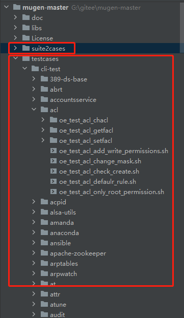
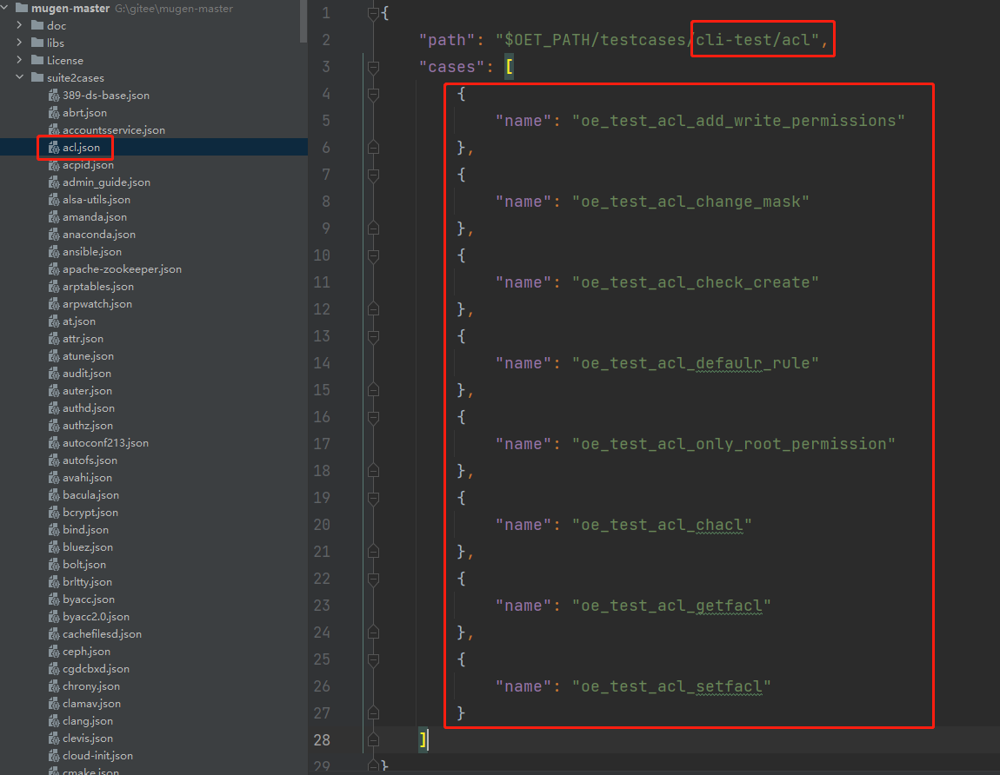
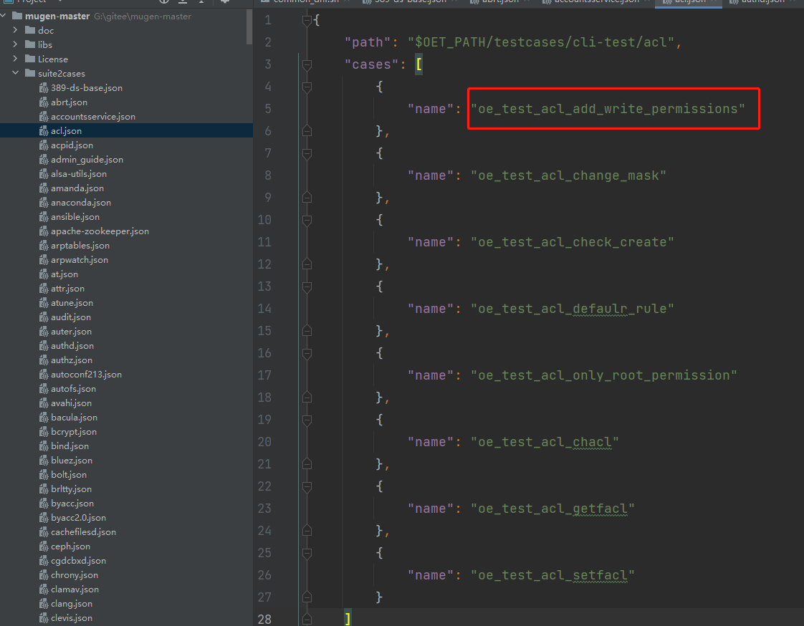

# 基于openEuler虚拟机远端执行mugen测试脚本

（1）首先需要准备两台台openEuler虚拟机，若未安装，可参考 [VMware安装openEuler-22.03-LTS版本的虚拟机](http://blog.redrose2100.com/article/420) 安装两台openEuler虚拟机，一台作为执行脚本的机器，一台作为远端被测机器，比如这里分别为：192.168.1.8（本地），192.168.1.12（远端）

（2）本地（192.168.1.8）安装git工具，若已安装，则直接跳过

    dnf install -y git

（3）在本地（192.168.1.8）下载mugen代码

    cd /opt/
    git clone https://gitee.com/openeuler/mugen.git

（4）本地（192.168.1.8）安装依赖

    cd mugen/
    chmod 777 dep_install.sh
    bash dep_install.sh

（5）查看命令帮助信息

    [root@openEuler-1 mugen]# bash mugen.sh --help
    mugen.sh：非法选项 -- -
    Usage:
    
        -c: configuration environment of test framework
    
        -a: execute all use cases
    
        -f: designated test suite
    
        -r: designated test case
    
        -x: the shell script is executed in debug mode
    
        -b: do make for test suite if test suite path have makefile or Makefile file
    
        -s: runing test case at remote NODE1

​    
​        Example:
​            run all cases:
​              normal mode:
​                bash mugen.sh -a
​              debug mode:
​                bash mugen.sh -a -x
​    
            run test suite:
              normal mode:
                bash mugen.sh -f test_suite
              debug mode:
                bash mugen.sh -f test_suite -x
    
            run test case:
              normal mode:
                bash mugen.sh -f test_suite -r test_case
              debug mode:
                bash mugen.sh -f test_suite -r test_case -x
    
            run at remote:
              normal mode:
                bash mugen.sh -a -s
                bash mugen.sh -f test_suite -s
                bash mugen.sh -f test_suite -r test_case -s
              debug mode:
                bash mugen.sh -a -s
                bash mugen.sh -f test_suite -s
                bash mugen.sh -f test_suite -r test_case -s

​    
​            configure env of test framework:
​                bash mugen.sh -c --ip $ip --password $passwd --user $user --port $port
​    
              if want run at remote should add --run_remote
              if want run at remote copy all testcase once add --put_all

​    
​        do make for test suite:
​            for all test suite:
​                bash mugen.sh -b -a
​            for one test suite:
​                bash mugen.sh -b test_suite

（6）在本地（192.168.1.8）配置环境变量

因为这里使用的远端（192.168.1.12）作为被测虚拟机，因此ip设置为192.168.1.12，此外还需要增加 --run\_remote 参数，即

    bash mugen.sh -c --ip 192.168.1.12 --password ISRCpassword123 --user root --port 22 --run_remote

（7）配置环境后，会自动生成confg/env.json环境变量文件

    [root@openEuler-1 mugen]# cat conf/env.json
    {
        "NODE": [
            {
                "ID": 1,
                "LOCALTION": "local",
                "MACHINE": "physical",
                "FRAME": "x86_64",
                "NIC": "ens33",
                "MAC": "00:0c:29:da:c2:41",
                "IPV4": "192.168.1.12",
                "USER": "root",
                "PASSWORD": "xxxxxx",
                "SSH_PORT": 22,
                "BMC_IP": "",
                "BMC_USER": "",
                "BMC_PASSWORD": ""
            }
        ]
    }[root@openEuler-1 mugen]# 

​    

（8）测试脚本目录说明

mugen测试目录如下，suite2cases 目录定义了所有的测试套，testcases目录下则是所有的脚本，testcases中的每个sh文件即为一个测试脚本，而目录只是用来分类管理测试用例的，测试套的名字并不是从testcases中的文件夹名。  

如下，展开suite2cases目录，这里可以看到每个json的文件名（去掉后缀），比如这里acl就是一个测试套，而json文件中定义了当前测试套包含哪些用例，用例的路径这了也给出了对应关系。  

（9）然后就可以执行测试脚本了，这里如下几个参数需要关注一下：

-   \-f：指定测试套
-   \-r：指定测试用例
-   \-a：执行所有用例
-   \-x：输出debug模式的信息，即控制套输出更加详细的内容
-   \-s：在远端节点执行脚本

比如远端执行测试套acl的的用例

    bash mugen.sh -f acl -x -s

执行结果如下，可以看出这里有三个成功，五个失败，具体失败原因，这里暂时不去深究，只作为演示执行的示例

    [root@openEuler-1 mugen]# bash mugen.sh -f acl -x -s
    Tue Nov 15 12:30:24 2022 - INFO  - start to put file:/opt/mugen/conf/mugen.env......
    Tue Nov 15 12:30:25 2022 - INFO  - start to run testcase:oe_test_acl_setfacl.
    Tue Nov 15 12:30:25 2022 - INFO  - start to put file:/opt/mugen/testcases/cli-test/acl/oe_test_acl_setfacl/oe_test_acl_setfacl.sh......
    Tue Nov 15 12:30:49 2022 - INFO  - The case exit by code 0.
    
    Tue Nov 15 12:30:49 2022 - INFO  - End to run testcase:oe_test_acl_setfacl.
    Tue Nov 15 12:30:49 2022 - INFO  - start to run testcase:oe_test_acl_chacl.
    Tue Nov 15 12:30:50 2022 - INFO  - start to put file:/opt/mugen/testcases/cli-test/acl/oe_test_acl_chacl/oe_test_acl_chacl.sh......
    Tue Nov 15 12:31:12 2022 - INFO  - The case exit by code 0.
    
    Tue Nov 15 12:31:12 2022 - INFO  - End to run testcase:oe_test_acl_chacl.
    Tue Nov 15 12:31:12 2022 - INFO  - start to run testcase:oe_test_acl_getfacl.
    Tue Nov 15 12:31:13 2022 - INFO  - start to put file:/opt/mugen/testcases/cli-test/acl/oe_test_acl_getfacl/oe_test_acl_getfacl.sh......
    Tue Nov 15 12:31:34 2022 - INFO  - The case exit by code 0.
    
    Tue Nov 15 12:31:34 2022 - INFO  - End to run testcase:oe_test_acl_getfacl.
    Tue Nov 15 12:31:34 2022 - INFO  - start to run testcase:oe_test_acl_add_write_permissions.
    Tue Nov 15 12:31:35 2022 - INFO  - start to put file:/opt/mugen/testcases/cli-test/acl/oe_test_acl_setfacl/oe_test_acl_setfacl.sh......
    Tue Nov 15 12:31:35 2022 - INFO  - start to put file:/opt/mugen/testcases/cli-test/acl/oe_test_acl_chacl/oe_test_acl_chacl.sh......
    Tue Nov 15 12:31:35 2022 - INFO  - start to put file:/opt/mugen/testcases/cli-test/acl/oe_test_acl_defaulr_rule.sh......
    Tue Nov 15 12:31:35 2022 - INFO  - start to put file:/opt/mugen/testcases/cli-test/acl/oe_test_acl_change_mask.sh......
    Tue Nov 15 12:31:36 2022 - INFO  - start to put file:/opt/mugen/testcases/cli-test/acl/oe_test_acl_check_create.sh......
    Tue Nov 15 12:31:36 2022 - INFO  - start to put file:/opt/mugen/testcases/cli-test/acl/oe_test_acl_add_write_permissions.sh......
    Tue Nov 15 12:31:36 2022 - INFO  - start to put file:/opt/mugen/testcases/cli-test/acl/oe_test_acl_only_root_permission.sh......
    Tue Nov 15 12:31:36 2022 - INFO  - start to put file:/opt/mugen/testcases/cli-test/acl/oe_test_acl_getfacl/oe_test_acl_getfacl.sh......
    Tue Nov 15 12:31:38 2022 - ERROR - The case exit by code 1.
    
    Tue Nov 15 12:31:38 2022 - INFO  - End to run testcase:oe_test_acl_add_write_permissions.
    Tue Nov 15 12:31:38 2022 - INFO  - start to run testcase:oe_test_acl_check_create.
    Tue Nov 15 12:31:39 2022 - INFO  - start to put file:/opt/mugen/testcases/cli-test/acl/oe_test_acl_setfacl/oe_test_acl_setfacl.sh......
    Tue Nov 15 12:31:39 2022 - INFO  - start to put file:/opt/mugen/testcases/cli-test/acl/oe_test_acl_chacl/oe_test_acl_chacl.sh......
    Tue Nov 15 12:31:39 2022 - INFO  - start to put file:/opt/mugen/testcases/cli-test/acl/oe_test_acl_defaulr_rule.sh......
    Tue Nov 15 12:31:39 2022 - INFO  - start to put file:/opt/mugen/testcases/cli-test/acl/oe_test_acl_change_mask.sh......
    Tue Nov 15 12:31:40 2022 - INFO  - start to put file:/opt/mugen/testcases/cli-test/acl/oe_test_acl_check_create.sh......
    Tue Nov 15 12:31:40 2022 - INFO  - start to put file:/opt/mugen/testcases/cli-test/acl/oe_test_acl_add_write_permissions.sh......
    Tue Nov 15 12:31:40 2022 - INFO  - start to put file:/opt/mugen/testcases/cli-test/acl/oe_test_acl_only_root_permission.sh......
    Tue Nov 15 12:31:40 2022 - INFO  - start to put file:/opt/mugen/testcases/cli-test/acl/oe_test_acl_getfacl/oe_test_acl_getfacl.sh......
    Tue Nov 15 12:31:41 2022 - ERROR - The case exit by code 1.
    
    Tue Nov 15 12:31:42 2022 - INFO  - End to run testcase:oe_test_acl_check_create.
    Tue Nov 15 12:31:42 2022 - INFO  - start to run testcase:oe_test_acl_change_mask.
    Tue Nov 15 12:31:42 2022 - INFO  - start to put file:/opt/mugen/testcases/cli-test/acl/oe_test_acl_setfacl/oe_test_acl_setfacl.sh......
    Tue Nov 15 12:31:43 2022 - INFO  - start to put file:/opt/mugen/testcases/cli-test/acl/oe_test_acl_chacl/oe_test_acl_chacl.sh......
    Tue Nov 15 12:31:43 2022 - INFO  - start to put file:/opt/mugen/testcases/cli-test/acl/oe_test_acl_defaulr_rule.sh......
    Tue Nov 15 12:31:43 2022 - INFO  - start to put file:/opt/mugen/testcases/cli-test/acl/oe_test_acl_change_mask.sh......
    Tue Nov 15 12:31:43 2022 - INFO  - start to put file:/opt/mugen/testcases/cli-test/acl/oe_test_acl_check_create.sh......
    Tue Nov 15 12:31:43 2022 - INFO  - start to put file:/opt/mugen/testcases/cli-test/acl/oe_test_acl_add_write_permissions.sh......
    Tue Nov 15 12:31:43 2022 - INFO  - start to put file:/opt/mugen/testcases/cli-test/acl/oe_test_acl_only_root_permission.sh......
    Tue Nov 15 12:31:43 2022 - INFO  - start to put file:/opt/mugen/testcases/cli-test/acl/oe_test_acl_getfacl/oe_test_acl_getfacl.sh......
    Tue Nov 15 12:31:45 2022 - ERROR - The case exit by code 1.
    
    Tue Nov 15 12:31:46 2022 - INFO  - End to run testcase:oe_test_acl_change_mask.
    Tue Nov 15 12:31:46 2022 - INFO  - start to run testcase:oe_test_acl_only_root_permission.
    Tue Nov 15 12:31:47 2022 - INFO  - start to put file:/opt/mugen/testcases/cli-test/acl/oe_test_acl_setfacl/oe_test_acl_setfacl.sh......
    Tue Nov 15 12:31:47 2022 - INFO  - start to put file:/opt/mugen/testcases/cli-test/acl/oe_test_acl_chacl/oe_test_acl_chacl.sh......
    Tue Nov 15 12:31:47 2022 - INFO  - start to put file:/opt/mugen/testcases/cli-test/acl/oe_test_acl_defaulr_rule.sh......
    Tue Nov 15 12:31:47 2022 - INFO  - start to put file:/opt/mugen/testcases/cli-test/acl/oe_test_acl_change_mask.sh......
    Tue Nov 15 12:31:47 2022 - INFO  - start to put file:/opt/mugen/testcases/cli-test/acl/oe_test_acl_check_create.sh......
    Tue Nov 15 12:31:47 2022 - INFO  - start to put file:/opt/mugen/testcases/cli-test/acl/oe_test_acl_add_write_permissions.sh......
    Tue Nov 15 12:31:47 2022 - INFO  - start to put file:/opt/mugen/testcases/cli-test/acl/oe_test_acl_only_root_permission.sh......
    Tue Nov 15 12:31:48 2022 - INFO  - start to put file:/opt/mugen/testcases/cli-test/acl/oe_test_acl_getfacl/oe_test_acl_getfacl.sh......
    Tue Nov 15 12:31:50 2022 - ERROR - The case exit by code 1.
    
    Tue Nov 15 12:31:50 2022 - INFO  - End to run testcase:oe_test_acl_only_root_permission.
    Tue Nov 15 12:31:50 2022 - INFO  - start to run testcase:oe_test_acl_defaulr_rule.
    Tue Nov 15 12:31:51 2022 - INFO  - start to put file:/opt/mugen/testcases/cli-test/acl/oe_test_acl_setfacl/oe_test_acl_setfacl.sh......
    Tue Nov 15 12:31:51 2022 - INFO  - start to put file:/opt/mugen/testcases/cli-test/acl/oe_test_acl_chacl/oe_test_acl_chacl.sh......
    Tue Nov 15 12:31:51 2022 - INFO  - start to put file:/opt/mugen/testcases/cli-test/acl/oe_test_acl_defaulr_rule.sh......
    Tue Nov 15 12:31:51 2022 - INFO  - start to put file:/opt/mugen/testcases/cli-test/acl/oe_test_acl_change_mask.sh......
    Tue Nov 15 12:31:51 2022 - INFO  - start to put file:/opt/mugen/testcases/cli-test/acl/oe_test_acl_check_create.sh......
    Tue Nov 15 12:31:52 2022 - INFO  - start to put file:/opt/mugen/testcases/cli-test/acl/oe_test_acl_add_write_permissions.sh......
    Tue Nov 15 12:31:52 2022 - INFO  - start to put file:/opt/mugen/testcases/cli-test/acl/oe_test_acl_only_root_permission.sh......
    Tue Nov 15 12:31:52 2022 - INFO  - start to put file:/opt/mugen/testcases/cli-test/acl/oe_test_acl_getfacl/oe_test_acl_getfacl.sh......
    Tue Nov 15 12:31:53 2022 - ERROR - The case exit by code 1.
    
    Tue Nov 15 12:31:54 2022 - INFO  - End to run testcase:oe_test_acl_defaulr_rule.
    Tue Nov 15 12:31:54 2022 - INFO  - A total of 8 use cases were executed, with 3 successes and 5 failures.
    [root@openEuler-1 mugen]#

为了更好的验证确实是远端执行的，这里把远端虚拟机（192.168.1.12）关机，然后再次执行

    bash mugen.sh -f acl -x -s

执行结果如下，可以看到连接均失败。这里可以从侧面说明确实在远端执行

    [root@openEuler-1 mugen]# bash mugen.sh -f acl -x -s
    Tue Nov 15 13:13:46 2022 - ERROR - Failed to connect the remote machine:192.168.1.12.
    Tue Nov 15 13:13:46 2022 - ERROR - [Errno None] Unable to connect to port 22 on 192.168.1.12
    Tue Nov 15 13:13:50 2022 - ERROR - Failed to connect the remote machine:192.168.1.12.
    Tue Nov 15 13:13:50 2022 - ERROR - [Errno None] Unable to connect to port 22 on 192.168.1.12
    Tue Nov 15 13:13:53 2022 - ERROR - Failed to connect the remote machine:192.168.1.12.
    Tue Nov 15 13:13:53 2022 - ERROR - [Errno None] Unable to connect to port 22 on 192.168.1.12
    Tue Nov 15 13:13:53 2022 - INFO  - start to run testcase:oe_test_acl_only_root_permission.
    Tue Nov 15 13:13:56 2022 - ERROR - Failed to connect the remote machine:192.168.1.12.
    Tue Nov 15 13:13:56 2022 - ERROR - [Errno None] Unable to connect to port 22 on 192.168.1.12
    Tue Nov 15 13:13:56 2022 - INFO  - start to run testcase:oe_test_acl_check_create.
    Tue Nov 15 13:13:59 2022 - ERROR - Failed to connect the remote machine:192.168.1.12.
    Tue Nov 15 13:13:59 2022 - ERROR - [Errno None] Unable to connect to port 22 on 192.168.1.12
    Tue Nov 15 13:13:59 2022 - INFO  - start to run testcase:oe_test_acl_getfacl.
    Tue Nov 15 13:14:02 2022 - ERROR - Failed to connect the remote machine:192.168.1.12.
    Tue Nov 15 13:14:02 2022 - ERROR - [Errno None] Unable to connect to port 22 on 192.168.1.12
    Tue Nov 15 13:14:02 2022 - INFO  - start to run testcase:oe_test_acl_add_write_permissions.
    Tue Nov 15 13:14:05 2022 - ERROR - Failed to connect the remote machine:192.168.1.12.
    Tue Nov 15 13:14:05 2022 - ERROR - [Errno None] Unable to connect to port 22 on 192.168.1.12
    Tue Nov 15 13:14:05 2022 - INFO  - start to run testcase:oe_test_acl_defaulr_rule.
    Tue Nov 15 13:14:08 2022 - ERROR - Failed to connect the remote machine:192.168.1.12.
    Tue Nov 15 13:14:08 2022 - ERROR - [Errno None] Unable to connect to port 22 on 192.168.1.12
    Tue Nov 15 13:14:08 2022 - INFO  - start to run testcase:oe_test_acl_change_mask.
    Tue Nov 15 13:14:11 2022 - ERROR - Failed to connect the remote machine:192.168.1.12.
    Tue Nov 15 13:14:11 2022 - ERROR - [Errno None] Unable to connect to port 22 on 192.168.1.12
    Tue Nov 15 13:14:11 2022 - INFO  - start to run testcase:oe_test_acl_setfacl.
    Tue Nov 15 13:14:14 2022 - ERROR - Failed to connect the remote machine:192.168.1.12.
    Tue Nov 15 13:14:14 2022 - ERROR - [Errno None] Unable to connect to port 22 on 192.168.1.12
    Tue Nov 15 13:14:14 2022 - INFO  - start to run testcase:oe_test_acl_chacl.
    Tue Nov 15 13:14:17 2022 - ERROR - Failed to connect the remote machine:192.168.1.12.
    Tue Nov 15 13:14:17 2022 - ERROR - [Errno None] Unable to connect to port 22 on 192.168.1.12
    Tue Nov 15 13:14:17 2022 - INFO  - A total of 8 use cases were executed, with 0 successes and 0 failures.
    [root@openEuler-1 mugen]#

比如想执行这里面具体一个用例  
  
则使用如下命令

    bash mugen.sh -f acl -r oe_test_acl_add_write_permissions -x -s

执行结果如下：

    [root@openEuler-1 mugen]# bash mugen.sh -f acl -r oe_test_acl_add_write_permissions -x -s
    Tue Nov 15 13:20:54 2022 - INFO  - start to put file:/opt/mugen/conf/mugen.env......
    Tue Nov 15 13:20:55 2022 - INFO  - start to run testcase:oe_test_acl_add_write_permissions.
    Tue Nov 15 13:20:56 2022 - INFO  - start to put file:/opt/mugen/testcases/cli-test/acl/oe_test_acl_setfacl/oe_test_acl_setfacl.sh......
    Tue Nov 15 13:20:56 2022 - INFO  - start to put file:/opt/mugen/testcases/cli-test/acl/oe_test_acl_chacl/oe_test_acl_chacl.sh......
    Tue Nov 15 13:20:56 2022 - INFO  - start to put file:/opt/mugen/testcases/cli-test/acl/oe_test_acl_defaulr_rule.sh......
    Tue Nov 15 13:20:56 2022 - INFO  - start to put file:/opt/mugen/testcases/cli-test/acl/oe_test_acl_change_mask.sh......
    Tue Nov 15 13:20:56 2022 - INFO  - start to put file:/opt/mugen/testcases/cli-test/acl/oe_test_acl_check_create.sh......
    Tue Nov 15 13:20:56 2022 - INFO  - start to put file:/opt/mugen/testcases/cli-test/acl/oe_test_acl_add_write_permissions.sh......
    Tue Nov 15 13:20:56 2022 - INFO  - start to put file:/opt/mugen/testcases/cli-test/acl/oe_test_acl_only_root_permission.sh......
    Tue Nov 15 13:20:57 2022 - INFO  - start to put file:/opt/mugen/testcases/cli-test/acl/oe_test_acl_getfacl/oe_test_acl_getfacl.sh......
    Tue Nov 15 13:20:58 2022 - ERROR - The case exit by code 1.
    
    Tue Nov 15 13:20:59 2022 - INFO  - End to run testcase:oe_test_acl_add_write_permissions.
    Tue Nov 15 13:20:59 2022 - INFO  - A total of 1 use cases were executed, with 0 successes and 1 failures.
    [root@openEuler-1 mugen]#

比如要执行所有脚本，则执行如下命令（这里就不演示了，数量比较多）

    bash mugen.sh -a -x -s

参考

https://blog.csdn.net/redrose2100/article/details/127869419?spm=1001.2014.3001.5506