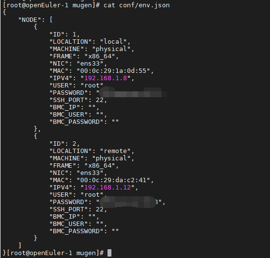
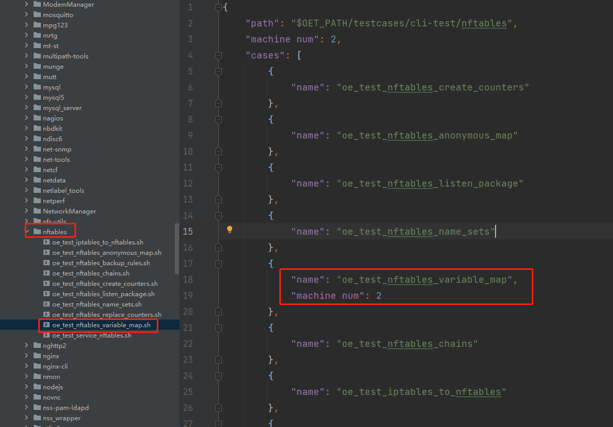
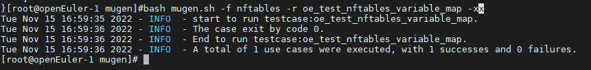

# 基于多个openEuler物理机执行mugen测试脚本

mugen脚本中有的脚本执行需要使用多个物理机，针对此场景，这里以需要两个物理机为例（用[openEuler](https://so.csdn.net/so/search?q=openEuler&spm=1001.2101.3001.7020)虚拟机模拟物理机）

（1）首先安装两台openEuler虚拟机（用过模拟openEuler物理机），具体安装可参考 [VMware安装openEuler-22.03-LTS版本的虚拟机](http://blog.redrose2100.com/article/420) 这里比如两台ip地址为：192.168.1.8和192.168.1.12

（2）在其中一台（192.168.1.8）安装git工具，若已安装，则直接跳过

    dnf install -y git

（3）在其中一台（192.168.1.8）下载mugen代码

    cd /opt/
    git clone https://gitee.com/openeuler/mugen.git

（4）在其中一台（192.168.1.8）安装依赖

    cd mugen/
    chmod 777 dep_install.sh
    bash dep_install.sh

（5）查看命令帮助信息

    [root@openEuler-1 mugen]# bash mugen.sh --help
    mugen.sh：非法选项 -- -
    Usage:
    
        -c: configuration environment of test framework
    
        -a: execute all use cases
    
        -f: designated test suite
    
        -r: designated test case
    
        -x: the shell script is executed in debug mode
    
        -b: do make for test suite if test suite path have makefile or Makefile file
    
        -s: runing test case at remote NODE1

​    
​        Example:
​            run all cases:
​              normal mode:
​                bash mugen.sh -a
​              debug mode:
​                bash mugen.sh -a -x
​    
            run test suite:
              normal mode:
                bash mugen.sh -f test_suite
              debug mode:
                bash mugen.sh -f test_suite -x
    
            run test case:
              normal mode:
                bash mugen.sh -f test_suite -r test_case
              debug mode:
                bash mugen.sh -f test_suite -r test_case -x
    
            run at remote:
              normal mode:
                bash mugen.sh -a -s
                bash mugen.sh -f test_suite -s
                bash mugen.sh -f test_suite -r test_case -s
              debug mode:
                bash mugen.sh -a -s
                bash mugen.sh -f test_suite -s
                bash mugen.sh -f test_suite -r test_case -s

​    
​            configure env of test framework:
​                bash mugen.sh -c --ip $ip --password $passwd --user $user --port $port
​    
              if want run at remote should add --run_remote
              if want run at remote copy all testcase once add --put_all

​    
​        do make for test suite:
​            for all test suite:
​                bash mugen.sh -b -a
​            for one test suite:
​                bash mugen.sh -b test_suite

（6）设置环境变量

如下，执行两次即可以将两个ip地址设置到环境变量中

    bash mugen.sh -c --ip 192.168.1.8 --password xxxxxx --user root --port 22
    bash mugen.sh -c --ip 192.168.1.12 --password xxxxxx --user root --port 22

然后可以查看环境变量文件 conf/env.json  

（7）从mugen中找到一个需要两个物理机的脚本，如下  

（8）执行测试用例

    bash mugen.sh -f nftables -r oe_test_nftables_variable_map -x

（9）执行结果如下，即成功执行  

（10）同理，如果需要多个物理环境，只需要参照步骤6多配置几个环境的配置即可

## 参考

https://blog.csdn.net/redrose2100/article/details/127869419?spm=1001.2014.3001.5506