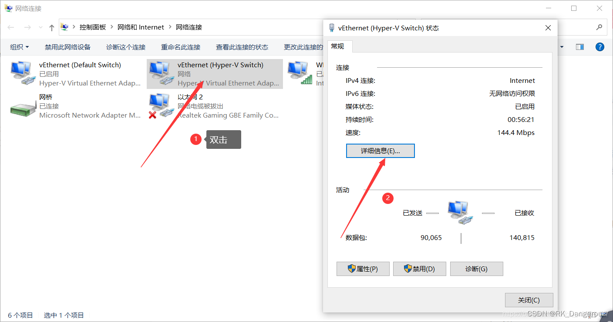

项目概要：  
使用mugen框架对[openEuler](https://so.csdn.net/so/search?q=openEuler&spm=1001.2101.3001.7020)操作系统的软件包rubygem-bacon进行测试，记录issue。

**涉及到一些保密性，我有些东西不便细述，因此设置了查看权限。**

## 一、申请[云服务器](https://so.csdn.net/so/search?q=%E4%BA%91%E6%9C%8D%E5%8A%A1%E5%99%A8&spm=1001.2101.3001.7020)+openEuler操作系统安装

说明：安装openEuler操作系统可以通过在“华为[云服务](https://so.csdn.net/so/search?q=%E4%BA%91%E6%9C%8D%E5%8A%A1&spm=1001.2101.3001.7020)”中购买云服务器，因为我有虚拟机，所以我想直接安装在我的虚拟机上。

### 设置我的虚拟机：Hyper-V

由于我的Hyper-V在之前用AVD的时候关闭了，所以我需要重新打开。

1.  **打开Hyper-V**  
    方法在我的笔记里：[https://blog.csdn.net/RK\_Dangerous/article/details/122252695?spm=1001.2014.3001.5502](https://blog.csdn.net/RK_Dangerous/article/details/122252695?spm=1001.2014.3001.5502)  
    
2.  **添加Hyper-V管理工具**  
    控制面板 -> 程序 -> 启用或关闭Windows功能 -> 勾选Hyper-V。  
    注意打开➕检查一下Hyper-V文件夹下各项文件夹是否都勾选，尤其是虚拟机监控程序。如果无法勾选、自动取消勾选，参考我的解决方案：[升级到win11家庭版了](https://blog.csdn.net/RK_Dangerous/article/details/121075740?csdn_share_tail=%7B%22type%22:%22blog%22,%22rType%22:%22article%22,%22rId%22:%22121075740%22,%22source%22:%22RK_Dangerous%22%7D&ctrtid=5BbfN)  
    
3.  **打开Hyper-V**  
    在开始菜单的“Windows管理工具”文件夹中可以看到Hyper-V管理器。

### 安装openEuler操作系统

参考：[openEuler 操作系统安装及配置网络](https://blog.csdn.net/weixin_42104154/article/details/123615753)

我的电脑：Win11家庭版

#### 下载镜像文件

选择x86\_64架构进行本地安装，分别将发布包 “openEuler-21.09-x86\_64-dvd.iso”和校验文件“openEuler-21.09-x86\_64-dvd.iso.sha256sum”下载到本地。  
[因为官网下载速度太慢，可以选择别的镜像源，链接在这里！](https://www.openeuler.org/zh/mirror/list/)  
_我是在第二次下载的时候才发现，第一次下载用了好几个小时，真的很慢，不要做和我一样的笨蛋_  
_SOW文件要求的版本是openEuler 22.03 LTS和openEuler 20.03 LTS SP3版本以及x86和arm上运行。我下载的时候为了和教程对应，下载了21.09版本，如果是交作业还行，但如果要把问题贡献至社区，显然版本必须是对应的，之后我再重新下载吧。_

#### 新建虚拟机

打开Hyper-V管理器，在右侧列表中选择新建虚拟机。输入虚拟机的名字和保存路径，然后选择第二代虚拟机。  
  
根据安装指南，分配内存为8GB，最小启动内存是4GB。因为我的内存不够，所以我填了4096。  
  
配置网络为Default Switch，意思是默认连接本机网络。我选择的是之前创建的一个虚拟交换机，详见之前Linux笔记。  
  
根据安装指南，虚拟硬盘大小为120GB。  
  
安装完成。

#### 安装openEuler

1.  双击虚拟机，启动并连接。  
    如果出现错误提示，例如“the unsigned image’s hash is not allowed”，可能是因为选择的是自定义镜像（ISO文件），镜像是没有微软签名的，会报错。先**强行关闭虚拟机**，在管理器里右键虚拟机点击设置，然后关闭安全启动即可。  
    参考：[hyper安装iso Hyper-V 使用ISO文件安装windows7](https://www.csdn.net/tags/MtjaMgwsNjQ3MTUtYmxvZwO0O0OO0O0O.html)
2.  安装openEuler  
      
      
      
    ②这里我选择了连接网络，因为我用的是Hyper-V，和VM可能不太一样，我以防万一就直接连接了（后续还要配置）。  
      
    安装完成！正在重新启动。

#### 使用

首先等待登陆，出现“localhost login:”之后，输入自己的用户名和密码，然后就可以输入命令了。  
_注：在输入命令的过程中，会不定时地报错？或者说自动提示一些信息。我查资料了解到可能是由于欧拉系统不稳定，暂时无伤大雅。_  
  
openEuler默认没有图形界面，但是华为提供了桌面环境，可以安装。安装方法：[为 openEuler 安装 桌面环境图形化界面【ukui】](https://blog.csdn.net/m0_51378263/article/details/115282335)

    // systemctl set-default graphical.target 表示开机将默认进入图形界面
    // systemctl set-default multi-user.target 表示开机将默认进入文本界面
    // systemctl get-default 可以获得当前的默认target

#### 配置网络

因为我的是Hyper-V，很多教程上的选项我这里都没有，所以费了很大的功夫才连通。而且由于连不上网，所以也没办法下载图形界面，只能用命令行配置网络，更难了！  
使用`ping www.baidu.com`检查网络是否连接，如果未连接，步骤如下：

1.  首先使用`sudo -i`登陆root用户，然后使用`cd /etc/sysconfig/network-scripts/`进入network-scripts目录。该目录的文件`ifcfg-eth0`用于配置网卡（网卡名字为eth0），后续将对该文件进行修改。
2.  打开物理主机的控制面板 -> 网络和Internet -> 查看网络状态和任务 -> 更改适配器设置，跳转到“网络连接”处。按照下图步骤记录IPv4地址、IPv4子网掩码、IPv4默认网关和IPv4DNS服务器（DNS有两个数据）。也可以在本机中打开命令行，输入`ipconfig`查看Windows的IP配置。  
      
    
3.  返回虚拟机中。使用命令`vi ifcfg-eth0`修改文件中的数据，（如果项目已有就修改，没有就添加）如图。这里会用到上一步中记录下的五项数据。  
      
    数据说明：

    BOOTPROTO="static"			// （固定的）修改为静态
    ONBOOT="yes"				// （固定的）系统启动时自动激活网卡
    GATEWAY=192.168.1.1			// （你自己的）网关
    IPADDR=192.168.1.100		// （你自己的）ip地址
    DNS1=114.114.114.114		// （你自己的）设置DNS
    DNS2=8.8.8.8
    NETMASK=255.255.255.0		// （你自己的）子网掩码
    
4.  配置好网卡后，设置DNS。使用命令`cd /etc/`进入etc目录，编辑`resolv.conf`文件的内容与DNS两个数据对应，大概格式如下。（图片来源网络）  
    
    
5.  打开系统域名解析服务（新版本的centos好像没有systemd-resolved.service，跳过这步也可以）。使用命令`systemctl status systemd-resolved.service`，如果状态不是active，就需要使用`systemctl restart systemd-resolved.service`重启该服务，然后使用`systemctl enable systemd-resolved.service`将其加入开机自启项。active状态图如下：  
    
    
6.  使用`systemctl restart NetworkManager`重启网络。
    
7.  再次使用ping命令测试网络。成功！  
    
    
8.  如果还不对，试试除ifcfg-eth0之外，再添加一个ifcfg-ens33文件，因为我自己试的过程中看到别人都有ens33，我就按照他们的自己写了一个，文件内容大致如下，要修改的地方同上  
    
    

参考来源：  
[Hyper-V虚拟机连接外部网络](https://blog.csdn.net/qq_43603477/article/details/118149671)  
[没有ens33配置文件 linux虚拟机ens33.config配置文件](https://www.csdn.net/tags/OtDaAgzsNTU1MjEtYmxvZwO0O0OO0O0O.html)  
[Name or service not known异常处理方法总结](https://blog.csdn.net/csdn690570213/article/details/104196873)  
[Ubuntu判断是否连上网络及无法连接网络的解决方法](https://blog.csdn.net/qq_53861870/article/details/123997281)

## 二、自动化测试框架mugen

> 软件包加固测试需要通过linux指令来部署相关环境并且执行软件包功能。而最后需要编写shell脚本进行测试用例的执行并将代码提交到仓库中。

相关链接（加密）：  
\[ openEuler / mugen\]  
\[ mugen/ README.md \]  
\[测试用例检视规范\]  
\[HDC-openEuler赛道任务辅导-Mugen框架的使用 (New)\]

### 基本了解

> mugen框架规定了我们编写的用例如何执行，shell脚本格式如何编写，同时还规定了各种公共函数可以直接调用。学会了mugen框架，才知道如何写一个测试用例、如何运行测试用例，这些都可以在mugen仓库的README.md文档中学习。

mugen框架有两个重要的包（详细知识可以通过阅读mugen仓库提供的文档以及B站的视频进行学习）

1.  **suite2cases**  
    在suite2cases里面只需要写一个**json**文件，里面存放测试用例名（脚本文件名）。当json文件里面有多个测试用例时，我们便可以用指令控制一次执行一个用例还是多条用例。
2.  **testcases** 的 **cli-test**  
    **cli-test**存放用于执行的脚本文件。

### 下载框架

1.  注册一个github账号。  
    _我在注册的过程中，用电脑登陆github官网，输完邮箱之后“continue”按钮点不动，用手机注册就很流畅_
2.  （可选）安装ssh。使用`yum -y install ssh`命令，作用是和其他主机通信。由于我的yum找不到ssh，所以我没有安装。

> Gitee有两种登录方式（HTTPS、SSH），SSH相对安全，而且ssh不需要每次登录都需要输入密码。ssh需要本地电脑生成一段密钥，然后去代码托管网站（Gitee、GitHub、Gitlab）中个人账号的SSH公钥管理添加这段密钥，这台电脑就可以拉代码了。

3.  安装git工具。使用命令`yum update`和命令`yum install git`。在安装前一定要确保网络链接ping通，否则后续会很麻烦。  
      
    不停报错。  
    主要是运行超时，我在浏览器下载的时候也常常中断，我找了很多办法，比如换一个其他的开源网址、修改DNS配置、本地安装等等，由于教程都不是很清楚，所以一直失败。后来我找到了一个设置超时时间的教程，通过修改配置文件`vi /etc/yum.conf`，添加超时`timeout=600`，然后中间又中断过一次就好了。  
    参考：[\[CentOS7\]yum 超时时间修改](https://www.cnblogs.com/leoshi/p/13500750.html)
    
4.  以管理员身份登陆虚拟机，在命令行中输入`git clone https://gitee.com/openeuler/test-tools.git`，下载测试框架到目前cd所在的目录下。  
    
    

## 三、rubygem-bacon软件包详情

> 首先我们需要熟悉软件的功能，它的各种指令（如-u -e -l等）。我们测试的目标就是覆盖该软件包命令行基本功能即所有指令。我们可以寻找关于该指令的文档进行阅读，若该软件的资料比较少，我们还可以阅读其源码。  
> 对于软件包的测试，要测试的点包括但不限于软件能否正常下载、正常开启或关闭、软件的各个指令能正常执行并达到预期的效果，软件能够正常卸载。测试完之后，要保证“无痕”，即保证软件所有相关的文件都被清楚掉，做到完美复原，这样就算一个软件包测试完成了。其中任何一个环节经过测试后，若确定有问题，需要向相应的软件包仓库提issue，供开发工程师进行解决。

该部分包括对程序源代码、二进制文件、说明文件等进行了解，并通过运行程序得到结果了解软件包。  
软件包名称：rubygem-bacon

源码文件（安装包）：[https://gitee.com/src-openeuler/rubygem-bacon](https://gitee.com/src-openeuler/rubygem-bacon)  
二进制文件（没用）：[https://repo.openeuler.org/openEuler-22.03-LTS/everything/ $ basearch](https://repo.openeuler.org/openEuler-22.03-LTS/everything/$basearch)  
下载二进制文件（没用）：[https://view.officeapps.live.com/op/view.aspx?src=https%3A%2F%2Fr.huaweistatic.com%2Fs%2Fkunpengstatic%2Flst%2Ffiles%2Fdocx%2Fecosystem%2Fecology\_remit%2F20220623170003\_01.docx&wdOrigin=BROWSELINK](https://view.officeapps.live.com/op/view.aspx?src=https://r.huaweistatic.com/s/kunpengstatic/lst/files/docx/ecosystem/ecology_remit/20220623170003_01.docx&wdOrigin=BROWSELINK)

### 下载软件包

> 软件包(Package)可以分为二进制和源代码。 二进制包里面包括已经编译完成， 可以直接运行的程序。 通过 sudo yum install 来进行下载和解包（ 安装） ， 执行完该命令后就可以马上使用。 并且这种方式简单快捷， 适合比较固定、 无需改动的程序。  
> 源代码包里是程序的原始代码， 在你的计算机上必须经过编译， 生成了可执行的二进制文件， 方可运行。 一些个人开发的程序、第三方修改或者你希望修改的程序都应当通过源代码包来编译安装。

文件中给的源码对应的二进制文件的下载方式有误，我下载不了。我打开源码链接，如下图。在左上角选择对应的操作系统版本，右上角查看地址，然后在欧拉命令行使用`git clone`克隆，然后再用`yum install rubygem-bacon`安装。  

就出现如下结果，我原来以为只能使用二进制文件安装，现在看应该是源码也可以安装软件包（可能安装的过程中就能生成二进制文件？我也不知道）不知道安装的是什么东西，反正是安装成功了。  
  
  
  

### 软件包了解

安装完毕之后，我根本不知道这个软件包该咋用。因为我看了一下华为给的特别不详细的测试演示，虽然软件包名是rubygem-bacon，但是好像可以直接用后面的，我就猜直接用`bacon`命令碰碰运气，所以有了下图。用`bacon -h`查看帮助。  
  
学到这里，我就懵逼了，根本不知道下一步该干什么。多亏了老师组织的第一阶段的汇报，我仔细听了同学的汇报和老师的建议，有了很多启发和灵感。首先是关于rubygem-bacon软件包的理解，ruby是一种语言，所以上图中ruby有自己的options，bacon应该就是软件包的名字，所以也可以解释上图为什么软件包的名字这么长，却只用bacon命令就可以。那么gem是什么意思？以上分析作为我的思路，进一步查找相关资料。

> rubygems是ruby的一个包管理器，提供了分发ruby程序和库的标准格式"gem"，旨在方便地管理gem安装的工具，以及用于分发gem的服务器。这类似于python里的pip。rubygems在功能上于apt-get、yum非常相似。  
> rubygems软件允许您轻松下载、安装和使用ruby在您的系统软件包。这个软件包被成为“Gem”和包含一个ruby包应用程序或库。

总结（我的理解可能有误）：ruby是一种动态语言，类似于python，gem是一种命令，同时Gem是一个管理Ruby库和程序的标准包。所以rubygem-bacon中，rubygem大概可以理解了吧，应该就是一个命名规则。

了解完rubygem，接下来了解bacon。我们在软件包源代码介绍中可以看到（注意划红线部分）：  
  
软件简介：A small RSpec clone，并且打了sig-ruby标签。我们逐一击破。

> RSpec 是一个用 Ruby 编写的“领域特定语言”测试工具，用于测试Ruby代码。它是一种行为驱动的开发框架，广泛用于生产应用程序。

所以bacon是用来克隆RSpec的吗？或者是RSpec的简单克隆版本吗？

> **sig ：Ruby方法的可选类型断言。**  
> 这个gem添加了sig方法，允许您向Ruby方法添加签名。 当您调用该方法时，它将验证该方法的参数/结果是否适合先前定义的行为。

大概先了解一下，那么我们的sig-ruby标签就极有可能是因为gem里面有这个sig功能，所以给它打了这么一个标签。

接下来为了进一步了解这个软件包，我们需要查看它的文档/使用手册。在哪里？网上没有找到任何相关的信息，但根据同学的分享，尝试解压缩源代码，看看里面有没有提供什么有用的信息吧！（如果你察觉到下图的问题，往后看有答案）  
  
尴尬了，根本没有可以打开它们的东西。那我们现在需要了解一下ruby语言是怎么编写的，以及它们需要的环境，以此来打开它们。

### Ruby

前言：由于我的虚拟机性能不咋样，而且窗口巨小，所以我打算在物理机去研究源代码，然后再到虚拟机测试。所以这节内容我是在Windows下完成的。  
参考：[Ruby 教程](https://www.runoob.com/ruby/ruby-tutorial.html)

#### 环境配置

> 如果您是在 Windows 上进行编写，那么您可以使用任何简单的文本编辑器，比如 VSCode 或 Edit plus。

我已经有VSCode（Visual Studio Code）了，编辑器解决。

_本节下面的内容选看。（因为我傻了，我还下载了ruby环境，我忘了我只是看代码，根本不需要调试……）_

接下来解决ruby环境。根据教程在官网下载（我直接下载推荐版本），下载速度巨慢。

………等待中………

（我去玩了）  
下载完毕，双击安装。点accept，然后一路确认（发现一个很方便的事情，就是它可以帮助我们配置环境变量，赞！）  
  
这个界面太酷了。然后我也不知道msys2是干啥用的，就把上面三个选项都装了。然后打开命令行，输入`ruby -v`查看版本，可见安装成功。  

### 源代码了解

用VSCode打开文件夹就可以看源码了哈！文件目录如下：  
————————————  
**bacon-1.2.0.gem**  
打开编辑器后提示这是一个二进制文件，我们打不开。根据我们之前的了解去分析这个文件名，这显然是一个gem文件，这就解释了为什么我们之前可以在命令行用克隆到的源代码安装成功了，因为这个文件夹下本身就有二进制文件。  
**README.md**

> README.md文件一般出现在项目的根目录下，其作用是对项目的主要信息进行描述。

**README.en.md**  
英文说明。  
**rubygem-bacon.spc**

> spec文件是配置规范文件，是RPM软件包编译过程的核心，它说明了软件包如何被配置、打那些补丁、安装哪些文件、安装到哪里、安装过程需要哪些系统级别活动。

**rubygem-bacon.yaml**  
yaml文件是配置文件，yaml文件是用来写部署时需要的资源清单的文件。

————————————  
你有没有发现上面的目录根本没有能用的东西？要么就是打不开，要么就是配置文件，核心代码根本没有啊。我转念一想，gem是软件包，开发ruby的时候怎么可能用这个后缀呢？  
我在.yaml文件中发现了一个网址：  
  
原来源代码在github里面！下载！  
  
解压后用VSCode打开，这才是一个源代码该有的样子！  
  
一应俱全。我终于理解同学说的“我的readme也什么都没写，但是解压了之后发现在里面”。接下来就是对软件的了解了。

## 四、测试

> 在所有指令测试完毕，代码编写完毕后，可以提交代码。需要注意的是mugen仓库配置后，会产生冗余文件，这些是不需要上传的，必须清除掉再提交，具体哪些文件可以对比mugen仓库的文件。

### 命令行功能总结

**Ruby options:**

short option

long option

describe

\-e

–eval LINE

evaluate a LINE of code

\-

\-

评估一行代码

\-d

–debug

set debugging flags(set $DEBUG to true)

\-

\-

设置调试标志为true

\-w

–warn

turn warnings on for your script

\-

\-

为脚本打开警告

\-I

–include PATH

specify $LOAD\_PATH (may be used more than once)

\-

\-

指定LOAD\_PATH（可能被多次使用）

\-r

–require LIBRARY

require the library, before executing your script

\-

\-

在执行脚本前需要这个库

\-h

–help

Show this message

\-v

–version

Show version

**bacon options:**

short option

long option

describe

\-s

–specdox

do AgileDox-like output (default)

\-q

–quiet

do Test::Unit-like non-verbose output

\-k

–knock

do Knock output

\-o

–output FORMAT

do FORMAT (SpecDox/TestUnit/Tap) output

\-Q

–no-backtrace

don’t print backtraces

\-

\-

不打印任何回溯

\-a

–automatic

gather tests from ./test/, include ./lib/

\-

\-

自动test指定的目录中的tests

\-n

–name NAME

runs tests matching regexp NAME

\-

\-

运行匹配正则表达式NAME的测试

\-t

–testcase TESTCASE

runs tests in TestCases matching regexp TESTCASE

\-

\-

运行TestCases中匹配正则表达式NAME的测试(需要再核实代码)

\-h

–help

Show this message

\-v

–version

Show version

至于bacon的lib库中能够实现的功能，需要检查代码。此处略。

### 参数测试+服务测试

> 从是否关心软件内部结构和具体实现的角度划分，测试方法主要有白盒测试和黑盒测试。  
> 白盒测试方法主要有代码检査法、静态结构分析法、静态质量度量法、逻辑覆盖法、基本路径测试法、域测试、符号测试、路径覆盖和程序变异。  
> 黑盒测试方法主要包括等价类划分法、边界值分析法、错误推测法、因果图法、判定表驱动法、正交试验设计法、功能图法、场景法等。  
> 从是否执行程序的角度划分，测试方法又可分为静态测试和动态测试。静态测试包括代码检査、静态结构分析、代码质量度量等。动态测试由3部分组成：构造测试实例、执行程序和分析程序的输出结果。

### mugen测试

下载好之后，编写测试套和测试用例。注意用例命名规范`oe_test_包名_序号`，注意测试套中存放测试用例和测试套的对应关系。测试用例在package-test文件夹下面和测试套同名的文件夹下。  
将测试套和测试用例放在对应的目录下：`cp -r integration-test/suite2cases/* test-tools/mugen/suite2cases/`和`cp -r integration-test/testcases/package-test/ test-tools/mugen/testcases/`。  
使用cd进入test-tools/mugen/文件夹初始化测试环境。`bash mugen.sh -c IP地址 用户名 密码`。  
测试：cd到mugen/，`bash mugen.sh -f 测试套名`，运行测试套；`bash mugen.sh -f 测试套名 -r 用例名`运行单个测试命令。  
查看日志：`cd logs/测试套名`，使用`ll`查看所有日志文件，然后`vi 文件名`查看某个日志。

## 五、总结

认识到了文档和注释的重要性！代码理解十分困难。

最大的困难是ruby的学习，网上没有系统的教程，这个语言学习的人相对较少，很多知识在学习的过程中都很零散。而且在官方文档中，我需要的库没有使用方法！很难受。  
  

* * *

参考：  
[开源实习经验分享：openEuler软件包加固测试](https://blog.csdn.net/openEuler_/article/details/125547670)  
[openEuler基础（八）给openEuler安装图形界面Ukui](https://blog.csdn.net/xcjyxy2021/article/details/123342877?utm_medium=distribute.pc_aggpage_search_result.none-task-blog-2~aggregatepage~first_rank_ecpm_v1~rank_v31_ecpm-1-123342877-null-null.pc_agg_new_rank&utm_term=openeuler%E5%9B%BE%E5%BD%A2%E5%8C%96%E7%95%8C%E9%9D%A2&spm=1000.2123.3001.4430)  
[Linux中提示找不到apt-get命令](https://blog.csdn.net/weixin_43876014/article/details/113726775)  
[ROS入门笔记（三）：二进制包与源代码包](https://zhuanlan.zhihu.com/p/335665579)  
[Gem介绍](https://blog.csdn.net/qq_15007601/article/details/82286376)  
[RubyGem命令详解](https://wenku.baidu.com/view/15ff112301020740be1e650e52ea551810a6c9ae.html)  
[sig：Ruby 方法的可选类型断言](https://www.rubydoc.info/gems/sig/1.0.2)  
[README.md文件的作用及其文件内容的语法](https://blog.csdn.net/qq_34297287/article/details/124185326)  
[README.md和README.en.md的区别](https://blog.csdn.net/SiShen654/article/details/107174916/)  
[spec文件](https://blog.csdn.net/SundayO/article/details/101687257)  
[Git 开发必备 .gitignore 详解！【建议收藏】](https://blog.csdn.net/nyist_zxp/article/details/119887324)  
[Travis.yml是干啥用的呢？](https://mubiaozhan.cn/web/content/260)  
[Rakefile实例教程](https://www.cnblogs.com/274914765qq/p/4428098.html)  
[一文搞清rake、Rakefile、gem、gemspec、bundler、bundle、Gemfile的关系](https://cloud.tencent.com/developer/article/1596045)  
[Ruby的require](https://blog.csdn.net/windone0109/article/details/8771390)  
[ruby加载路径$Load\_Path](https://blog.csdn.net/afengxg123/article/details/39188091)  
[Ruby自学笔记（五）— 条件判断](http://t.zoukankan.com/windy1118-p-RubyLearning5.html)  
[Ruby File.join用法及代码示例](https://vimsky.com/examples/usage/ruby-File-method-c-join-rb.html)  
[Ruby中实现把字符串转换为类的2种方法](https://www.jb51.net/article/56104.htm)  
[raise-Ruby 异常处理(转载)](https://blog.csdn.net/jamst8522127/article/details/84622591)  
[Ruby中inspect和to\_s的区别](https://blog.csdn.net/zl728/article/details/5812908)  
[Ruby中Unless的用法](https://blog.csdn.net/weixin_43586296/article/details/102838566)  
[Ruby defined? 运算符](http://cw.hubwiz.com/card/c/56974bafacf9a45a69b050c2/1/6/8/)  
[ruby符号的应用](https://blog.csdn.net/weixin_33834628/article/details/86272617?spm=1001.2101.3001.6661.1&utm_medium=distribute.pc_relevant_t0.none-task-blog-2~default~CTRLIST~default-1-86272617-blog-91376727.pc_relevant_multi_platform_whitelistv1_exp2&depth_1-utm_source=distribute.pc_relevant_t0.none-task-blog-2~default~CTRLIST~default-1-86272617-blog-91376727.pc_relevant_multi_platform_whitelistv1_exp2&utm_relevant_index=1)  
[你能在Ruby中用分号吗?](http://ask.sov5.cn/q/BJMn43V3uY)  
[Ruby 3.1.2 Standard Library Documentation](https://ruby-doc.org/stdlib-3.1.2/)  
[Ruby 的 yield 浅析](https://blog.csdn.net/TomorrowAndTuture/article/details/108523877)  
[什么是Ruby中的attr\_accessor？](https://blog.csdn.net/asdfgh0077/article/details/103730309)  
[ruby里面的=~标识什么](https://zhidao.baidu.com/question/918321449433610299.html)  
[深入理解 Ruby 中的 instance\_eval 和 class\_eval](https://blog.csdn.net/antony1776/article/details/77869158)  
[ruby中的"+=“操作符和”<<"操作符](https://blog.csdn.net/greybeard/article/details/84155450)  
[使用 else 语句](http://cw.hubwiz.com/card/c/56974bafacf9a45a69b050c2/1/13/5/)  
[Ruby 中的BEGIN和begin](https://blog.csdn.net/sch1111878/article/details/60137077)  
[Ruby中的alias和alias\_method](https://www.jianshu.com/p/91d9711b4970)  
[Ruby: attr\_reader &attr\_accessor用法](https://blog.csdn.net/sunyllove/article/details/51819086)  
[Ruby Array.shift实例讲解](http://www.manongjc.com/detail/31-amdpxskcvwksbsc.html)  
[关于语法：Ruby send vs **send**](https://www.codenong.com/4658269/)

最后，发现一个作者有好多关于Euler的文章：[看山还是山，看水还是水](https://blog.csdn.net/xcjyxy2021?type=blog)

## 参考

https://blog.csdn.net/RK_Dangerous/article/details/125624440?spm=1001.2014.3001.5506