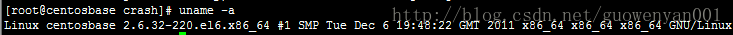

一、简介

linux内核发送崩溃时，kdump会生成一个内核转储文件vmcore。 可以通过分析vmcore分析出内核崩溃的原因。

crash是一个被广泛应用的内核奔溃转储文件分析工具。

使用crash调试内核转储文件，需要安装crash工具和内核调试工具kernel-debuginfo。

二、安装kudmp、crash、kernel-debuginfo

安装包的版本，要与linux内核一致，查看linux内核版本：

uname -a

2.1 安装、配置、启动kdump

安装kdump：

yum search kexec-tools

yum install kexec-tools.x86\_64

配置kdump：

vim /boot/grub/menu.lst： 设置crashkernel=auto

vim /etc/kdump.conf： path /var/crash （core文件产生的目录）

启动kdump：

service kdump start

2.2 安装crash

文件名：crash-6.1.0-5.el6.x86\_64.rpm

安装：yum search crash

yum install crash.x86\_64

2.3 安装kernel-debuginfo

文件名：kernel-debuginfo-common-x86\_64-2.6.32-220.el6.x86\_64.rpm

kernel-debuginfo-2.6.32-220.el6.x86\_64.rpm

安装：rpm -ivh kernel-debuginfo-common-x86\_64-2.6.32-220.el6.x86\_64.rpm

rpm -ivh kernel-debuginfo-2.6.32-220.el6.x86\_64.rpm

三、分析vmcore

3.1 模拟机内内核奔溃

echo c > /proc/sysrq-trigger

执行此命令内核崩溃，会在/var/crash目录下生成vmcore文件。（vim /etc/kdump.conf； path /var/crash）

3.2 分析vmcore

进入目录/var/crash/127.0.0.1-2014-02-24-09:30:19，可以看到vmcore文件。

1\. 执行/usr/bin/crash /usr/lib/debug/lib/modules/2.6.32-220.el6.x86\_64/vmlinux vmcore

2\. 具体分析过程见：Linux内核：分析coredump文件 - 内核代码崩溃

## 参考

https://zhuanlan.zhihu.com/p/497905821