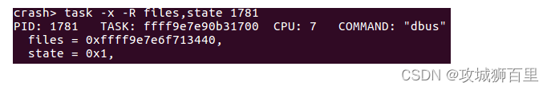

# Linux内核程序调试工具Crash的安装

> 转载自 山上有风景 [https://www.cnblogs.com/ssyfj/p/16278883.html#ubuntu-20.04-kdump-±crash-%E5%88%9D%E4%BD%93%E9%AA%8C](https://www.cnblogs.com/ssyfj/p/16278883.html#ubuntu-20.04-kdump-+-crash-%E5%88%9D%E4%BD%93%E9%AA%8C)

## 一: 程序调试工具介绍

在linux中的程序主要分为用户空间程序和内核空间程序两种，他们使用[不同的](https://so.csdn.net/so/search?q=%E4%B8%8D%E5%90%8C%E7%9A%84&spm=1001.2101.3001.7020)工具生成的不同的dump文件，并用不同[软件](https://marketing.csdn.net/p/3127db09a98e0723b83b2914d9256174?pId=2782&utm_source=glcblog&spm=1001.2101.3001.7020)分析dump文件。

**对于用户空间下的程序，所产生的dump文件，如:core.3296 和core-hellotest.2816.xm.1593867625 ，用gdb工具分析即可。**

**对于内核空间下的程序，所产生的dump文件，如/var/crash/202007092214/dump.202007092214，常用crash分析。**

本文将介绍如何安装[crash](https://so.csdn.net/so/search?q=crash&spm=1001.2101.3001.7020)工具和对crash工具的简单使用！！

> **Linux内核源码分析教程：[https://mp.weixin.qq.com/s?\_\_biz=Mzk0MzE5MTkzOA==&mid=2247488308&idx=1&sn=ed084f20c52a0a9f33c16aae07535190&chksm=c336f1d9f44178cffa89217e57d977c3e404b2001434d83af866ef4b6dca64c2f589818c2363&token=2002831924&lang=zh\_CN#rd](https://mp.weixin.qq.com/s?__biz=Mzk0MzE5MTkzOA==&mid=2247488308&idx=1&sn=ed084f20c52a0a9f33c16aae07535190&chksm=c336f1d9f44178cffa89217e57d977c3e404b2001434d83af866ef4b6dca64c2f589818c2363&token=2002831924&lang=zh_CN#rd)**

### (一)Kdump工作原理介绍

coredump为用户态进程段错误等触发的crash现场转储机制，可利用gdb进行corefile的调试。而**Kdump**为kernel crash/panic等而触发的转储机制， 一般使用crash工具进行调试.

内核崩溃转储指的是在内核异常情况时，将 RAM 中部分内容进行转储到磁盘或者其他存储中。当内核发生 panic 时，内核依靠 kexec 机制在预先保留的内存区域快速重启一个新的内核实例，预留内存区域大小可通过内核启动参数 `crashkernel` 指定。

为了实现 “双内核” 布局，**Kdump 在内核崩溃后立即使用 kexec 引导到转储捕获内核（capture kernel），使用 kexec 引导 “覆盖” 当前运行的内核**。转储捕获内核可以是专门构建的单独 Linux 内核映像，也可以在支持可重定位内核的[系统架构](https://edu.csdn.net/cloud/sd_summit?utm_source=glcblog&spm=1001.2101.3001.7020)上重用主内核映像。

kexec（kernel execution，类似于 Unix 或 Linux 的系统调用 exec）是 Linux 内核的一种机制，其允许从当前运行的内核启动新内核。kexec 会跳过由系统固件（BIOS或UEFI）执行的引导加载程序阶段和[硬件](https://marketing.csdn.net/p/3127db09a98e0723b83b2914d9256174?pId=2782&utm_source=glcblog&spm=1001.2101.3001.7020)初始化阶段，直接将新内核加载到主内存并立即开始执行。这避免了完全重新启动的漫长时间，并且可以通过最小化停机时间来满足系统高可用性要求。

#### 简而言之，Kdump原理就是通过预留部分内存(如192MB) 供转储内核使用， 当panic/crash产生时 利用kexec系统调用直接拉起转储内核。 利用该内核进行crash现场的储存dump。

### (二)Kdump安装

本文使用的Ubuntu16系统，如下图所示：  
  
虽然在Ubuntu18中自带Kdump，但是Ubuntu16中却没有，通过kdump-config show命令发现需要进行安装  
  
因此，使用sudo apt install kdump-tools进行安装即可，最后进行重启操作。  
  
再次使用kdump-config show命令，显示如下，正常工作。  

### (三)Crash安装

通过以下命令进行安装，完成之后进行重启即可

    sudo apt install linux-crashdump
    sudo apt install crash

通过相关文件查看，可得知安装过程中，内核启动参数中的 `crashkernel` 已经进行了设置。

    sudo cat /etc/default/grub.d/kdump-tools.cfg

    sudo cat /boot/grub/grub.cfg 

其实吧，我感觉在前面安装Kdump后就已经安装了前面的crash工具…，为了保险起见，这里再重启一次吧(在后面配置完crashkernel大小再进行重启吧)。

在服务重启成功后，我们可在内核 `dmesg` 中查看到相关信息，本机保留了128M RAM 内存区供转储捕获内核使用。

    dmesg -T | grep -i crash

同时我们通过命令 `kdump-config show` 查看到 `Kdump` 的状态已经 `Ready`

`service kdump-tools status` 显示 `kdump-tools` 状态为 `Active`。  

查看启动命令行 sudo cat /proc/cmdline

查看 crashkernel 内存分配的地址空间(root状态下)，cat /proc/iomem | grep -i crash

查看 crashkernel 内存分配的大小cat /proc/iomem | grep -i crash

至此，kdump 服务已生效，在系统遇到崩溃的情况即可生成对应的转储文件，**保存目录为 `/var/crash`**。

`Crash` 工具为 Red Hat 公司开发用于分析转储文件的工具，等同于对于内核快照进行类似于 `gdb` 调试的体验。

补充:128M的空间不足以支持系统崩溃时进行生成对应的转储文件,因此需要进行**调整crashkernel内存大小(重点)**

#### 1.修改 /etc/defatul/grub.d/kdump-tools.cfg 中 crashkernel=512M-:768M

#### 2.使用sudo grub-mkconfig -o /boot/grub/grub.cfg更新配置

#### 3.reboot进行重启操作

### (四)测试验证

Linux `sysrq` 工具可手工触发内核 panic，我们可用于临时测试：

    sudo echo 1 > /proc/sys/kernel/sysrq
    sudo echo c > /proc/sysrq-trigger

注意:运行后会死机,重启,重启后，/var/crash会保存此次手动触发生成的vmcore

此外以上命令需要进入root用户下使用,如果使用su -无法进入,出现su: Authentication failure问题.一般是没有为root用户设置密码,设置一下即可!

    sudo passwd root

命令运行成功后，`/var/carsh` 目录中会生成了一个以当前日期命名的目录，包含 `dmesg.x` 和 `dump.x` 两个文件，其中 `demsg.x` 为崩溃时候的系统内核日志，`dump.x` 文件则为转储的内核快照文件。

## 二:安装带有调试信息的 `vmlinux` 文件

为了使用 `Crash` 工具，我们还需要安装带有调试信息的 `vmlinux` 文件.

### (一)vmlinux介绍

找到vmlinuz对应的vmlinux文件,vmlinux文件是crash工具的必要输入参数。

vmlinux 是ELF文件，即linux kernel编译出来的最原始的文件。

vmlinuz是由ELF文件vmlinux经过OBJCOPY后，并经过压缩后的文件。

### (二)vmlinux安装

通过以下方法找到kernel对应的vmlinux.

#### 1.设置`repo仓库`

    echo "deb http://ddebs.ubuntu.com $(lsb_release -cs) main restricted universe multiverse
     deb http://ddebs.ubuntu.com $(lsb_release -cs)-updates main restricted universe multiverse
     deb http://ddebs.ubuntu.com $(lsb_release -cs)-proposed main restricted universe multiverse" | sudo tee -a /etc/apt/sources.list.d/ddebs.list
    sudo apt-get update

#### 2.安装dbgsym

    sudo apt -y install linux-image-$(uname -r)-dbgsym --allow-unauthenticated

输入命令后,会自动查找对应内核版本下的dbgsym文件,如下图:

    linux-image-unsigned-4.15.0-142-generic-dbgsym

当然同样最好把以下版本一起安装

    linux-image-4.15.0-142-generic-dbgsym

若是使用apt安装太慢,通过网站搜索进行安装也可(第一次是用的网站https://launchpad.net/ubuntu/xenial/amd64/linux-image-unsigned-4.15.0-142-generic-dbgsym/4.15.0-142.146~16.04.1,这次使用的命令)

安装完成后：

在 `ubuntu-dbgsym-keyring` 包安装成功后，我们可以看到在目录 `/usr/lib/debug/boot/` 中已经安装了 `vmlinux-5.4.0-80-generic` 文件。  

至此，我们已经万事俱备，可以愉快地使用 `Crash` 工具进行调试：

    sudo crash /usr/lib/debug/boot/vmlinux-4.15.0-142-generic /var/crash/202205171635/dump.202205171635

使用 bt 命令查看崩溃时候的运行栈

**补充:当我们安装了不同版本的dbgsym调试文件，会导致无法进入crash工具，好像会提示问题。因此我们需要按照前面的方法进入网站找到合适的文件，通过dpkg -i命令进行安装即可。**

**至此crash工具安装完成，以后编写内核程序出错，死机时系统会保存内核状态，并进行自动重启，我们通过使用crash工具，通过简单的命令，如bt查看运行栈，可以大致了解出问题的函数位置和原因，包括使用空指针等等。**

## 三:Crash 子命令使用

子命令的运行与 `bash` 运行类似，可以使用文件重定向、grep/awk 等命令，分析起来非常方便。

具体使用格式，可通过 `man subcommand` 来了解子命令的详细用法。

### (一)bt:用于查看进程的栈和寄存器状态

我就常用这个，得知在那个函数，出现什么错误，然后修改即可  

### (二)ps命令查看系统中的全部进程

`ps` 命令查看系统中的全部进程，其中 ST 字段表示状态， RU = “Running”， IN = “Interruptable” UN = “UnInterruptable”， ID = “Idle” 。`TASK` 字段表示 `task_struct` 的地址。

### (三)files:`files pid` 查看指定进程打开文件详情

### (四)task 用于显示 task\_struct 结构体

如果只想查看个别子字段，可以使用 `-R` 来指定，支持逗号分割多个子字段：

### (五)struct struct 命令可以查看对应结构的详细字段，如果需要查看字段的偏移量添加 -o 参数即可

如果明确知道某个地址对应的数据结构，也可通过 `struct` 来打印：(ffff9e7e90b31700对应前面1781进程地址)

### (六)vm 查看指定进程的虚拟内存

### (七)irq 命令查看中断

### (八)kmem 用于查看系统内存信息

## 参考

https://blog.csdn.net/weixin_52622200/article/details/134204444?ops_request_misc=&request_id=&biz_id=102&utm_term=linux%20crash%E5%AE%89%E8%A3%85&utm_medium=distribute.pc_search_result.none-task-blog-2~all~sobaiduweb~default-0-134204444.142^v100^pc_search_result_base5&spm=1018.2226.3001.4187