# crash实战：手把手教你使用crash分析内核dump

Kdump是Linux的一种内核崩溃捕获机制，[Linux内核](https://so.csdn.net/so/search?q=Linux%E5%86%85%E6%A0%B8&spm=1001.2101.3001.7020)遇到致命错误崩溃时会触发Kdump机制将崩溃时的现场保存下来，以便后续分析和故障排查。目前市面上有很多分析Kdump的工具，例如trace32, crash tool，本文介绍crash tool在手机领域的应用，并重点介绍一些实用的技巧。然而，本文的重点并不是介绍crash tool的工作原理和基础命令，也不是为了介绍Kdump转储的原理以及其他Kdump解析工具，如果你对这些内容感兴趣，请参考本文末尾提供的参考文档。

**一、为什么要用crash**

在手机领域常用[trace32](https://so.csdn.net/so/search?q=trace32&spm=1001.2101.3001.7020)或crash来解析内核dump，选择适合的工具可以大大提高问题定位的效率，但有时候我们不得不使用crash，例如下面场景：

-   **trace32太占用资源**

在手机领域中，当机器崩溃时通常会将整个内存现场全部转储下来，使用trace32工具分析这些转储信息时，首先需要将这些转储文件全部加载到本地PC端的内存中。目前市面上手机的内存容量一般为16GB或24GB，使用trace32来分析这些dump文件对PC机器的[性能](https://marketing.csdn.net/p/3127db09a98e0723b83b2914d9256174?pId=2782&utm_source=glcblog&spm=1001.2101.3001.7020)要求就很高了。下图展示了在一个32GB内存的PC上加载一个16GB手机产生的dump文件时的内存使用情况。此时，trace32占用了约17GB的内存，加上系统本身使用的一些软件占用的资源，几乎耗尽了PC的所有内存资源。因此PC端的性能变得非常拉胯，变得巨卡无比，这时候也几乎不可能同时启动多个trace32终端。

而[crash](https://so.csdn.net/so/search?q=crash&spm=1001.2101.3001.7020)工具的工作原理并不要求将整个dump文件全部加载到内存中。它使用“用时读取”的技术，即只有在需要使用某一段dump文件时才将该段加载到内存中，因此对内存的消耗较小。笔者的crash环境搭建在一个6GB内存的VMware虚拟机中，在分析16GB的dump文件时，通常可以同时启动3至4个终端。因此，在需要分析大型dump文件时，考虑到PC端的性能，crash工具可能是一个最佳的选择，特别是在资源受限的环境中。

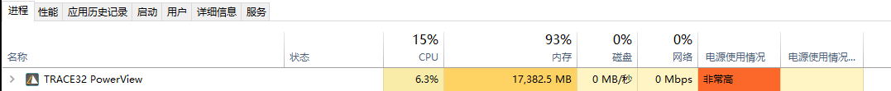

-   **trace32可能看不到调用栈**

在使用trace32解析dump时，有时候即使是已经把崩溃现场的各个cpu寄存器全部恢复，也可能会出现看不到任务调用栈的情况，如下图所示。这时候可以通过crash手动还原任务的调用栈，详见本文第四章内容。

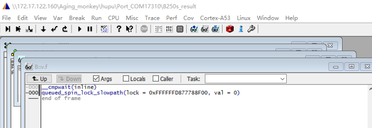

-   **trace32对变量的解析可能会失败**

trace32对局部变量的解析可能会失败，要么是完全没有对要关注的局部变量进行解析，要么是对局部变量的解析是错误的。如下图所示，在multi\_cpu\_stop这一层调用栈中，完全没有对newstate和flags变量进行解析，并且对msdata变量的解析出的值是错误的。此时可以通过crash工具从函数的栈帧中恢复局部变量的值，详情请参见本文第五章内容。

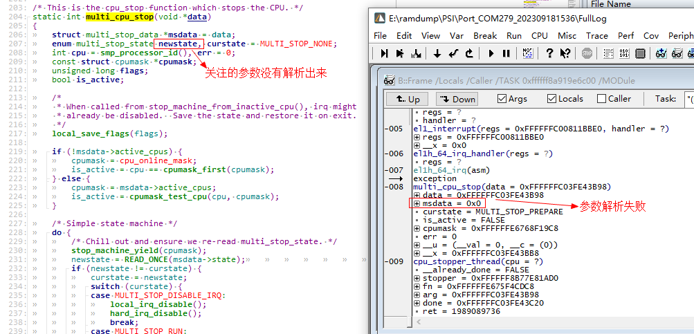

在面对上面的问题时，就不得不使用crash工具来解析dump了。

**二、dump文件加载**

本文使用的工具源码和插件信息如下：

源码: https://github.com/crash-utility/crash

插件: https://crash-utility.github.io/extensions.html

本文主要介绍crash在手机领域中的应用，目前国内安卓手机主要以MTK和高通为主，这两个平台的dump转储文件格式不同，使用crash加载的方式也不同。

MTK平台dump加载命令如下：

高通平台dump加载命令如下：

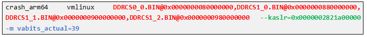

MTK平台的加载命令很简单，这里简单介绍一下高通平台的加载命令中各个部分的含义，我们把命令大致分为下面3个部分。

-   第一部分：指定转储文件对应的物理地址

Kdump在转储文件时，会把物理内存中的所有内容保存为对应的二进制文件，在通过crash加载dump文件时，需要告诉crash某个bin文件对应的物理内存是在哪里。

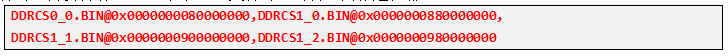

这段命令指示了不同的转储文件对应的物理内存的地址，信息来源于dump\_info.txt，该文件在dump导出的时候就生成，你也可以通过"grep DDRCS dump\_info.txt -nr"命令来快速获取。

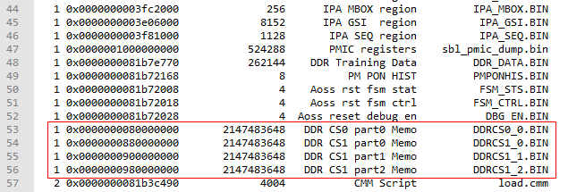

-   第二部分：指定kaslr

KASLR是kernel address space layout randomization的缩写，即内核地址空间布局随机化，作为Linux内核的一个重要安全机制，它旨在防止黑客对内核数据进行修改。KASLR技术可以让kernel运行的地址和vmlinux中的链接地址有个偏移量，并且每次reboot后该偏移量都不一样，使得内核加载和运行的地址每次都不同。因此，在使用crash进行dump分析时，我们需要获取相应的kimage\_voffset偏移量，并将其传递给crash工具进行解析。

kaslr值保存在OCIMEM.BIN中，使用下面的命令可以从OCIMEM.BIN中快速提取出kaslr，直接关注4ead dead这一行，后面的0000 21a0 0028 0000即为kaslr。需要注意的是，由于arm采用little-endian，因此需要倒序读取，拼接后kaslr为：0x0000002821a00000

-   第三部分：计算vabits\_actual

在64位系统中，用64位地址线来描述一个虚拟地址空间，但是实际上并不是每一个bit都有效的，vabits\_actual就像是一个mask，用于表示这64位地址中有多少位是有效的。

虚拟地址有效位数经常是在记录的内核配置项中，可使用使用内核源码自带的extract-ikconfig工具直接从vmlinux中解析出CONFIG\_ARM64\_VA\_BITS的值，命令格式如下：

在本例中，vabits\_actual为39

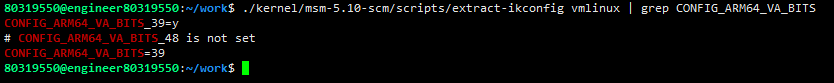

高通平台计算完上面的参数后，便可启动crash加载dump文件了。下面示例中笔者已经把命令写进crash.sh脚本，这样就不用每次都计算一次了。

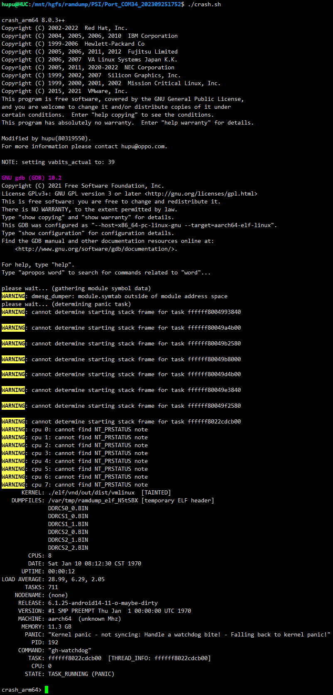

**三、基础信息搜集**

如果你是新手的话，dump加载起来之后可能也是一头雾水，不知道从何处开始分析，没有突破口。这时候可以尝试搜集下面基础信息，在搜集的过程中说不定你就找到突破口了。

-   系统信息查询；
-   内存使用情况；
-   中断状态；
-   runq上各个线程时间；
-   dmesg信息；
-   trace信息；

**3.1 系统信息查询**

命令如下：

示例如下，通过该命令你可以获取下面信息

-   cpu的个数；
-   已经开机多长时间了；
-   内核版本；
-   内存大小；
-   panic的大致原因；

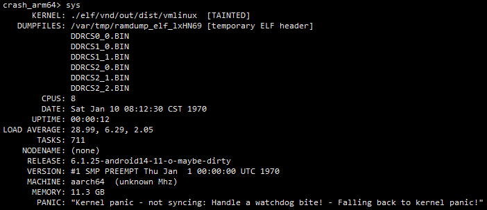

**3.2 内存使用情况**

命令如下：

示例如下，通过该命令可以确定问题产生时的内存使用情况，是否处于低内存的场景下。

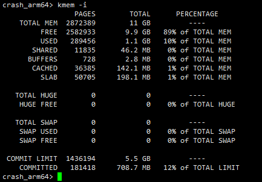

**3.3 中断状态**

命令如下：

示例如下，确定各个cpu上中断产生的情况。笔者之前就遇到过一例，因为外设异常造成的中断风暴问题，最终导致这个cpu频繁的处理中断，cpu的runqueue上的线程长时间获取不到cpu资源而最终触发hungtask进dump的问题。所以作为基础信息，先瞥一眼各个cpu上的中断处理情况还是很有必要的。

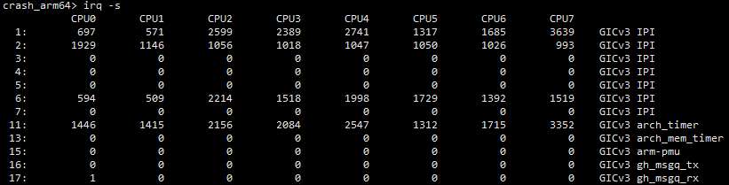

**3.4 runq上各个线程时间**

命令如下：

示例如下，通过该命令可以获取到各个cpu上正在运行的线程，以及运行了的时间。需要注意的是：对于非idle线程：这里获取到的运行时间是指这个线程在本次运行时机中的已经运行了多长时间，当线程进入睡眠或者阻塞状态从cpu的runqueue摘除时，这个时间会清零。对于idle线程：这里获取到的时间表示系统已经开机运行了多长时间。详见请参见内核关于sched\_info的统计信息。

如下图所示，可以确定机器进dump时各个cpu上正在运行的线程是什么，并且可知cpu4上的migration/4线程运行时间是最长的，共运行了4秒，那么这个线程很可能是触发dump的罪魁祸首，后面在分析的过程中需要重点关注。

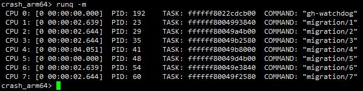

下面示例中cpu3~cpu7上的idle线程运行时间为20小时44分41秒，表示系统已经开机这么长时间了。另一方面，我们看到migration/0线程已经在cpu上19.867秒了，要知道调度一般是以ms级别为单位的，而这里连续运行19+秒，肯定是存在问题了，在后面的分析过程中也要重点关注。

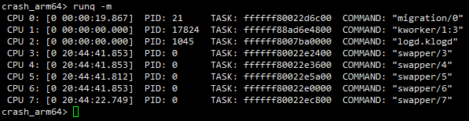

**3.5 dmesg信息**

命令如下：

示例如下，这没什么好解释的，dmesg用于查看内核日志，它可以显示一些与系统运行相关的重要信息，包括崩溃时的一些关键信息。笔者一般喜欢搭配tail命令或者直接通过">"将其直接重定向到指定的文件中后再查看。

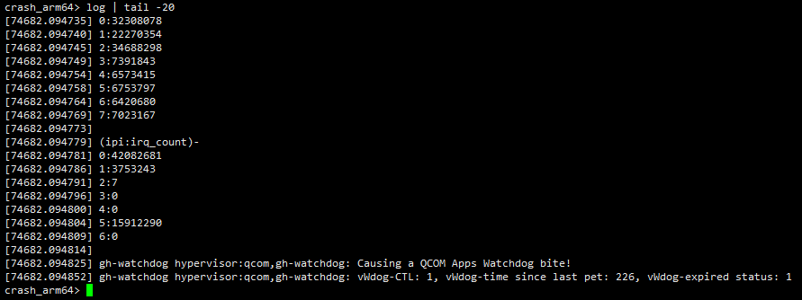

**3.6 trace信息**

命令如下，使用trace命令需要先安装trace.so插件，下面第一句的作用是先安装插件，第二句才是查看trace信息。

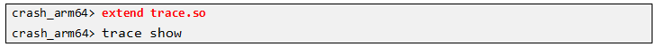

示例如下，通过该命令可以查看设备触发dump时的trace信息，但是这依赖于设备在进dump时trace-event系统正在往外面吐数据的，如果彼时trace-event根本就没有使能的话，也就没有trace信息输出了。

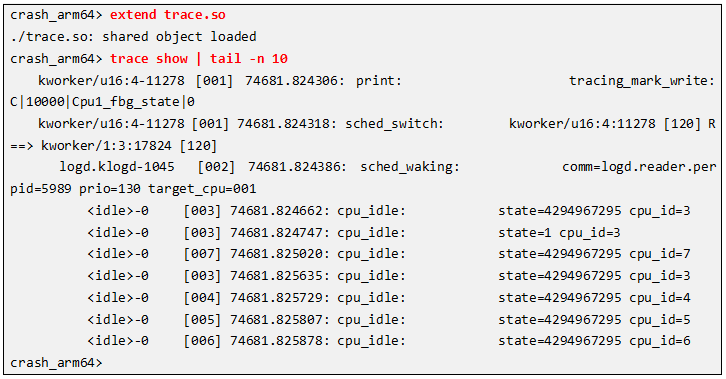

**四、查看任务的调用栈信息**

如果一个任务处于阻塞、睡眠状态，或者是处于runnable状态（在cpu的runqueue上等待运行，但是还没有获取到cpu资源），这类任务可以直接通过bt命令查看任务的调用栈，通过空格分隔多个pid可一次查看多个线程的调用栈。

注：crash命令基本用法不是本文的重点信息，如果你对crash命令的使用方法以及各种参数含义感兴趣，可以参考本文最后的参考文档。

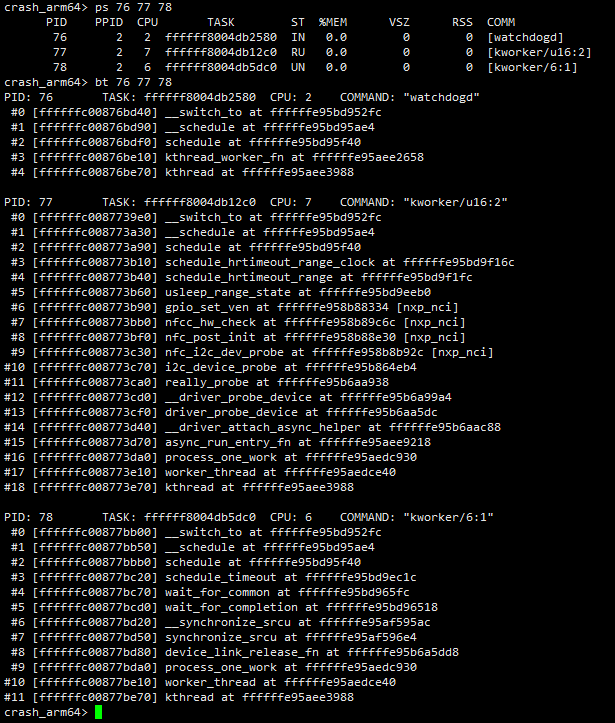

但是对于正在cpu上running的任务的调用栈应该怎么查看呢？如下图所示，这时候直接使用bt命令无法查看任务的调用栈，提示找不到任务的栈帧信息。

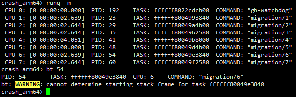

对于正在running的任务，有下面三种方法可以恢复其调用栈，下面依次介绍。

**4.1 方法一：通过cpu\_context中获取sp的值**

首先通过下面命令从任务的上下文中读出崩溃时sp指针。下面命令中54为线程pid，你可以替换为任何需要查看的任务，多个任务pid用空格隔开。

然后通过bt -S指定sp地址，这样就能查看任务的调用栈了。

注意，下面传给bt的地址实际上是sp+8，原因在本文4.3章节解释。

需要注意的是，该方法依赖于内核崩溃时已经将真正running的上下文保存进task\_struct::thread::cpu\_context中去，一般只有那些因为死锁或者长时间获取不到资源而触发看门狗的dump才会对上下文进行保存。所以该方法不一定每次都能成功。

另一方面，因为每个任务都有自己的任务栈，而中断栈则是percpu维度的，是这个cpu上的所有任务共享的，所以通过该方法无法看到中断栈中的内容。

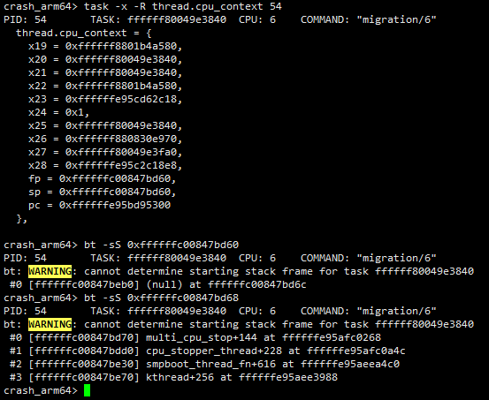

**4.2 方法二：从解析好的cmm中获取sp\_el1的值**

该方法需要依赖于芯片厂商的提供的dump解析工具。当系统触发dump时会将各个cpu的上下文信息（即各个寄存器的值）保存进dump文件的执行位置，芯片厂商提供的解析工具可以从dump文件中解析出系统奔溃时刻各个cpu的现场，并保存进一个cmm脚本中。例如MTK对应的脚本名称为debug.cmm，高通平台对应的脚本名称为corevcpuN\_regs.cmm。下图以高通为例，在corevcpu6\_regs.cmm中记录了sp\_el1的值。然后通过bt -S命令指定栈帧地址即可查看任务的调用栈。

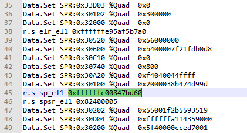

命令执行效果如下：

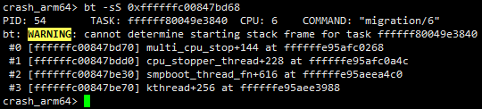

同理，该方法同样存在下面两个缺点：

一方面，该方法严重依赖厂商提供的解析工具，并且有时候并不一定能完整的解析出dump的内容，可能根本获取不到cmm脚本；

另一方面，使用该方法只能看到任务栈的内容，无法看到中断栈内容，原因同上，不再赘述。

**4.3 方法三：手动恢复栈帧信息**

上面两个方法有一个共同的缺点，那就是看不到中断栈中的信息，并且对工具或者崩溃时的环境又有要求，所以并不是每次都能成功恢复出调用栈。所以上述两个方案不是本文重点，了解即可。本文重点是要介绍下面的方法，直接在任务栈或中断栈中找出最顶层的栈帧，然后手动恢复各层调用栈信息。该方法对工具或者奔溃时的环境无任何要求，成功率极高（笔者至今没有遇到过恢复失败的情况），强烈建议get该技能。

在介绍本方法之前我们还需要科普一些计算机中的八股文信息。

**4.3.1 ATPCS规则**

首先是函数调用时各个寄存器的使用规则，下表是笔者罗列ARM64平台中的一些常用规则，更多详细详细大家可以google一下ATPCS（ARM-Thumb Produce Call Standard）规则，或者参考本文后面的参考文档，此处不再赘述。

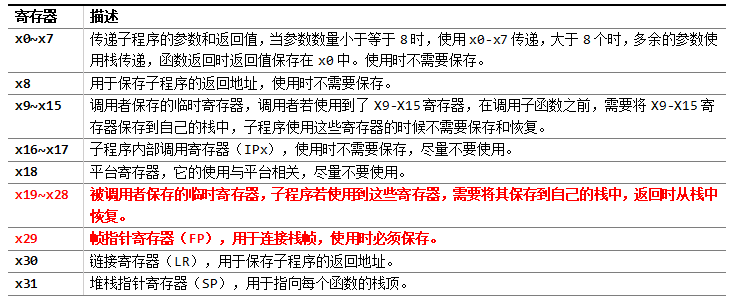

**4.3.2 栈帧格式**

其次是函数调用时的栈帧中的内容，在ARM64平台中，函数栈帧中的内容如下：

-   本函数用到的局部变量；
-   本函数即将破坏的“所有”寄存器(X19~X28)；
-   本函数执行完毕后要返回到哪里LR(X30)；
-   父函数的栈帧起始地址FP(X29)；

举个栗子，以下面程序为例：

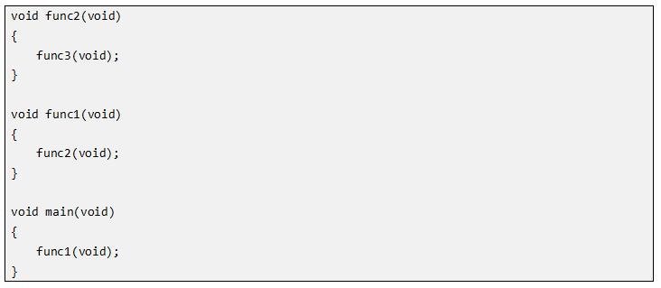

各级函数栈帧中的内容如下，其中：

-   FP(X29)指向上一个函数调用的栈帧的结束地址；
-   LR(X30)保存在FP+8的位置（这也是为什么上面在使用bt -S命令时要加8的原因），指向本级函数返回后要执行的下一条指令的地址；

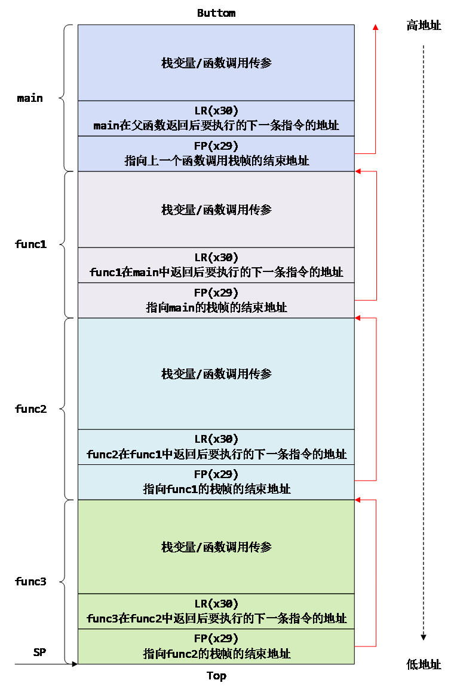

上面的示例程序只是理想的情况，函数沿着main -> func1 -> func2 -> func3的路径一直调用下去，返回时沿着func3 -> func2 -> func1 -> main的方向原路返回，中间没有“分叉”，此时任务栈中的栈帧信息还是比较简洁的。

但是实际情况中函数之间的调用关系往往错综复杂，如下，在func1返回之后又立刻调用和其他函数func4，那么此时的任务栈帧中的内容又应该是怎么的呢？

示例程序如下，假设当前PC指针在fun4内部。

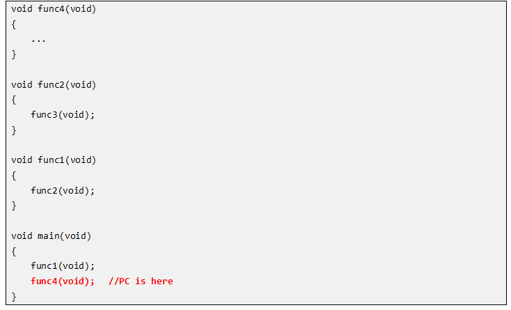

这时候栈帧中的内容取决于func4这一层栈帧的大小，分下面三种情况：

-   **场景1：func4的栈帧和func1的栈帧完全重叠**

这种情况下func2的栈帧中的FP在func4调用前后依然指向同一个地址，并且在func4调用前后该地址中保存的内容都表示FP，并且他俩的值是一样的。在func4调用之前，该地址保存的是func1的FP，指向main函数的栈帧的起始地址；在func4调用之后，该地址保存的是func4的FP，也指向main函数的栈帧的起始地址。这时候我们从最底层栈帧（即main函数对应的栈帧）沿着图中的红色箭头反方向回溯时，得到的调用栈内容应该是main -> func4 -> func2 -> func3。实际上因为当前PC指针是在func4中，所以实际的调用栈应该是main -> func4，只有后面的func2 -> func3只是历史执行过程中留下的“影子”，这主要是由于栈的“退出不清空”的特性造成的。遇到这种情况时，需要你对代码的逻辑比较熟悉，或者结合任务cpu\_context或解析好的cmm脚本中记录的PC或SP指针，从回溯出的调用栈中精准的判断出哪些是真正的调用栈，哪些是残留的影子，本文4.3.4章节有一个很好的示例。好在完全重叠这种情况是小概率事件，正常情况下都是后面将介绍的两种场景。

然而，事物总是有两面性的，虽然这个“影子”具有一定的迷惑性，但是因为从这个“影子”中可以推断出代码在过去的时间里执行过哪些逻辑，这对于哪些系统崩溃时Kdump没有抓到第一现场的情况下简直就是一根救命稻草，后面有机会笔者会补充一篇利用栈帧中的“影子”分析奔溃问题的一篇案例，本文我们还是先掌握常规操作吧。

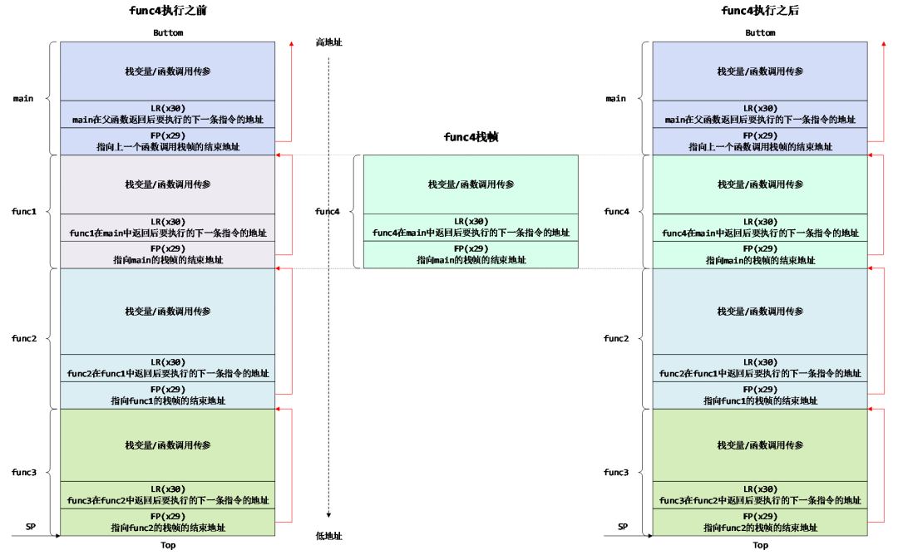

-   **场景二：func4的栈帧小于func1的栈帧**

这种情况下func2的栈帧中的FP在func4调用前后依然指向同一个地址，在func4调用之前，该地址保存的是func1的FP，指向main函数的栈帧的起始地址；因为func4的栈帧小于func1的栈帧，所以在func4调用之后并不会覆盖该地址的内容，该地址依然指向main函数的栈帧的起始地址，如下面图中红色虚线部分。这时候我们从最底层栈帧（即main函数对应的栈帧）沿着图中的红色箭头反方向回溯时，会得到下面两条调用栈，分别是：

a) 调用栈1：main -> func4

b) 调用栈2：main -> func1 -> func2 -> func3

到底那一条才是真正的调用栈呢？这时候需要结合代码逻辑、任务cpu\_context或解析好的cmm脚本中记录的PC或SP指针、报错时dmesg中的信息，最后不难找出真正的调用栈。

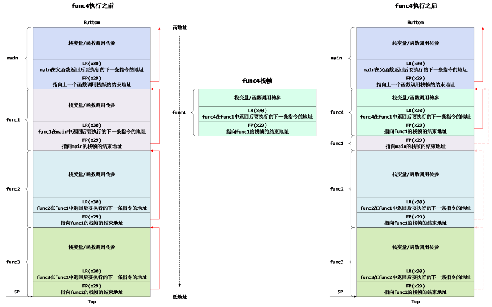

-   **场景三：func4的栈帧大于func1的栈帧**

这种情况下func2的栈帧中的FP在func4调用前后依然指向同一个地址，在func4调用之前，该地址保存的是func1的FP，指向main函数的栈帧的起始地址；但是因为func4的栈帧大于func1的栈帧，所以在func4调用之后该地址的内容会被覆盖，有可能保存的是func4中某一个局部变量的值，在本例中该地址保存的是func4的LR，如下面图中红色虚线部分。这时候我们从最底层栈帧（即main函数对应的栈帧）沿着图中的红色箭头反方向回溯时，只会得到一条调用栈：main -> func4

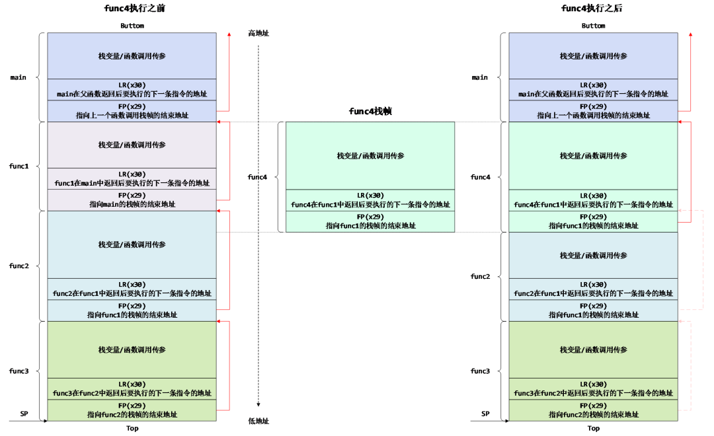

至此，八股文科普完毕，下面来实战分析一下

**4.3.4 实战**

首先，恢复任务栈中的内容，步骤如下：

-   **第一步：获取任务栈的内容**

在查看某个线程的调用栈之前，需要通过set指令先将crash的工作环境到这个线程的上下文中。

尽管任务栈的起始地址会保存在task\_struct::stack中，但是笔者一般不从该成员中获取，而是直接通过bt -S指定一个错误的地址，接着crash会直接告诉你这个任务合法的任务栈范围。通过rd命令直接将这段内存空间中的值读取到文本中，以便进行下一步分析。

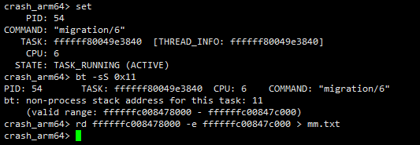

-   **第二步：沿着FP找到最深的栈帧**

上一步我们已经将pid=54的任务栈导出到mm.txt文本中，下面我们用Notepad++打开，使用NotePad++的好处是双击指定的地址可以高亮显示，这样我们可以很快定位出下一个栈帧的FP地址指向哪里。

如下图所示，下图最左侧的为栈地址，中间两列为栈内容。从高地址向低地址，沿着红色箭头反向回溯。具体方法是使用鼠标双击最左侧的栈地址，如果在栈内容区域中找到一处高亮的值（在Notepad++中，只有相同的两个值才会高亮），则表示该高亮的位置是下一个函数栈帧的起始地址；如果没有发现高亮的值则继续查找下一个地址；如果发现有多处高亮的值，则需要根据上面4.3.2章节介绍的三种调用栈格式，判断那一条才是真实的栈帧。一般遇到存在多条高亮的值时候，笔者会直接找出最深的栈帧，然后在下面第三步去判断到底哪些层调用栈是真实的，哪些层是“影子”。

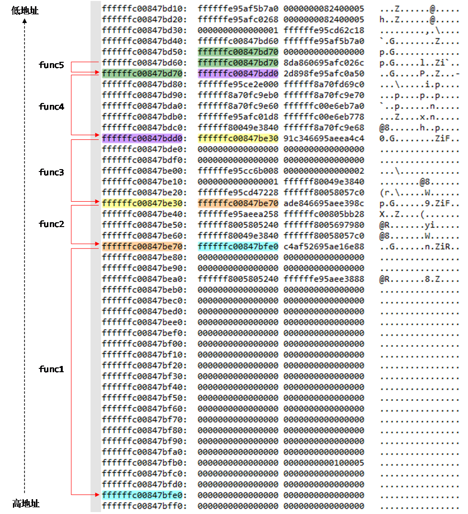

-   **第三步：通过bt -S查看任务栈中的调用关系**

需要注意的是，bt -S后面接的参数应该是LR的值，所以需要在上面找出高亮的地址的基础上加8。

注意：由下面的任务栈中的内容可知，当前这个任务应该是被中断打断了。在Linux内核中，每一个任务都有自己的任务栈空间，但是中断栈空间是这个cpu上的所有任务共享的。既然任务已经被中断打断，那么后面还需要看一下中断栈中的调用关系。

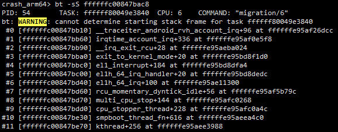

-   第四步：查看中断栈的范围

直接通过help -m命令，拉到最后面可以看到系统为各个cpu分配的中断栈的起始地址和大小，然后通过rd命令将中断栈的范围导出到文本中分析。

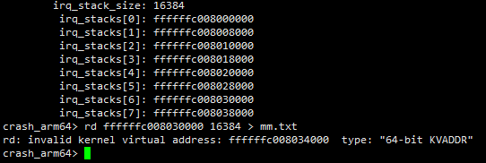

-   第五步：沿着FP找到最深的栈帧

该步骤同上面第二步，直接找到最顶层的FP即可，此处不再赘述。

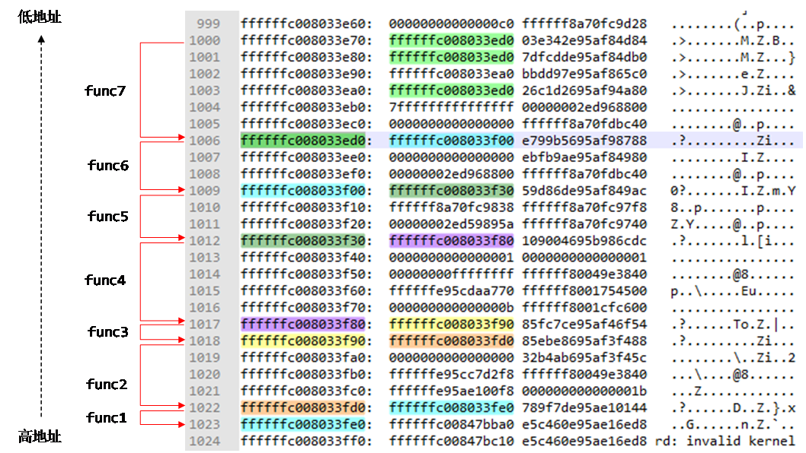

-   第六步：查看完整的任务栈+中断栈中的内容

下面通过bt -S命令就可以查看完整的任务栈和中断栈中的内容了。

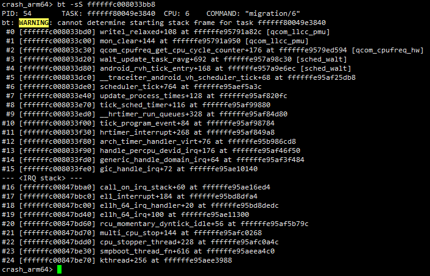

实际上上面获取到的调用栈，从第0~19层全部是“影子”，可以从下面两点证实：

pid=54的任务task\_struct::thread::cpu\_context中记录的sp和fp的值为0xffffffc00847bd60，说明真实的栈帧到0xffffffc00847bd60这一层就结束了，之后的内容是影子。

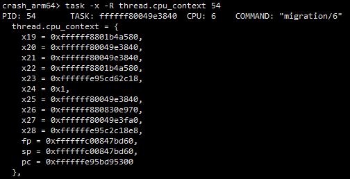

另一方面，在corevcpu6\_regs.cmm脚本中记录了系统崩溃时的pc指针为0xffffffe95af5b7a0，通过crash中的sym命令可以查看该地址对应的符号为rcu\_momentary\_dyntick\_idle+60，通过这个也可以确定真实的调用栈是第20层一下的内容。

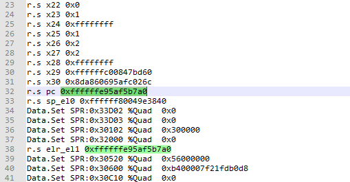

通过sym命令可查看指定地址对应的符号

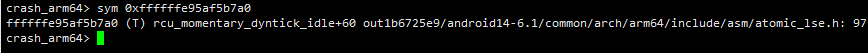

所以，pid=54任务真实的调用栈应该是这样的

**五、查看全局变量/局部变量的值**

\*\*  
\*\*

**5.1 普通的全局变量**

普通的全局变量的值很好查看，直接p后面接函数名即可。

**5.2 percpu的全局变量**

\*\*  
\*\*

对于percpu类型的全局变量查看方式也比较简单。在Linux内核中每个cpu都对应一个struct rq结构，下面命令是查看指定的cpu上rq结构里面的指定成员。需要注意的是下面的runqueues为全局变量的名称，冒号后面表示查看指定的cpu上的值。

注：本文不打算对crash的基础命令进行讲解，关于crash的基础命令的使用方法，请参见本文最后的参考文档。

percpu变量runqueues定义如下

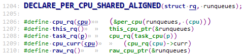

命令执行效果如下：

**5.3 局部变量**

普通全局变量和percpu全局变量的查看还是比较简单的，但是要想查看局部变量的值就没那么简单了，本文重点是恢复指定局部变量的值。例如在下面调用栈中，我们想分析在multi\_cpu\_stop这一层的调用栈局部变量的值。

multi\_cpu\_stop函数实现如下，本文我们以newstate、curstate和msdata这几个局部变量为例，分析局部变量的恢复过程。

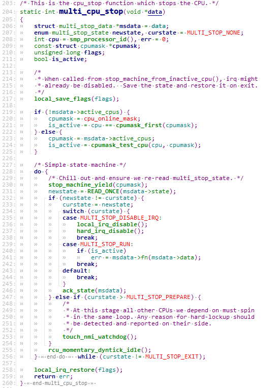

newstate和msdata这两个局部变量恰恰使用trace32无法解析出，这时候就轮到crash上场了。

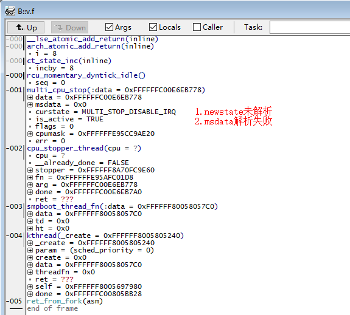

通过对multi\_cpu\_stop函数实现的分析，我们可以把newstate、curstate和msdata这几个局部分为下面两类，这两类的局部变量的恢复方法类似，下面分别介绍：

-   msdata来源于函数传递的参数；
-   newstate、curstate是函数中的普通变量；

**5.3.1 通过函数传参的局部变量: msdata**

\*\*  
\*\*

确定函数传参的步骤如下：

-   第一步：确定调用关系，找出父函数

由上面multi\_cpu\_stop的实现可知，局部变量msdata的值来源于multi\_cpu\_stop函数的第一个传参，由上面4.3.1章节介绍的ATPCS规则可知：函数调用时传递的参数，当参数数量小于等于8个时，使用x0~x7传递，大于8个时，多余的参数使用栈传递；函数返回时返回值保存在x0中。

所以在本例中我们要想知道msdata局部变量的值，只需要知道在cpu\_stopper\_thread中调用multi\_cpu\_stop时传递的参数即可，也就x0的值。

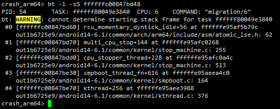

-   第二步：对父函数进行反汇编，确定参数所在的寄存器

使用下面命令对父函数cpu\_stopper\_thread函数进行反汇编，其中"/s"参数表示显示汇编在C文件中的行数。

找出调用cpu\_stopper\_thread的地方，确定传递的参数x0的来源。在本例中，x0来源于x21。

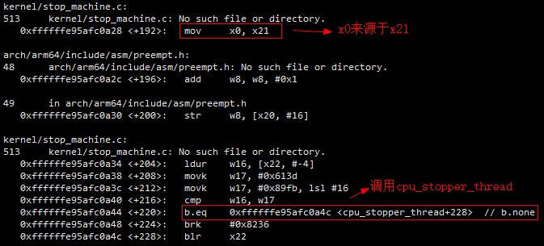

-   第三步：对子函数进行反汇编，确定sp和x21保存的位置

上一步已经分析出调用multi\_cpu\_stop函数传递的参数data保存在x21中。由上面4.3.1章节介绍的ATPCS规则可知，x19~x28这几个寄存器是需要被调用者保存的临时寄存器，子程序若使用到这些寄存器，需要将其保存到自己的栈帧中，返回时从栈中恢复。那么在multi\_cpu\_stop函数对应的汇编代码中，如果要使用x21寄存器，就需要在自己的栈帧中对x21的值进行保存，在函数退出的时候再进行恢复。

下面对multi\_cpu\_stop函数进行反汇编，只关注最前面的压栈操作部分。下面第一个红框中的汇编指令实现的是将x29（也就是父函数cpu\_stopper\_thread的栈帧地址）保存进sp-96的位置，感叹号"!"的含义表示这一条store指令执行完毕之后sp=sp-96。下面第二个红框表示将x21保存进\[sp+64+8\]的位置，需要注意的是，此时的sp已经在执行上一条指令的时候被改为sp-96了。所以，x21的保存位置应该为sp-96+64+8的位置。

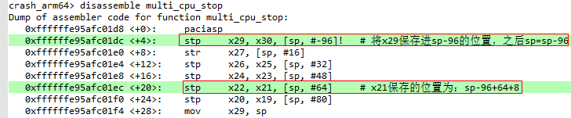

-   第四步：结合结合栈帧中的内容计算出x21的值

如下图所示，bt命令加上-f参数可以查看各层栈帧中的内容，由下面红色箭头和红框中的内容可知cpu\_stopper\_thread的栈帧FP保存在ffffffc00847bd70地址处，也就是说sp-96=ffffffc00847bd70，进一步得到sp = 0xffffffc00847bd70 + 96 = 0xffffffc00847bdd0，需要注意的是，这里得到的sp是还没有执行感叹号"!"操作之前的值。

由上一步的分析可知，x21保存的地址为sp - 96 +64 + 8 = 0xffffffc00847bdd0 - 96 + 64 + 8 = 0xffffffc00847bdb8。

接着，结合下面栈帧中的内容可知，0xffffffc00847bdb8地址处保存的值为ffffffc00e6eb778，也就是说x21(msdata)的值为ffffffc00e6eb778

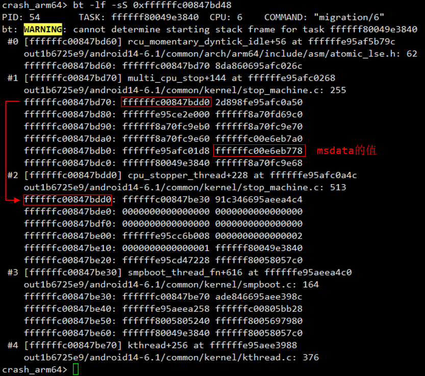

-   第五步：查看局部变量msdata的值

上面已经分析出msdata的值，结合代码中可知msdata的数据类型为multi\_stop\_data，则通过下面struct命令即可查看msdata的值。

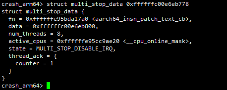

**5.3.2 查看普通局部变量的值: newstate、curstate**

如果关注的局部变量并不是通过函数传参传进来的，而是函数自己定义的局部变量，此时我们则需要换个姿势。在本例中我们看一下系统奔溃时newstate、curstate这两个局部变量的值。

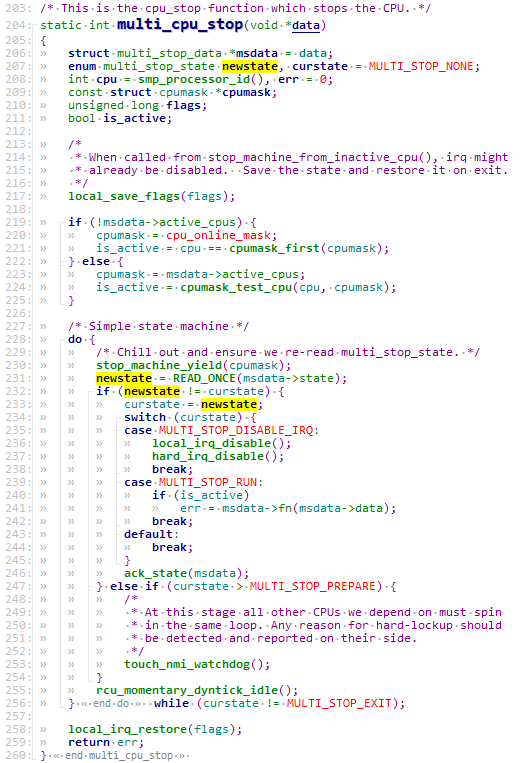

-   第一步：对使用变量所在的行进行反汇编，确定变量保存在哪两个寄存器中

结合上面的C函数实现，发现在C文件的第231233行有对着两个变量进行访问的地方，下面对multi\_cpu\_stop函数进行反汇编，重点关注231233这几行反汇编。通过对这几行反汇编进行分析可知，msdata中保存在x19中，w26中记录着newstate的值，w27中记录着curstate的值。

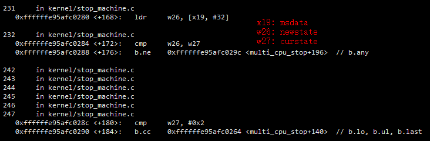

-   第二步：查看子函数汇编，是否对w26，w27保存

寄存器w26和w27实际就只x26和x27的低32位。由4.3.1章节介绍的ATPCS规则可知，x19~x28这几个寄存器是需要被调用者保存的临时寄存器，子程序若使用到这些寄存器，需要将其保存到自己的栈帧中，返回时从栈中恢复。所以如果rcu\_momentary\_dyntick\_idle对应的汇编代码中需要使用x26或x27这两个寄存器，则会在最前面的压栈操作中对这两个寄存器的值进行保存。

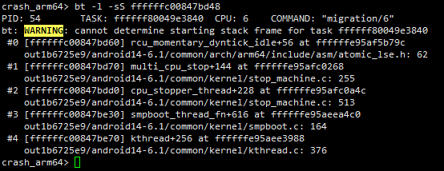

下面对rcu\_momentary\_dyntick\_idle进行反汇编，发现在该函数中并没有使用到这两个寄存器，因此也就不会对这两个寄存器进行保存。

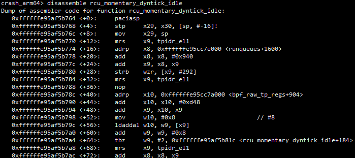

-   第三步：从cmm脚本中获取x26和x27的值

这时候怎么办呢？由上面4.3.4章节分析的结果可知，54号线程的真实的调用栈的最顶层栈帧就是rcu\_momentary\_dyntick\_idle，不存在下一层函数了，此时要获取x26或x27这两个寄存器的值就只能依赖高通或者MTK解析好的cmm脚本。这是因为系统崩溃后，如果已经没有函数调用了，就不可能再将崩溃现场的寄存器保存在某个函数的栈帧中了。好在高通和MTK厂商应对这个问题时都采用类似的方法：即在收集Kdump转储信息的时候，都会将系统奔溃时各个cpu上的各个寄存器中的值保存进dump文件的某个地址中，后期再使用解析工具从这些地址中读取出各个寄存器的值并保存在cmm脚本中。所以我们只需要从cmm脚本中获取x26和x27这两个寄存器的值即可。

如下，在高通corevcpu6\_regs.cmm脚本中记录的x26=x27=2，因此系统奔溃时newstate、curstate这两个局部变量的值为2。

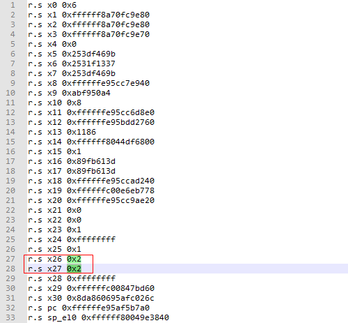

**5.3.3 扩展：tick中断产生时newstate、curstate这两个局部变量的值**

由上面4.3.4章节分析可知，在过去某个时刻，migration/6在执行过程中曾经被tick中断打断过，完整的调用栈如下，当时我们还说从第0~19层调用栈实际上是一个“影子”，栈帧中的内容记录的也是那次tick中断产生时的现场。

为了深入理解crash解析局部变量的方法，我们在此处扩展一下，继续分析在这次tick中断产生时，彼时newstate和curstate这两个局部变量的值。

这样我们就能够接着上面5.3.2章节的第二步分析继续了，因为彼时rcu\_momentary\_dyntick\_idle并不是调用栈的最顶层，所以即使rcu\_momentary\_dyntick\_idle的汇编代码中没有使用到x26和x27这两个寄存器，但是我们可以继续查看下一层，也就是el1h\_64\_irq这一层。

下面对el1h\_64\_irq函数进行反汇编，终于发现该函数中对x26和x27这两个寄存器保存的地方。由下面两点可知：

-   x29有多处保存，分别在sp+224+8处和sp+304处；
-   x26, x27分别保存在sp+208和sp+208+8处；

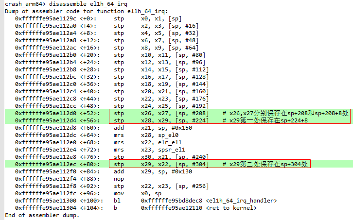

下面查看通过bt -f参数查看栈帧中的内容，因为x29有多处保存，分别在sp+224+8处和sp+304处我们此处以高地址为例，可知sp+304 = 0xffffffc00847bd40，那么sp和x26,x27保存的地址就可以计算出来了，如下：

sp = 0xffffffc00847bd40-304 = 0xffffffc00847bc10

&x26 = sp+208= 0xffffffc00847bc10+208 = 0xffffffc00847bce0

&x27 = sp+208+8= 0xffffffc00847bc10+208+8 = 0xffffffc00847bce8

由下面栈帧中的内容可知newstate=curstate=1。

需要注意的是，这是彼时tick中断产生时的瞬时值，并不是系统奔溃时的值。

**六、哪些线程正在访问/访问过指定的变量**

再介绍最后一个实用技巧，有时候我们在分析dump的时候经常会有这样的需求：

-   已经知道某一把锁在内存中的地址，我们想知道有哪些线程在等这把锁；
-   已经知道某个全局变量的地址或名称，我们想知道有哪些任务正在访问这个全局变量；
-   已经知道某个函数名称，我们想知道有哪些任务的调用栈中会调用到这个函数；

这时候我们就可以使用下面命令格式，来对系统中所有的任务的调用栈进行搜索了，其中-t是对所有的任务进行搜索，不区分任务的状态。而-T则表示只对系统中正在running的任务的调用栈进行搜索。

前面已经得知msdata的值为0xffffffc00e6eb778，在本例中，我们看一下系统中有哪些线程在访问msdata变量，命令如下：

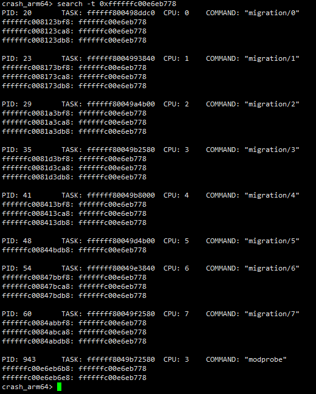

发现pid=943的线程也在访问msdata变量，下面通过bt命令看一下这个线程在干啥。

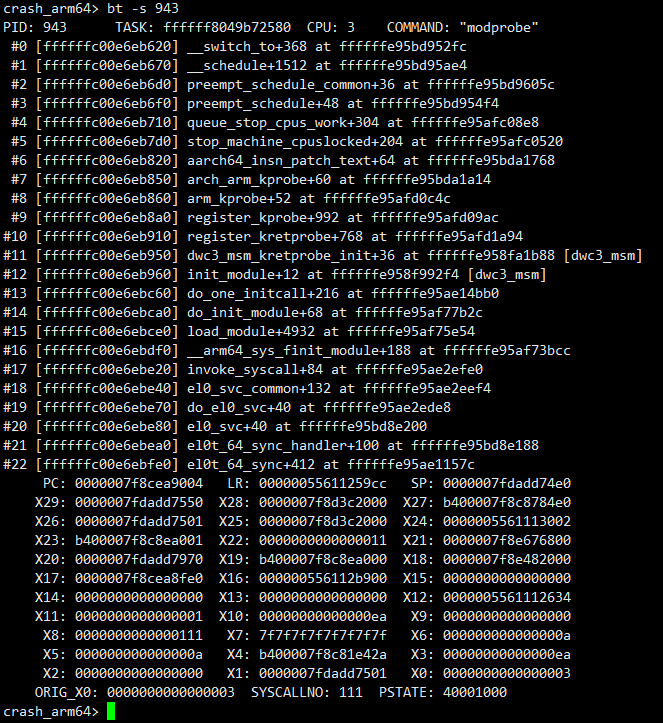

**七、结语**

本文从一个实例入手，介绍了使用crash工具分析dump的方法。重点介绍了如何利用crash查看系统崩溃时cpu上正在running的任务的调用栈的方法，并从任务的栈帧中恢复局部变量的方法。

crash工具非常强大，它可以弥补trace32的不足，当trace32无法恢复任务调用栈或者无法查看某些局部变量的值时，crash tool是一个不错的选择。此外，crash中还集成了许多实用的命令，例如search, foreach, list等命令，如果要在trace32上实现这些命令的功能，需要编写复杂的脚本实现，而在crash中只需要一条命令即可实现。

知道某一把锁在内存中的地址，我们想知道有哪些线程在等这把锁；

-   已经知道某个全局变量的地址或名称，我们想知道有哪些任务正在访问这个全局变量；
-   已经知道某个函数名称，我们想知道有哪些任务的调用栈中会调用到这个函数；

这时候我们就可以使用下面命令格式，来对系统中所有的任务的调用栈进行搜索了，其中-t是对所有的任务进行搜索，不区分任务的状态。而-T则表示只对系统中正在running的任务的调用栈进行搜索。

\[外链图片转存中…(img-U2uH4n67-1702957856261)\]

前面已经得知msdata的值为0xffffffc00e6eb778，在本例中，我们看一下系统中有哪些线程在访问msdata变量，命令如下：

\[外链图片转存中…(img-2M51TRNX-1702957856261)\]

发现pid=943的线程也在访问msdata变量，下面通过bt命令看一下这个线程在干啥。

\[外链图片转存中…(img-YIaMnKJ6-1702957856262)\]

**七、结语**

本文从一个实例入手，介绍了使用crash工具分析dump的方法。重点介绍了如何利用crash查看系统崩溃时cpu上正在running的任务的调用栈的方法，并从任务的栈帧中恢复局部变量的方法。

crash工具非常强大，它可以弥补trace32的不足，当trace32无法恢复任务调用栈或者无法查看某些局部变量的值时，crash tool是一个不错的选择。此外，crash中还集成了许多实用的命令，例如search, foreach, list等命令，如果要在trace32上实现这些命令的功能，需要编写复杂的脚本实现，而在crash中只需要一条命令即可实现。

crash还有许多功能强大的地方，由于文章篇幅限制，无法在此一一列举，感兴趣的同学可以参考本文后面的参考文档部分，了解更多关于Kdump原理、crash基本命令以及其他解析dump工具（如trace32）的使用教程等。