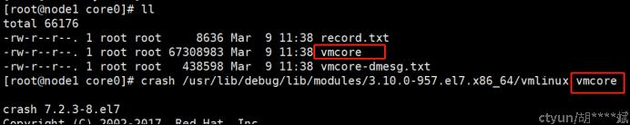
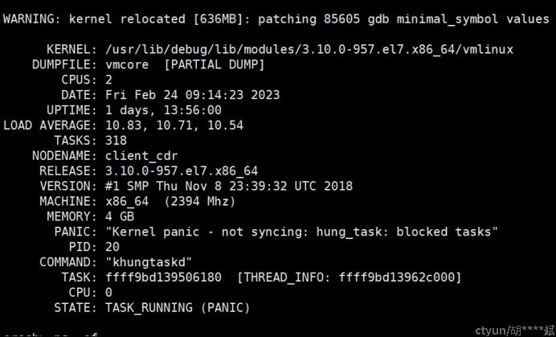
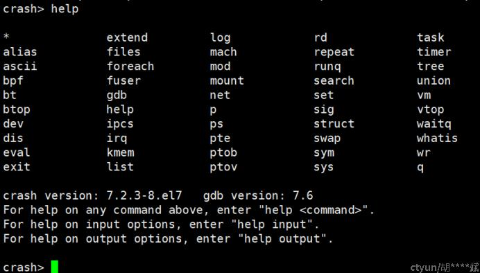
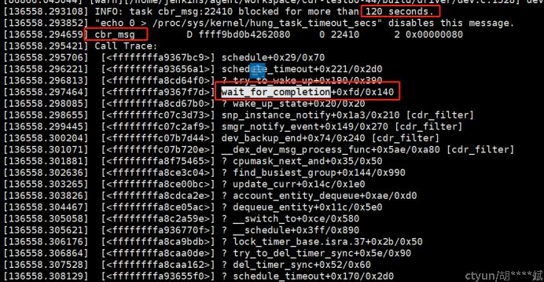
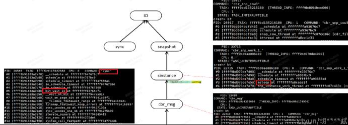
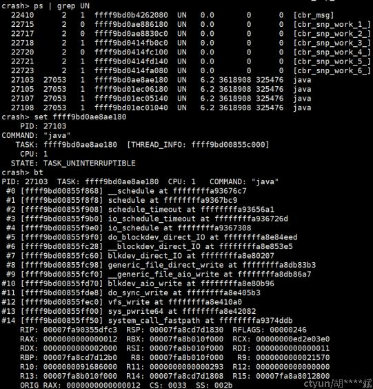
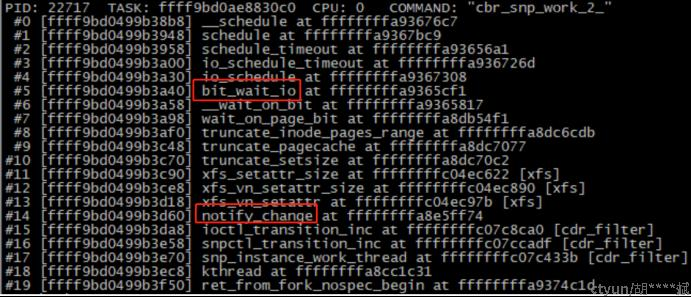
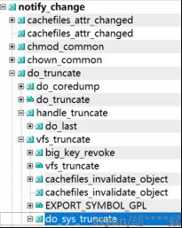

# crash工具简介与实战示例

**一、概述**

crash是一款可用来离线分析linux内核转存文件的工具，它整合了部分gdb的功能，可以查看堆栈、dmesg日志、内核数据结构、反汇编等等，功能非常强大。crash可支持多种工具生成的转存文件格式，例如kdump、netdump、diskdump等，而且还可以分析虚拟机Xen和Kvm上生成的内核转存文件。

**二、使用前的准备工作**

crash与linux内核紧密耦合，需要与linux内核匹配。如果你的内核版本较新，crash很可能无法解析，可以尝试安装最新的crash工具。在使用crash分析问题之前，需要先做好准备工作。

1、下载和安装内核版本对应的文件：

kernel-debuginfo-3.10.0-957.el7.x86\_64.rpm

kernel-debuginfo-common-x86\_64-3.10.0-957.el7.x86\_64.rpm

下载地址：[http://debuginfo.centos.org/7/x86\_64/](https://www.ctyun.cn/portal/link.html?target=http%3A%2F%2Fdebuginfo.centos.org%2F7%2Fx86_64%2F)

2、进入crash工作界面

进入core文件所在路径， 执行如下命令：

crash /usr/lib/debug/lib/modules/3.10.0-957.el7.x86\_64/vmlinux vmcore

crash在加载内核转存文件时会输出系统基本信息。例如，从上图可以看出这个dump是khungtaskd检测到blocked tasks导致的Panic系统复位，问题发生在CPU0，系统内存大小是4GB，系统架构是x86\_64，等等。

**三、常用命令**

常用命令可参考crash\_whitepaper和crash工具自带的帮助文档。我用的版本是crash 7.2.3-8.el7和gdb-7.6，使用时可以使用“help command”来查看详细的帮助文档。

| 命令       | 功能                 | 示例                                                         |
| ---------- | -------------------- | ------------------------------------------------------------ |
| bt         | 打印函数调用栈       | displays a task's kernel-stack backtrace，可以指定进程号bt <pid> |
| log        | 打印系统消息缓冲区   | displays the kernel log_buf contents，如log \| tail -n 30    |
| ps         | 显示进程的状态       | >表示活跃的进程，如ps \| grep RU                             |
| sys        | 显示系统概况         |                                                              |
| kmem -i    | 显示内存使用信息     |                                                              |
| dis <addr> | 对给定地址进行反汇编 |                                                              |

 

**四、实战演示**

在进入crash时已知道该core文件的原因是hangtask所致。下面我们继续寻找原因。

执行log 命令， 在尾部可见如下信息：

由此可知，是驱动中一个消息处理线程在等待完成量时，等待的时间超过了120秒。

通过查看对应的代码，发现此处等待是应为异步执行的一个请求一直未被callback。

代码细节暂不用关注， 简单来说就是正在等待的异步请求涉及IO操作， 可能当时的系统在处理IO时耗时太久；在等待的进程状态通常为“不可中断睡眠”。

进一步寻找信息， 查看进程信息， 过滤出处于“不可中断睡眠”状态的进程，分别查看他们的堆栈和task信息，寻找和业务相关的可疑进程。

依次执行如下命令：

-   Ps | grep UN
-   Set _task\_addr_
-   Bt

### **从其中一个请求的处理进程的堆栈发现，他在处理过程中涉及notify\_change操作，需要等待XFS文件系统的处理，最终需要等待底层IO完成。**

查看linux kernel代码，发现notify\_change正式对应系统调用sys\_truncate。业务流程中也确实存在文件截断的动作。

至此，问题已基本清晰， 在系统IO压力较大时， 驱动发起了一个涉及IO操作的请求，因系统处理该请求长时间未返回，触发hungtaskd的检测机制，导致系统panic复位。愉快结案。

## 参考

https://www.ctyun.cn/developer/article/421358102605893