# linux内核调试（八）使用crash调试内核转储文件

架构:ARMv8

内核版本：5.14.0-rc5

## 1　crash简介

　　crash是一个由redhat工程师开发，用于分析内核转储文件的工具。它可以通过转储文件，获取内核崩溃时的各种信息，如挂死原因，cpu寄存器，堆栈信息，内存信息，变量值，进程信息等。crash可以分析多个不同工具生成的转储文件，如kdump、diskdump等，其中如何通过kdump生成转储文件的流程可参考本系列的第四篇。

## ２　crash使用方法

### ２.1　启动crash

（1）通过kdump生成内核转储文件vmcore

（2）通过以下命令启动crash

    crash vmlinux vmcore

注意：内核编译时需要开启debug选项

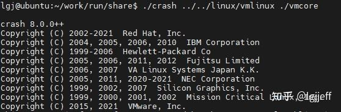

### ２.2　vmcore的基本信息

crash启动时会输出以下vmcore文件的基本信息：

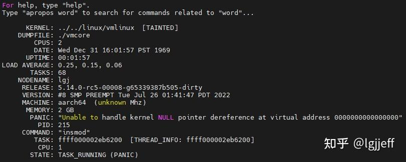

（1）KERNEL：带符号信息的内核路径，即crash的第一个参数

（2）DUMPFILE：vmcore文件

（3）CPUS：系统中总的cpu数量

（4）DATE：内核崩溃的时间

（5）UPTIME：内核的运行时间

（6）LOAD AVERAGE：系统负载情况

（7）TASKS：总的进程数量

（8）MEMORY：内存容量

（9）PANIC：内核挂死原因，如本例是由空指针访问引起的

（10）PID：引起内核挂死进程的pid

（11）COMMAND：引起内核挂死的进程名

（12）TASK：引起内核挂死进程的task\_struct结构体指针

（13）CPU：内核在哪个cpu上挂死

（14）STATE：引起内核挂死进程的状态

### ２.3　crash常用命令

（1）help：用于显示crash支持的命令

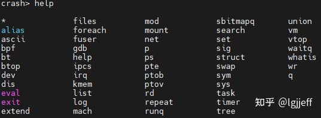

　　若希望查看某个命令的详细帮助信息，则可以使用help command格式，例如下面的例子将显示bt命令的详细用法：

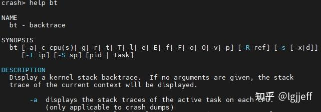

（2）bt：输出内核栈信息

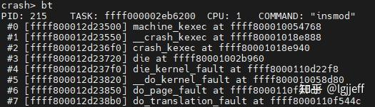

（3）dev：输出内核中的设备信息

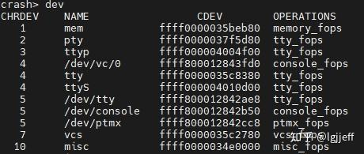

（4）dis：用于反汇编操作，如以下命令用于反汇编schedule函数

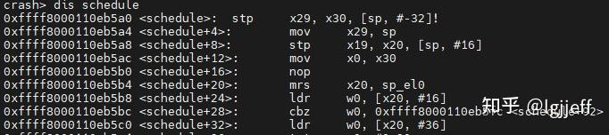

（5）files：用于输出系统当前打开的文件

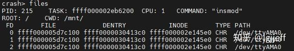

（6）irq：显示系统中已注册的中断

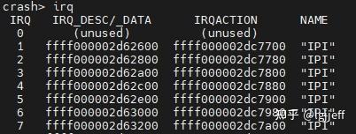

（7）kmem：显示系统内存的使用情况，它包含多个选项，如-i表示总体内存使用情况

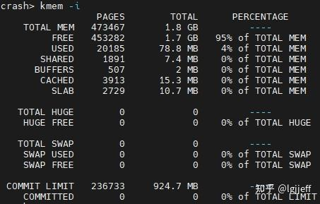

　　其它选项的具体用法可以使用帮助信息查看

（8）mod：用于显示系统已加载的模块信息，也可用于加载模块的符号信息

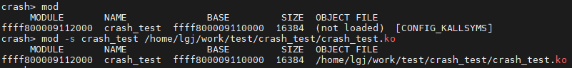

（9）mount：文件系统挂载信息

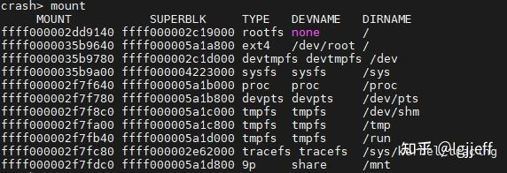

（10）p：打印变量或符号的值

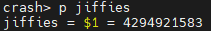

（11）ps：系统中的进程信息

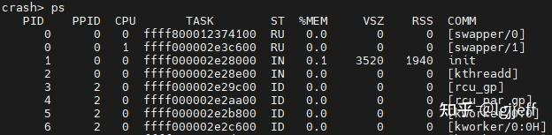

（12）rd：读内存的值，它包含多个选项，通过不同选项可分别读虚拟地址或物理地址

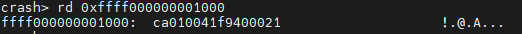

　　　读取物理地址：

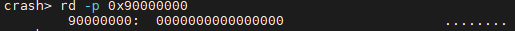

（13）runq：输出每个cpu上不同调度类的运行队列信息

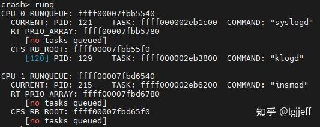

（14）sig：输出信号信息

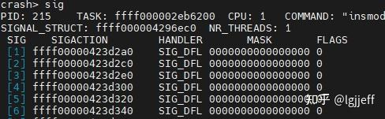

（15）struct：用于输出结构体的定义或值，如以下命令用于输出task\_struct的定义：

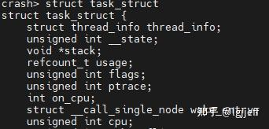

　　　以下命令用于输出某特定task\_struct的值：

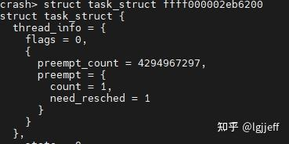

（16）sym：用于查询符号信息，它可以通过-l选项查询所有符号信息，-m选项查询某个模块的符号信息，或不加选项查询某个特定符号的信息

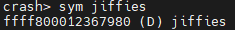

（17）task：用于显示进程的task\_struct结构体中各成员的值

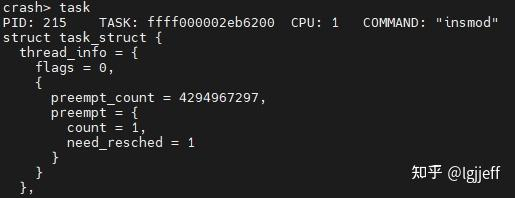

（18）timer：用于显示定时器信息

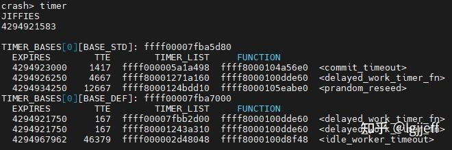

（19）vm：用于显示进程地址空间信息

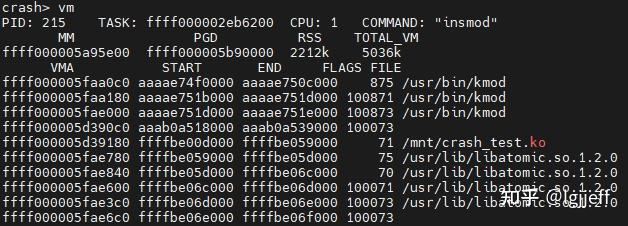

（20）q：退出crash

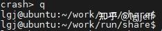

## 参考

https://zhuanlan.zhihu.com/p/546676834