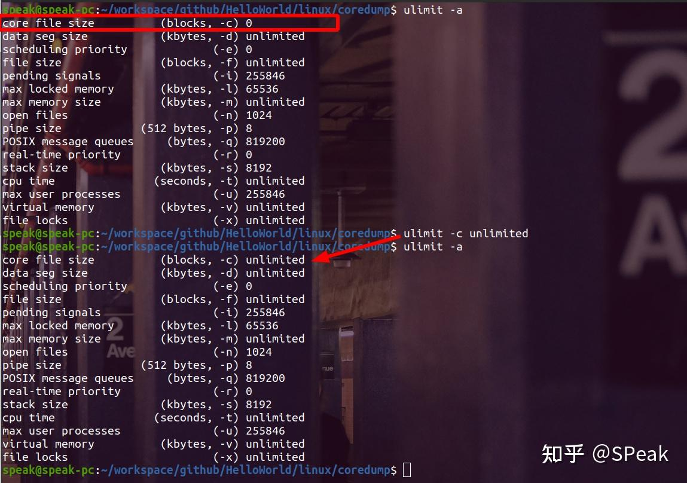
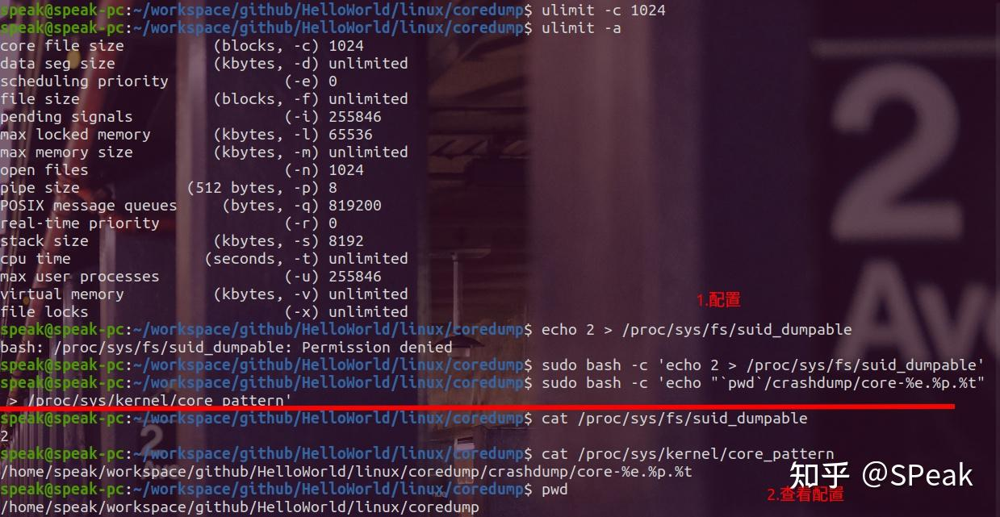
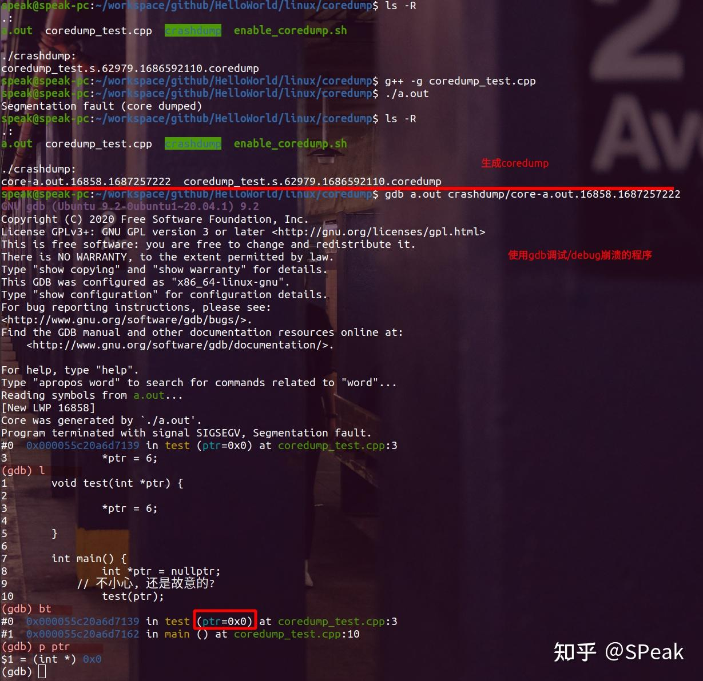

# Linux稳定性: C/C++程序Crash/崩溃 - Coredump分析基础

在Linux系统中，C/C++程序崩溃是常见的问题之一。Coredump是指当一个程序崩溃时，系统把程序运行时的内存数据以二进制文件的形式保存下来，以便程序开发者进行崩溃分析。本文将介绍如何开启并配置Coredump，并使用示例程序进行分析/演示。

  

[Linux稳定性: C/C++程序Crash/崩溃 - Coredump分析基础\_哔哩哔哩\_bilibiliwww.bilibili.com/video/BV1wV4y1y7Hr/?share\_source=copy\_web&vd\_source=2ab9f3bdf795fb473263ee1fc1d268d0](https://link.zhihu.com/?target=https%3A//www.bilibili.com/video/BV1wV4y1y7Hr/%3Fshare_source%3Dcopy_web%26vd_source%3D2ab9f3bdf795fb473263ee1fc1d268d0)

  

## 1、查看并配置coredump

> 在Linux系统中，默认情况下是不会生成Coredump文件的。需要手动开启并配置

### 1.1 状态查看

**使用ulimit命令检查系统Coredump配置(默认情况下，Coredump是被关闭的)**

    ulimit -a

若输出结果中的"core file size"为"0"，则表示Coredump被关闭。

**修改系统Coredump配置**

    ulimit -c unlimited

这条命令会将Coredump文件大小设置为无限制。修改完成后，使用ulimit命令再次检查Coredump配置，确认修改成功。如果希望设置一个特定的大小限制，可以将unlimited替换为所需的大小，单位为blocks（块），通常是512字节。例如，`ulimit -c 1024`将限制core dump文件的大小为1024 blocks，即512KB。

### 1.2 配置

> 开启coredump的shell脚本, dump路径为当前目录下的crashdump目录中

    #!/bin/bash
    
    DUMP_PATH=`pwd`/crashdump
    
    # 检查当前用户是否具有sudo权限
    if [ "$(id -u)" != "0" ]; then
      echo "请使用sudo运行此脚本"
      exit 1
    fi
    
    # 配置Coredump
    echo 2 > /proc/sys/fs/suid_dumpable
    echo "$DUMP_PATH/%e.%p.%t.coredump" > /proc/sys/kernel/core_pattern
    
    # 创建Coredump保存目录
    mkdir -p $DUMP_PATH
    chmod 777 $DUMP_PATH
    
    # Coredump功能已开启 配置信息
    cat /proc/sys/fs/suid_dumpable
    cat /proc/sys/kernel/core_pattern

-   **`/proc/sys/fs/suid_dumpable`**: 这个节点用于控制setuid程序的Coredump生成行为。它有以下取值：
-   0：禁止setuid程序生成Coredump文件；
-   1：只允许root用户获取setuid程序的Coredump文件；
-   2：允许任何用户获取setuid程序的Coredump文件。

> 可在root权限下手动执行上面的命令, 或使用sudo权限如:  
> `sudo bash -c 'echo 2 > /proc/sys/fs/suid_dumpable'`

-   **`/proc/sys/kernel/core_pattern`**:这节点用于指定Coredump文件的保存路径和文件名格式。它的取值可以是一个文件路径，也可以是一个字符串模板。当Coredump文件生成时，系统会根据这个配置项指定的路径和模板生成Coredump文件。

在模板中，可以使用以下占位符：

-   %e：可执行文件名
-   %p：进程ID
-   %u：当前用户ID
-   %g：当前用户组ID
-   %s：生成Coredump文件时的信号
-   %t：生成Coredump文件时的时间戳
-   %h：主机名

> 注意: 可以用cat查看节点状态如: **`cat /proc/sys/fs/suid_dumpable`**

### 1.3 Coredump配置永久生效

**修改/etc/sysctl.conf文件**

    fs.suid_dumpable = 1
    kernel.core_pattern = /tmp/core-%e.%p.%t

-   **fs.suid\_dumpable：**同上
-   **kernel.core\_pattern：** 同上

**修改完成后，更新配置(生效)**

    sysctl -p

> **注:** `/etc/sysctl.conf`是一个在Linux系统中用于配置内核参数的配置文件。它包含了一系列键值对，用于设置内核参数的值，以优化系统性能和安全性。  
> 在Linux系统中，如果一个setuid程序崩溃并生成了Coredump文件，那么这个Coredump文件将包含setuid权限执行时的内存数据，这个数据可能包含敏感信息。因此默认情况下，Linux系统不会为setuid程序生成Coredump文件。将fs.suid\_dumpable设置为2，则表示可以为setuid程序生成Coredump文件并保存内存数据，这可能会带来安全风险，需要在使用时仔细评估风险和利益。

**修改/etc/security/limits.conf 文件**

> 允许系统中的所有用户生成无限制大小的coredump文件, 对于某些操作系统或发行版，可能具有不同的文件名或位置以及格式

    * soft core unlimited
    * hard core unlimited

## 2、示例crash程序

为了演示Coredump文件的分析过程，我们创建一个简单的C++程序。代码如下：

    void test(int *ptr) {
    
        *ptr = 6;
    
    }
    
    int main() {
        int *ptr = nullptr;
        // 是不小心, 还是故意的?
        test(ptr);
        return 0;
    }

这个程序会在运行时出现段错误，导致程序崩溃。

## 3、获取coredump并使用GDB分析

运行上述程序，可以看到程序崩溃并输出了一条错误信息

    Segmentation fault (core dumped)

这条信息表明程序出现了段错误，并生成了Coredump文件(**路径为文章开始配置的路径**)。Coredump文件的路径和文件名可以在上面的kernel.core\_pattern中指定, 或查看文件节点`/proc/sys/kernel/core_pattern`。

现在，我们需要使用GDB来分析Coredump文件。执行以下命令：

    gdb <program_name> <core_dump_file>

执行以上命令后，GDB会打开并加载Coredump文件。可以使用bt命令查看崩溃时的函数调用栈，使用info命令查看变量值，以及使用其他GDB命令进行更深入的分析

## 4、分析的基本技巧

在进行Coredump分析时，以下是一些基本的技巧：

-   **查看函数调用栈:** 使用bt命令可以查看崩溃时的函数调用栈，找到出错的函数。  
    
-   **查看变量值:** 使用info命令可以查看 寄存器值等，找到出错的变量。  
    
-   **使用GDB命令进行更深入的分析:** GDB提供了很多命令，比如p（打印变量值）、x（查看内存）、watch（设置变量监视器）等，可以帮助开发者进行更深入的分析。熟练掌握这些命令可以提高分析效率。  
    
-   **使用符号表:** 如果程序是使用编译器编译的，那么可以使用符号表来查看函数名、变量名等信息。使用以下命令生成符号表：  
    

    g++ -g <program_name>.cpp -o <program_name>

**其中，-g选项表示生成符号表。生成符号表后，可以在GDB中查看函数名、变量名等信息。**

## 5、Other

[演示源码](https://link.zhihu.com/?target=https%3A//github.com/Sunrisepeak/HelloWorld/tree/main/linux/coredump)

[HelloWorld项目-欢迎交流&Star](https://link.zhihu.com/?target=https%3A//github.com/Sunrisepeak/HelloWorld)