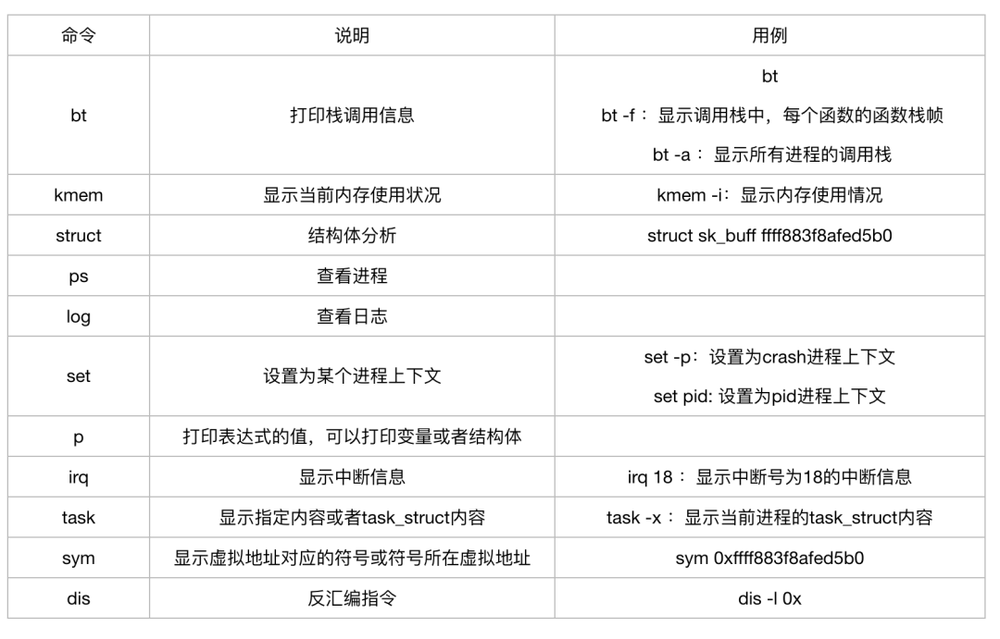
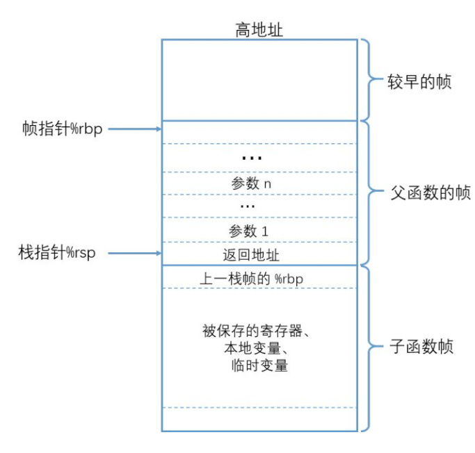

# 故障分析 | 系统崩溃分析小妙招

## **前言**

众所周知，Linux系统可能会因为异常指令、访问无效内存地址、死锁（soft lockup）等原因崩溃。而系统崩溃后，我们可以通过kdump将当时的内存信息dump下来并生成一个转储文件vmcore，同时，crash工具可以帮助我们分析vmcore文件并找到问题所在。

本文将简单介绍**「crash工具的安装和常用命令」**，并通过举例讲解如何使用crash工具定位内核问题。

* * *

## **什么是crash工具**

crash工具是Redhat提供的开源工具，主要用来离线分析Linux内核转存文件，它整合了gdb工具，可以查看堆栈，dmesg日志，内核数据结构，反汇编等等，功能十分强大。

  

**安装及运行crash工具**

    # 安装crash工具
    1 yum install crash
    2 # 安装debuginfo包
    3 debuginfo-install kernel  

​    
    # 运行crash工具
    crash /usr/lib/debug/lib/modules/<kernel>/vmlinux /var/crash/<timestamp>/vmcore

  

**crash工具常用命令**

* * *

## **CPU寄存器与函数栈帧结构**

在使用crash工具分析vmcore文件之前，我们还需要简单了解下CPU中的寄存器以及函数栈帧的结构，因为定位问题时我们经常需要查看某个变量或参数的值，而这些线索往往就存在于寄存器或函数栈中，只有清楚了它们的作用和结构才能准确找到对应的存放位置。除此之外还需要了解一些简单的汇编指令，大家可自行查询。

  

**x86-64寄存器作用**

-   %rax : 存储函数返回值
-   %rsp : 栈指针寄存器，指向栈顶
-   %rdi, %rsi, %rdx, %rcx, %r8, %r9 : 函数参数，依次对应param1, param2....
-   %rbx, %rbp, %r12~%r15 : 数据存储，遵循被调用者使用原则
-   %r10, %r11 : 数据存储，遵循调用者使用原则

  

**被调用者使用原则：**在函数调用时，调用者不必保存这些寄存器的值而直接进行子函数调用，进入子函数后，子函数在覆盖这些寄存器前，需要保存这些寄存器的值，即这些寄存器的值是由被调用者来保存和恢复的。

**调用者使用原则：**在进行子函数调用前，就需要由调用者提前保护好这些寄存器的值，保存方法通常是把寄存器的值压入堆栈中，调用者保存完成后，在子函数中就可以随意覆盖这些寄存器的值了。

* * *

## **函数栈帧结构**

函数调用栈从高地址向下往低地址增长，其中rsp和rbp分别指向栈顶和栈底。在进行函数调用时，会将参数赋值到对应寄存器中，同时将父函数的rbp地址压栈，然后rsp赋值给rbp，随后再依次将其他信息压栈保存，这样我们就可以通过bt -F命令再结合汇编指令，就可以知道被压入栈中的信息了。

  

  

## **举个栗子**

  

尝试分析下面这个vmcore文件，我们先用crash工具打开vmcore文件，接着使用log或者bt命令查看最后的堆栈及寄存器信息。从第一行“unable to handle kernel paging request”，我们可以确定这是一个因为访问了非法地址引发crash的问题，接下来就需要定位这个非法地址是从哪里来的。

  

    crash> log
    [...]
    [2221616.681792] BUG: unable to handle kernel paging request at 0000000000019600
    [2221616.682227] IP: [<ffffffff810fdfa0>] native_queued_spin_lock_slowpath+0x110/0x200
    [2221616.682565] PGD 0 
    [2221616.682816] Oops: 0002 [#1] SMP 
    [2221616.683060] Modules linked in: binfmt_misc nfsv3 rpcsec_gss_krb5 nfsv4 dns_resolver nfs fscache ipt_MASQUERADE nf_nat_masquerade_ipv4 xt_addrtype iptable_filter xt_nat iptable_nat nf_conntrack_ipv4 nf_defrag_ipv4 nf_nat_ipv4 nf_nat nf_conntrack bonding emcpdm(POE) emcpgpx(POE) emcpmpx(POE) emcp(POE) vfat fat iTCO_wdt iTCO_vendor_support mxm_wmi dcdbas sb_edac edac_core intel_powerclamp coretemp intel_rapl iosf_mbi kvm_intel kvm irqbypass crc32_pclmul ghash_clmulni_intel aesni_intel lrw gf128mul glue_helper ablk_helper cryptd pcspkr cdc_ether usbnet mii mei_me mei lpc_ich acpi_power_meter sg shpchp wmi ipmi_si ipmi_devintf ipmi_msghandler nfsd auth_rpcgss nfs_acl lockd grace sunrpc ip_tables xfs libcrc32c sd_mod mgag200 i2c_algo_bit drm_kms_helper lpfc syscopyarea sysfillrect sysimgblt fb_sys_fops
    [2221616.685213]  ttm drm crc32c_intel ahci i40e libahci crc_t10dif crct10dif_generic libata crct10dif_pclmul scsi_transport_fc megaraid_sas i2c_core scsi_tgt ptp pps_core crct10dif_common dm_mirror dm_region_hash dm_log dm_mod [last unloaded: emcpioc]
    [2221616.686573] CPU: 39 PID: 101271 Comm: systemd-cgtop Tainted: P           OE  ------------   3.10.0-693.21.1.el7.x86_64 #1
    [2221616.687011] Hardware name: Dell Inc. PowerEdge R630/02C2CP, BIOS 2.7.1 001/22/2018
    [2221616.687509] task: ffff88158c812f70 ti: ffff88a4b502c000 task.ti: ffff88a4b502c000
    [2221616.687982] RIP: 0010:[<ffffffff810fdfa0>]  [<ffffffff810fdfa0>] native_queued_spin_lock_slowpath+0x110/0x200
    [2221616.688519] RSP: 0018:ffff88a4b502fdc8  EFLAGS: 00010006
    [2221616.689011] RAX: 0000000000001fd4 RBX: ffffffff81abb3a0 RCX: 0000000001390000
    [2221616.689520] RDX: 0000000000019600 RSI: 00000000fea18bd0 RDI: ffff88b68e104f98
    [2221616.690044] RBP: ffff88a4b502fdc8 R08: ffff88befe2d9600 R09: 0000000000000000
    [2221616.690618] R10: ffff8801bfc07300 R11: 0000000000000246 R12: 0000000000000000
    [2221616.691175] R13: ffff88748b81be00 R14: ffffffff81318e90 R15: ffff88bed0d860c0
    [2221616.691743] FS:  00007efd99b72740(0000) GS:ffff88befe2c0000(0000) knlGS:0000000000000000
    [2221616.692299] CS:  0010 DS: 0000 ES: 0000 CR0: 0000000080050033
    [2221616.692870] CR2: 0000000000019600 CR3: 0000009284026000 CR4: 00000000003607e0
    [2221616.693498] DR0: 0000000000000000 DR1: 0000000000000000 DR2: 0000000000000000
    [2221616.694113] DR3: 0000000000000000 DR6: 00000000fffe0ff0 DR7: 0000000000000400
    [2221616.694719] Call Trace:
    [2221616.695352]  [<ffffffff816a8ff4>] queued_spin_lock_slowpath+0xb/0xf
    [2221616.695956]  [<ffffffff816b6758>] _raw_spin_lock_irq+0x28/0x30
    [2221616.696615]  [<ffffffff81319654>] blkcg_print_blkgs+0x74/0xe0
    [2221616.697260]  [<ffffffff8131f286>] cfqg_print_rwstat+0x36/0x40
    [2221616.697899]  [<ffffffff8110cfd6>] cgroup_seqfile_show+0x76/0x80
    [2221616.698527]  [<ffffffff8122ac87>] ? seq_buf_alloc+0x17/0x40
    [2221616.699185]  [<ffffffff8122b1b0>] seq_read+0x110/0x3e0
    [2221616.699849]  [<ffffffff812054ef>] vfs_read+0x9f/0x170
    [2221616.700539]  [<ffffffff812063bf>] SyS_read+0x7f/0xe0
    [2221616.701184]  [<ffffffff816c0715>] system_call_fastpath+0x1c/0x21
    [2221616.701834] Code: 87 47 02 c1 e0 10 45 31 c9 85 c0 74 44 48 89 c2 c1 e8 13 48 c1 ea 0d 48 98 83 e2 30 48 81 c2 00 96 01 00 48 03 14 c5 a0 10 b2 81 <4c> 89 02 41 8b 40 08 85 c0 75 0f 0f 1f 44 00 00 f3 90 41 8b 40 
    [2221616.703308] RIP  [<ffffffff810fdfa0>] native_queued_spin_lock_slowpath+0x110/0x200
    [2221616.704014]  RSP <ffff88a4b502fdc8>
    [2221616.704702] CR2: 0000000000019600

  

通常我们会先反汇编RIP寄存器中的指令，因为这是在系统崩溃时执行的指令，是在执行mov指令时出的问题。

  

    crash> dis -lr ffffffff810fdfa0 | tail -n 10
    /usr/src/debug/kernel-3.10.0-693.21.1.el7/linux-3.10.0-693.21.1.el7.x86_64/kernel/qspinlock.c: 107
    0xffffffff810fdf85 <native_queued_spin_lock_slowpath+245>:  shr    $0x13,%eax
    /usr/src/debug/kernel-3.10.0-693.21.1.el7/linux-3.10.0-693.21.1.el7.x86_64/kernel/qspinlock.c: 110
    0xffffffff810fdf88 <native_queued_spin_lock_slowpath+248>:  shr    $0xd,%rdx
    0xffffffff810fdf8c <native_queued_spin_lock_slowpath+252>:  cltq   
    0xffffffff810fdf8e <native_queued_spin_lock_slowpath+254>:  and    $0x30,%edx
    0xffffffff810fdf91 <native_queued_spin_lock_slowpath+257>:  add    $0x19600,%rdx
    0xffffffff810fdf98 <native_queued_spin_lock_slowpath+264>:  add    -0x7e4def60(,%rax,8),%rdx
    /usr/src/debug/kernel-3.10.0-693.21.1.el7/linux-3.10.0-693.21.1.el7.x86_64/include/linux/compiler.h: 208
    0xffffffff810fdfa0 <native_queued_spin_lock_slowpath+272>:  mov    %r8,(%rdx)  <--- crashed here

  

在对应版本的内核代码中，我们找到blkcg\_print\_blkgs这个函数，在调用spin\_lock\_irq的地方看到自旋锁是来自“blkcg\_gq”结构体，接下来我们希望找到blkg->q->queue\_lock的地址，判断这个地址是否有问题。

  

    void blkcg_print_blkgs(struct seq_file *sf, struct blkcg *blkcg,
                 u64 (*prfill)(struct seq_file *,
                     struct blkg_policy_data *, int),
                 const struct blkcg_policy *pol, int data,
                 bool show_total)
    {
       struct blkcg_gq *blkg;
       u64 total = 0;
    
       rcu_read_lock();
       hlist_for_each_entry_rcu(blkg, &blkcg->blkg_list, blkcg_node) {
          spin_lock_irq(blkg->q->queue_lock);
          if (blkcg_policy_enabled(blkg->q, pol))
             total += prfill(sf, blkg->pd[pol->plid], data);
          spin_unlock_irq(blkg->q->queue_lock);
       }
       rcu_read_unlock();
    
       if (show_total)
          seq_printf(sf, "Total %llu\n", (unsigned long long)total);
    }

  

继续用dis命令反汇编blkcg\_print\_blkgs的指令， 通过“lea -0x18(%rcx),%r15”指令，我们可以知道blkg的地址存放在r15寄存器中。知道了blkg的地址，我们就可以找到最后queue\_lock的地址啦。

  

    crash> dis -lr ffffffff81319654 | tail -n 10
    0xffffffff8131963c <blkcg_print_blkgs+92>:  test   %rcx,%rcx
    0xffffffff8131963f <blkcg_print_blkgs+95>:  je     0xffffffff81319688 <blkcg_print_blkgs+168>
    0xffffffff81319641 <blkcg_print_blkgs+97>:  lea    -0x18(%rcx),%r15
    /usr/src/debug/kernel-3.10.0-693.21.1.el7/linux-3.10.0-693.21.1.el7.x86_64/block/blk-cgroup.c: 504
    0xffffffff81319645 <blkcg_print_blkgs+101>: mov    (%r15),%rax
    /usr/src/debug/kernel-3.10.0-693.21.1.el7/linux-3.10.0-693.21.1.el7.x86_64/include/linux/spinlock.h: 331
    0xffffffff81319648 <blkcg_print_blkgs+104>: mov    0x458(%rax),%rdi
    0xffffffff8131964f <blkcg_print_blkgs+111>: callq  0xffffffff816b6730 <_raw_spin_lock_irq>
    /usr/src/debug/kernel-3.10.0-693.21.1.el7/linux-3.10.0-693.21.1.el7.x86_64/block/blk-cgroup.c: 505
    0xffffffff81319654 <blkcg_print_blkgs+116>: mov    (%r15),%rdi

  

通过blkcg\_gq结构体的地址，我们可以先找到q的地址。

  

    struct blkcg_gq {
       /* Pointer to the associated request_queue */
       struct request_queue      *q;
       struct list_head      q_node;
       struct hlist_node     blkcg_node;
       struct blkcg         *blkcg;
      ...
    };

​    
​    
​    
    crash> blkcg_gq.q ffff88bed0d860c0
      q = 0xffff88bef3f1b4e0

  

接着再通过q找到queue\_lock的地址。

    struct request_queue {
       /*
        * Together with queue_head for cacheline sharing
        *
       struct list_head   queue_head;
       struct request    *last_merge;
       struct elevator_queue  *elevator;
       int          nr_rqs[2]; /* # allocated [a]sync rqs */
       int          nr_rqs_elvpriv;    /* # allocated rqs w/ elvpriv */
       ...
       spinlock_t     __queue_lock;
       spinlock_t    *queue_lock;   ...
    };

​    
​    
    crash> struct request_queue.queue_lock 0xffff88bef3f1b4e0
     queue_lock= 0xffff88b68e104f98

  

使用kmem命令查看当先内存的分配情况，可以看出0xffff88b68e104f98这个地址已超出已分配地址，确实是一个非法地址。

  

    crash> kmem -s 0xffff88b68e104f98
    CACHE            NAME                 OBJSIZE  ALLOCATED     TOTAL  SLABS  SSIZE
    ffff8801bfc07a00 kmalloc-96                96      23531     34776    828     4k
      SLAB              MEMORY            NODE  TOTAL  ALLOCATED  FREE
      ffffea02da384100  ffff88b68e104000     1     42         10    32
      FREE / [ALLOCATED]
       ffff88b68e104f60

  

查看requset\_queue结构体，这个队列已没有设备在使用，但是从requeust\_fn可以确认它被emcp模块使用。

  

    crash> dev -d | grep ffff88bef3f1b4e0
    crash> request_queue.dev,request_fn,nr_queues 0xffff88bef3f1b4e0
      dev = 0x0
      request_fn = 0xffffffffc09348b0
      nr_queues = 0x0
    crash> sym 0xffffffffc09348b0
    ffffffffc09348b0 (t) emcp_native_strategy_request_fn [emcp]

  

因此，我们可以得出结论：  
由于**「emcp模块没有正确删除request\_queue」**，导致自旋锁操作访问无效地址。

* * *

## **总结**

综上所述，可以看出crash工具非常强大，而学习使用crash工具不仅可以帮我们更快速地定位问题，更能够帮助我们深入地理解linux内核。

## 参考

https://zhuanlan.zhihu.com/p/541167724